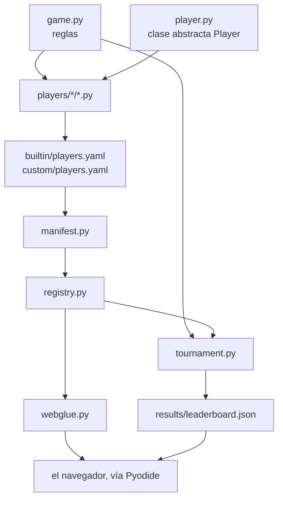

# Estructura del código

```text
nim-arena/
├── pyproject.toml          # empaquetado, dependencias, configuración de herramientas
├── conftest.py             # pone la raíz del repo y web/ en sys.path para pytest
├── src/nimarena/
│   ├── game.py             # reglas puras: legal_moves, apply_move, is_terminal, nim_sum
│   ├── player.py           # la clase abstracta Player — la API que implementan otros
│   ├── registry.py         # catálogo en memoria nombre -> Player
│   ├── manifest.py         # carga los manifiestos en el registro
│   ├── elo.py              # puntuación Elo por partida (formato liga)
│   ├── tournament.py       # formatos (simple/league/championship), tiempos, resultados
│   └── bots/               # estrategias reutilizables de las que salen los jugadores
│       ├── minimax.py      # negamax genérico + poda alfa-beta, dos ganchos, sin saber NIM
│       ├── basic_minimax.py  # heurística débil de palos totales   (la usa `medium`)
│       ├── smart_minimax.py  # oráculo de finales + mejor heurística (la usa `hard`)
│       ├── random_bot.py
│       └── greedy_bot.py
├── players/                # un archivo .py por jugador: identidad y configuración
│   ├── builtin/            # la escalera de referencia, incluida en el proyecto
│   │   ├── players.yaml    #   el manifiesto que admite los cuatro de abajo
│   │   ├── random.py       #   `random` — la referencia base
│   │   ├── easy.py         #   `easy`   — vacía la fila más grande
│   │   ├── medium.py       #   `medium` — minimax de profundidad 2
│   │   └── hard.py         #   `hard`   — minimax de profundidad 4 + oráculo de finales
│   └── custom/             # jugadores enviados; un PR solo toca esto
│       └── players.yaml    #   el manifiesto que los admite
├── results/leaderboard.json  # lo escribe el workflow del torneo
├── web/                    # sitio de GitHub Pages (Pyodide + una capa fina de JS)
│   ├── index.html          # solo el esqueleto: cabecera, navegación, arranque, scripts
│   ├── screens/            # un fragmento HTML por pantalla, inyectado al arrancar
│   │   ├── menu.html  game.html  scoreboard.html
│   │   └── tournament.html  about.html
│   ├── js/                 # un script por pantalla, con etiquetas <script> simples
│   │   ├── core.js         # utilidades, navegación, identidad de jugador, tablero
│   │   ├── play.js  scoreboard.js  tournament.js
│   │   └── main.js         # carga las pantallas, las conecta y arranca el motor
│   ├── style.css
│   ├── pyodide-bootstrap.js# carga Pyodide + el paquete Python
│   └── webglue.py          # puente Python<->JS (JSON en la frontera)
├── scripts/build_web.py    # empaqueta la librería en web/py.zip
├── docs/                   # esta documentación (MkDocs + Material)
│   ├── arena/              # el manual de referencia de este repositorio
│   └── guide/              # la guía del estudiante: Git, GitHub, Python, docs
├── .github/workflows/      # tests, docs, torneo, pages
└── tests/                  # batería de pytest
```

## Cómo encajan las piezas



### Decisiones de diseño que conviene entender

- **`apply_move` devuelve un estado nuevo y nunca muta la entrada.** El minimax
  explora muchos futuros hipotéticos; un estado mutable compartido sería una
  fuente sutil de errores.
- **El estado es una lista simple de enteros.** El mismo valor cruza Python → JS →
  Python (Pyodide) sin serialización propia.
- **Los tiempos viven en el torneo, no en el jugador ni en el juego.** El contrato
  que implementa alguien de fuera se mantiene diminuto; el control de tiempo es
  una propiedad de la *partida*.
- **El descubrimiento es un manifiesto explícito, no un escaneo de carpeta.** La
  frontera de confianza es visible en un solo diff, y el código de un desconocido
  no se ejecuta solo para ser descubierto.

## Adónde ir después

- [API de jugador](player-api.md) — la única interfaz a la que sirve todo esto.
- [El marcador](scoreboard.md) — el archivo al final de la cadena.
- [Organización](../guide/python-library/organization.md) — por qué el código está
  en `src/` y qué hace `pyproject.toml`.

## Referencia de la API (autogenerada)

!!! info "Esta referencia se genera del código fuente y está en inglés"
    Los bloques siguientes salen directamente de los docstrings del paquete, que
    están escritos en inglés. La prosa que los rodea sí está traducida.

::: nimarena.game

::: nimarena.registry.Registry

::: nimarena.manifest.load_players

## Estrategias reutilizables (autogeneradas)

::: nimarena.bots.minimax.MinimaxBot

::: nimarena.bots.smart_minimax.SmartMinimaxBot
