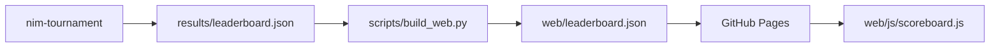

# El marcador

El marcador no es un programa. Es **un archivo JSON** que escribe el torneo y lee
la página web. Nada más los conecta: sin base de datos, sin backend, sin API.

Esta página describe la forma de ese archivo y el camino que recorre, que es todo
lo que necesitas para calcular el tuyo y mostrarlo.

## El camino que recorren los datos



1. **Una ejecución lo produce.** `nim-tournament --out results/leaderboard.json`
   juega todas las partidas y vuelca un único objeto JSON. El workflow del torneo
   hace commit del archivo en el repositorio, así que los últimos resultados
   publicados siempre forman parte del código fuente.
2. **La construcción lo copia.** `scripts/build_web.py` copia
   `results/leaderboard.json` junto a la página como `web/leaderboard.json`. Si el
   archivo aún no existe, imprime un aviso y sigue — el sitio se construye igual.
3. **Pages lo sirve.** El workflow de Pages sube todo el directorio `web/` como
   artefacto estático.
4. **La página lo pide.** `web/js/scoreboard.js` hace
   `fetch("leaderboard.json", { cache: "no-cache" })` al cargar. Cuando la
   petición falla, la pantalla muestra *«No leaderboard yet…»* en lugar de un
   error.

!!! info "Por qué un archivo versionado y no una base de datos"
    Una página estática no puede consultar nada. Que los resultados sean un archivo
    del repositorio significa que el marcador no tiene infraestructura que
    mantener viva, que el historial de cada ejecución publicada está en `git log`,
    y que cualquiera puede reproducir una ejecución en local y comparar.

## La estructura del archivo

Ocho claves de primer nivel. Todas están siempre presentes; solo el contenido de
`structure` cambia con el formato de torneo.

| Clave | Qué contiene |
|---|---|
| `generated_at` | marca de tiempo UTC de la ejecución, `"%Y-%m-%dT%H:%M:%SZ"` |
| `config` | los ajustes que usó la ejecución — suficientes para reproducirla |
| `players` | el directorio de jugadores: una entrada por **tipo** |
| `standings` | la clasificación ordenada — la tabla en sí |
| `matches` | una entrada por enfrentamiento, agregada sobre sus partidas |
| `player_stats` | detalle por jugador, incluido el cara a cara |
| `totals` | contadores de toda la ejecución para los recuadros resumen |
| `structure` | específico del formato: grupos y cuadro en un campeonato |

### `config` — cómo se configuró la ejecución

```json
"config": {
  "tournament": "league",
  "starting_states": [[3, 5, 7], [1, 2, 3, 4, 5], [4, 5, 6, 7, 8, 9]],
  "repetitions": 3,
  "game_budget_ms": 2000,
  "build_budget_ms": 2000,
  "elo": true,
  "hard_timeout": true,
  "time_limit_s": 2.0,
  "player_repetition": null,
  "player_copies": { "random": 2, "easy": 2, "medium": 2, "hard": 2 }
}
```

La página lee `config.tournament` para decidir qué bloques renderizar.

### `players` — el directorio

Una entrada por **tipo**, no por copia de la plantilla, ordenada por nombre:

```json
"players": [
  {
    "name": "easy",
    "icon": "🌱",
    "authors": ["jparisu"],
    "description": "Always empties the largest row. A plausible-looking rule that is barely better than random…"
  }
]
```

Este bloque existe para que el marcador sea **autocontenido**: la página renderiza
iconos, autores y descripciones directamente desde el archivo, sin importar el
registro de Python. Un marcador de hace seis meses sigue renderizando bien aunque
la plantilla haya cambiado desde entonces.

### `standings` — la clasificación

```json
"standings": [
  {
    "rank": 1, "player": "hard_0",
    "points": 117, "wins": 117, "losses": 9, "forfeits": 0,
    "games": 126, "win_rate": 0.929,
    "avg_move_ms": 43.148, "std_move_ms": 146.232, "max_move_ms": 855.784,
    "elo": 1998.839
  }
]
```

`elo` solo aparece en una ejecución `league` con Elo activado. `player` es un
**nombre de plantilla**, no un tipo — véase más abajo.

### `matches` — una fila por emparejamiento

```json
{
  "player_a": "random_0", "player_b": "random_1",
  "phase": "round-robin",
  "games": 18, "a_wins": 9, "b_wins": 9, "winner": "", "forfeits": 0,
  "a_avg_move_ms": 0.01,  "b_avg_move_ms": 0.009,
  "a_std_move_ms": 0.02,  "b_std_move_ms": 0.015,
  "a_max_move_ms": 0.131, "b_max_move_ms": 0.076
}
```

Los tiempos son **solo agregados** — media, desviación típica y máximo.
Deliberadamente no hay un array por jugada: una ejecución de varios cientos de
partidas produciría un archivo demasiado grande para descargarlo en cada carga de
página. `winner` es la cadena vacía cuando hay empate a partidas ganadas.

### `player_stats` — las tarjetas desplegables

Todo lo de `standings`, más `moves_made`, `total_move_ms`, las tres cifras
`*_build_ms` y una lista `opponents`:

```json
"opponents": [
  { "opponent": "easy_0", "wins": 18, "losses": 0 }
]
```

De esa lista sale el desglose cara a cara de cada tarjeta de jugador.

### `totals` — los recuadros resumen

```json
"totals": {
  "players": 8, "matches": 28, "games": 504,
  "total_moves": 3607, "avg_game_moves": 7.157, "longest_game_moves": 20,
  "forfeits": 0,
  "total_move_time_ms": 47498.405, "total_build_time_ms": 63.191
}
```

### `structure` — el bloque específico del formato

Para `simple` y `league` es solo un marcador:

```json
"structure": { "type": "league", "elo": true }
```

Para `championship` lleva toda la forma de la competición — las tablas de grupo y
el cuadro eliminatorio:

```json
"structure": {
  "type": "championship",
  "group_size": 4,
  "advance_per_group": 2,
  "groups": [
    { "name": "Group A", "members": ["hard_0", "easy_1", "…"],
      "table": [ { "rank": 1, "player": "hard_0", "points": 9, "…": "…" } ],
      "advance": ["hard_0", "medium_1"] }
  ],
  "bracket": {
    "rounds": [
      { "name": "Semi-finals",
        "ties": [ { "a": "hard_0", "b": "easy_1", "a_wins": 12, "b_wins": 6, "winner": "hard_0" } ] }
    ],
    "champion": "hard_0"
  }
}
```

La página solo renderiza los grupos y el cuadro cuando `type` es `championship`.

## Nombres de plantilla: `hard_0`, no `hard`

Un tipo puede entrar en el torneo más de una vez, de modo que juegue contra sí
mismo y cada copia tenga su propia semilla. Las copias se llaman
`<tipo>_<semilla>`: `hard_0`, `hard_1`, `random_0`, … `config.player_copies` anota
cuántas recibió cada tipo.

La página vuelve a separar ese nombre con `splitPlayer` en `web/js/core.js` y
renderiza `⚔️ hard₀` — el icono viene del directorio `players` indexado por *tipo*
y el índice se convierte en subíndice. Las opciones `<select>` nativas no admiten
marcado, así que ahí el subíndice es un carácter Unicode y no un elemento `<sub>`.

Tenlo presente al calcular un marcador propio: `standings`, `matches` y
`player_stats` usan nombres de plantilla, mientras que `players` usa tipos.

## Qué dibuja la página con esto

Renderizado puramente mecánico, sin lógica de juego:

- una columna de **clasificación** a la derecha con 🥇🥈🥉 para los tres primeros;
- un **filtro de jugadores** y un **gráfico radar** que compara los seleccionados;
- un bloque plegable de **estructura del torneo** (grupos y cuadro, solo en
  campeonato);
- una tabla de **resumen de enfrentamientos** desde `matches`;
- tarjetas desplegables de **estadísticas por jugador** desde `player_stats`;
- recuadros de **estadísticas totales** desde `totals`.

## Producir uno tú

```bash
nim-tournament --out results/leaderboard.json     # escríbelo
python scripts/build_web.py                       # cópialo junto a la página
python -m http.server -d web 8000                 # sírvelo y míralo
```

## Adónde ir después

- [El torneo](tournament.md) — cómo se producen los números del archivo.
- [La página web](web.md) — la página que los renderiza.
- [Primeros pasos](getting-started.md) — ejecuta ambos en local.
