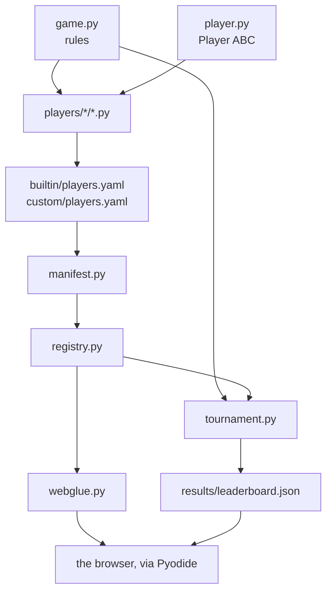

# Code structure

```text
nim-arena/
├── pyproject.toml          # packaging, dependencies, tooling config
├── conftest.py             # puts the repo root and web/ on sys.path for pytest
├── src/nimarena/
│   ├── game.py             # pure rules: legal_moves, apply_move, is_terminal, nim_sum
│   ├── player.py           # the Player ABC — the API outsiders implement
│   ├── registry.py         # in-memory name -> Player catalogue
│   ├── manifest.py         # loads the manifests into the registry
│   ├── elo.py              # per-game Elo ratings (used by the league format)
│   ├── tournament.py       # formats (simple/league/championship), timing, results
│   └── bots/               # reusable strategies the players are built from
│       ├── minimax.py      # generic negamax + alpha-beta, two hooks, no NIM knowledge
│       ├── basic_minimax.py  # weak total-sticks heuristic      (used by `medium`)
│       ├── smart_minimax.py  # endgame oracle + better heuristic (used by `hard`)
│       ├── random_bot.py
│       └── greedy_bot.py
├── players/                # one .py file per player: identity + configuration
│   ├── builtin/            # the reference ladder, shipped with the project
│   │   ├── players.yaml    #   the manifest admitting the four below
│   │   ├── random.py       #   `random` — the baseline
│   │   ├── easy.py         #   `easy`   — empties the largest row
│   │   ├── medium.py       #   `medium` — depth-2 minimax
│   │   └── hard.py         #   `hard`   — depth-4 minimax + endgame oracle
│   └── custom/             # submitted players; a PR only ever touches this
│       └── players.yaml    #   the manifest admitting them
├── results/leaderboard.json  # written by the tournament workflow
├── web/                    # GitHub Pages site (Pyodide + thin JS UI)
│   ├── index.html          # shell only: header, nav, boot overlay, script tags
│   ├── screens/            # one HTML partial per screen, injected at boot
│   │   ├── menu.html  game.html  scoreboard.html
│   │   └── tournament.html  about.html
│   ├── js/                 # one script per screen, plain <script> tags
│   │   ├── core.js         # helpers, nav, player identity, board renderer
│   │   ├── play.js  scoreboard.js  tournament.js
│   │   └── main.js         # loads screens, wires each one, boots the engine
│   ├── style.css
│   ├── pyodide-bootstrap.js# loads Pyodide + the Python bundle
│   └── webglue.py          # Python<->JS bridge (JSON at the boundary)
├── scripts/build_web.py    # bundles the package into web/py.zip
├── docs/                   # this documentation (MkDocs + Material)
│   ├── game/               # the reference manual of this repository
│   └── guide/              # the Guide: Git, GitHub, Python, docs
├── .github/workflows/      # tests, docs, tournament, pages
└── tests/                  # pytest suite
```

## How the pieces fit



### Design decisions worth understanding

- **`apply_move` returns a new state and never mutates the input.** Minimax
  explores many hypothetical futures; shared mutable state would be a subtle bug
  source.
- **State is a plain list of ints.** The same value crosses Python → JS → Python
  (Pyodide) without any custom serialization.
- **Timeouts live in the tournament, not the player or the game.** The contract
  a stranger implements stays tiny; time control is a property of the *match*.
- **Discovery is an explicit manifest, not folder auto-scan.** The trust boundary
  is visible in one PR diff, and no stranger's code runs merely to be discovered.

## Where to go next

- [Player API](../upload-a-bot/player-api.md) — the one interface all of this exists to serve.
- [The scoreboard](scoreboard.md) — the file at the end of the chain.
- [API reference](api.md) — every public name of `nimarena`, generated from the
  source.
- [Organization](../../guide/python-library/organization.md) — why the code sits in
  `src/`, and what `pyproject.toml` does.
