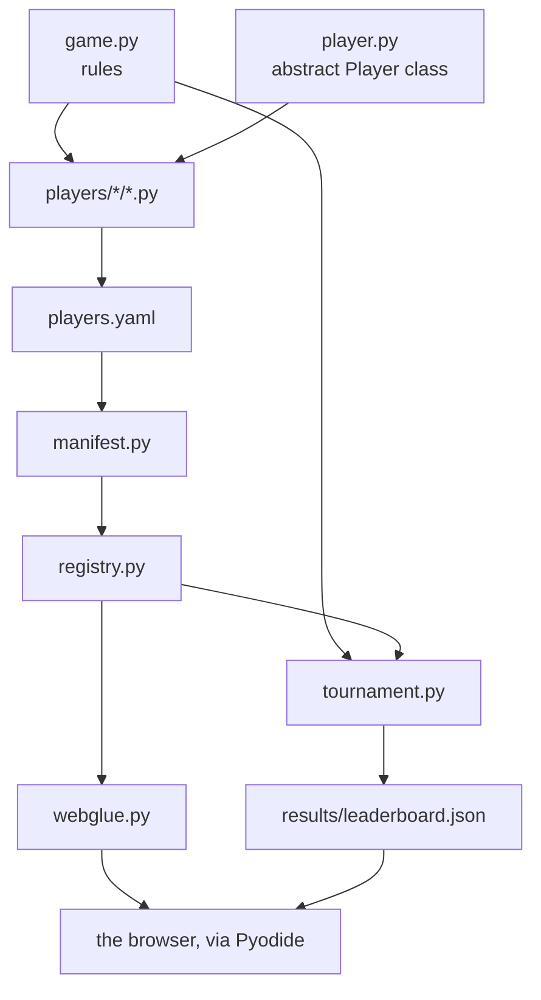

# Code structure

The repository has **six places to look**. Everything else hangs off them.

```text
nim-arena/
├── src/nimarena/      the package: rules, player API, tournament
│   └── bots/          the reusable strategies
├── players/           one .py file per player
│   ├── builtin/       the reference ladder
│   └── custom/        players submitted by PR
├── results/           leaderboard.json, written by the tournament
├── web/               the GitHub Pages site (Pyodide + thin JS)
├── docs/              this documentation (MkDocs + Material)
└── tests/             the pytest suite
```

---

## Inside the package

| Module | What it does |
|---|---|
| `game.py` | the pure rules: `legal_moves`, `apply_move`, `is_terminal`, `nim_sum` |
| `player.py` | the abstract `Player` class — [the API other people implement](../upload-a-bot/player-api.md) |
| `registry.py` | in-memory catalogue, name → `Player` |
| `manifest.py` | loads the `players.yaml` manifests into the registry |
| `tournament.py` | formats, timing and results |
| `elo.py` | per-game Elo rating |
| `bots/` | generic negamax with alpha-beta pruning, and the two heuristics `medium` and `hard` use |

---

## How the pieces fit



---

## Four design decisions

| Decision | Why |
|---|---|
| **`apply_move` returns a new state** and never mutates its input | minimax explores many hypothetical futures; shared mutable state would be a subtle source of bugs |
| **State is a plain list of ints** | the same value crosses Python → JS → Python (Pyodide) with no custom serialization |
| **Timing lives in the tournament**, not in the player or the game | the contract an outsider implements stays tiny; timing is a property of the *game* |
| **Discovery is an explicit manifest**, not a folder scan | the trust boundary is visible in a single diff, and a stranger's code is not run just to be discovered |

---

**Next:** [API reference](api.md) — every public name, generated from the
source.
