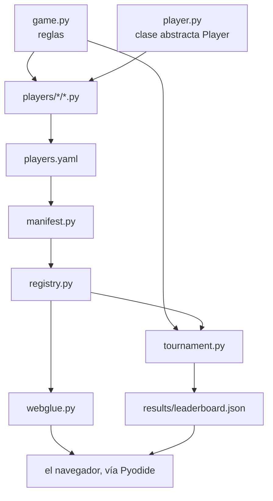

# Estructura del código

El repositorio tiene **seis sitios donde mirar**. Todo lo demás cuelga de ellos.

```text
nim-arena/
├── src/nimarena/      el paquete: reglas, API de jugador, torneo
│   └── bots/          las estrategias reutilizables
├── players/           un archivo .py por jugador
│   ├── builtin/       la escalera de referencia
│   └── custom/        los jugadores enviados por PR
├── results/           leaderboard.json, escrito por el torneo
├── web/               la página de GitHub Pages (Pyodide + JS fino)
├── docs/              esta documentación (MkDocs + Material)
└── tests/             la batería de pytest
```

---

## El paquete, por dentro

| Módulo | Qué hace |
|---|---|
| `game.py` | las reglas puras: `legal_moves`, `apply_move`, `is_terminal`, `nim_sum` |
| `player.py` | la clase abstracta `Player` — [la API que implementan otros](../upload-a-bot/player-api.md) |
| `registry.py` | catálogo en memoria, nombre → `Player` |
| `manifest.py` | carga los manifiestos `players.yaml` en el registro |
| `tournament.py` | formatos, tiempos y resultados |
| `elo.py` | puntuación Elo por partida |
| `bots/` | negamax genérico con poda alfa-beta, y las dos heurísticas que usan `medium` y `hard` |

---

## Cómo encajan las piezas



---

## Cuatro decisiones de diseño

| Decisión | Por qué |
|---|---|
| **`apply_move` devuelve un estado nuevo** y nunca muta la entrada | el minimax explora muchos futuros hipotéticos; un estado mutable compartido sería una fuente sutil de errores |
| **El estado es una lista simple de enteros** | el mismo valor cruza Python → JS → Python (Pyodide) sin serialización propia |
| **Los tiempos viven en el torneo**, no en el jugador ni en el juego | el contrato que implementa alguien de fuera se mantiene diminuto; el control de tiempo es una propiedad de la *partida* |
| **El descubrimiento es un manifiesto explícito**, no un escaneo de carpeta | la frontera de confianza es visible en un solo diff, y el código de un desconocido no se ejecuta solo para ser descubierto |

---

**Siguiente:** [Referencia de la API](api.md) — todos los nombres públicos,
generados desde el código fuente.
