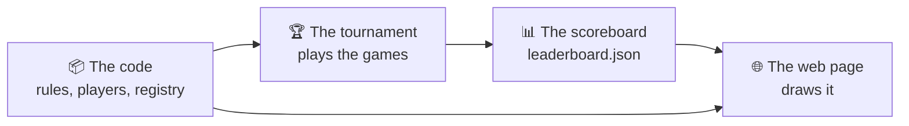

# Advanced documentation

How NIM Arena is put together on the inside.

!!! info "This is optional"
    You do **not** need any of this section to write a bot — for that, go to
    [Upload a new bot](../upload-a-bot/index.md). Read it if you want to
    understand the machinery, fix a bug, or change the project itself.

---

## The whole path

- :material-file-tree:{ .lg .middle } **[Code structure](code-structure.md)**

    ---

    The repository tree and how the modules depend on each other.

- :material-trophy:{ .lg .middle } **[The tournament](tournament.md)**

    ---

    Formats, time budgets and forfeits.

- :material-podium:{ .lg .middle } **[The scoreboard](scoreboard.md)**

    ---

    The results file, and how it is rendered.

- :material-web:{ .lg .middle } **[The web app](web.md)**

    ---

    The Pyodide page that runs the same Python in your browser.

- :material-api:{ .lg .middle } **[API reference](api.md)**

    ---

    Every public name of `nimarena`, generated from the source.

