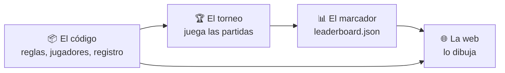

# Documentación avanzada

Cómo está montado NIM Arena por dentro.

!!! info "Esto es opcional"
    **No** necesitas nada de esta sección para escribir un bot — para eso ve a
    [Subir un bot nuevo](../upload-a-bot/index.md). Léela si quieres entender la
    maquinaria, arreglar un error o cambiar el proyecto en sí.

---

## El recorrido completo

- :material-file-tree:{ .lg .middle } **[Primeros pasos](getting-started.md)**

    ---

    Primeros pasos para descargar e instalar el proyecto.

- :material-file-tree:{ .lg .middle } **[Estructura del código](code-structure.md)**

    ---

    El árbol del repositorio y cómo dependen unos módulos de otros.

- :material-trophy:{ .lg .middle } **[El torneo](tournament.md)**

    ---

    Formatos, presupuestos de tiempo y descalificaciones.

- :material-podium:{ .lg .middle } **[El marcador](scoreboard.md)**

    ---

    El archivo de resultados y cómo se renderiza.

- :material-web:{ .lg .middle } **[La página web](web.md)**

    ---

    La página Pyodide que ejecuta el mismo Python en tu navegador.

- :material-api:{ .lg .middle } **[Referencia de la API](api.md)**

    ---

    Todos los nombres públicos de `nimarena`, generados desde el código fuente.

