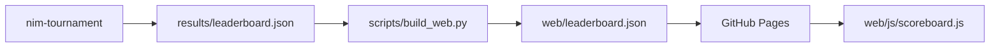

# The scoreboard

The scoreboard is not a program. It is **one JSON file** that the tournament
writes and the web page reads. Nothing else connects them: no database, no
backend, no API.

This page describes the shape of that file and the path it travels, which is all
you need in order to compute your own and render it.

## The path the data travels



1. **A run produces it.** `nim-tournament --out results/leaderboard.json` plays
   every game and dumps one JSON object. The file is committed to the repository
   by the Tournament workflow, so the last published results are always part of
   the source.
2. **The build copies it.** `scripts/build_web.py` copies
   `results/leaderboard.json` next to the page as `web/leaderboard.json`. If the
   file does not exist yet, it prints a note and carries on — the site still
   builds.
3. **Pages serves it.** The Pages workflow uploads the whole `web/` directory as
   a static artifact.
4. **The page fetches it.** `web/js/scoreboard.js` does
   `fetch("leaderboard.json", { cache: "no-cache" })` on load. When the fetch
   fails, the screen shows *"No leaderboard yet…"* instead of an error.

!!! info "Why a committed file and not a database"
    A static page cannot query anything. Making the results a file in the repo
    means the scoreboard has no infrastructure to keep alive, the history of every
    published run is in `git log`, and anyone can reproduce a run locally and diff
    the result.

## The structure of the file

Eight top-level keys. All of them are always present; only the contents of
`structure` change with the tournament format.

| Key | What it holds |
|---|---|
| `generated_at` | UTC timestamp of the run, `"%Y-%m-%dT%H:%M:%SZ"` |
| `config` | the settings the run used — enough to reproduce it |
| `players` | the player directory: one entry per player **kind** |
| `standings` | the ranked classification — the table itself |
| `matches` | one entry per match, aggregated over its games |
| `player_stats` | per-player detail, including head-to-head |
| `totals` | whole-run counters for the summary tiles |
| `structure` | format-specific: groups and bracket for a championship |

### `config` — how the run was set up

```json
"config": {
  "tournament": "league",
  "starting_states": [[3, 5, 7], [1, 2, 3, 4, 5], [4, 5, 6, 7, 8, 9]],
  "repetitions": 3,
  "game_budget_ms": 2000,
  "build_budget_ms": 2000,
  "elo": true,
  "hard_timeout": true,
  "time_limit_s": 2.0,
  "player_repetition": null,
  "player_copies": { "random": 2, "easy": 2, "medium": 2, "hard": 2 }
}
```

The page reads `config.tournament` to decide which blocks to render.

### `players` — the directory

One entry per **kind**, not per roster copy, sorted by name:

```json
"players": [
  {
    "name": "easy",
    "icon": "🌱",
    "authors": ["jparisu"],
    "description": "Always empties the largest row. A plausible-looking rule that is barely better than random…"
  }
]
```

This block exists so the scoreboard is **self-contained**: the page renders icons,
authors and descriptions straight from the file, without importing the Python
registry. A leaderboard from six months ago still renders correctly even if the
roster has changed since.

### `standings` — the classification

```json
"standings": [
  {
    "rank": 1, "player": "hard_0",
    "points": 117, "wins": 117, "losses": 9, "forfeits": 0,
    "games": 126, "win_rate": 0.929,
    "avg_move_ms": 43.148, "std_move_ms": 146.232, "max_move_ms": 855.784,
    "elo": 1998.839
  }
]
```

`elo` is present only in a `league` run with Elo enabled. `player` is a **roster
name**, not a kind — see below.

### `matches` — one row per pairing

```json
{
  "player_a": "random_0", "player_b": "random_1",
  "phase": "round-robin",
  "games": 18, "a_wins": 9, "b_wins": 9, "winner": "", "forfeits": 0,
  "a_avg_move_ms": 0.01,  "b_avg_move_ms": 0.009,
  "a_std_move_ms": 0.02,  "b_std_move_ms": 0.015,
  "a_max_move_ms": 0.131, "b_max_move_ms": 0.076
}
```

Timings are **aggregates only** — average, standard deviation and maximum. There
is deliberately no per-move array: a run of several hundred games would otherwise
produce a file too large to fetch on every page load. `winner` is the empty string
for a draw on games won.

### `player_stats` — the expandable cards

Everything `standings` has, plus `moves_made`, `total_move_ms`, the three
`*_build_ms` figures, and an `opponents` list:

```json
"opponents": [
  { "opponent": "easy_0", "wins": 18, "losses": 0 }
]
```

That list is what the head-to-head breakdown on each player card is drawn from.

### `totals` — the summary tiles

```json
"totals": {
  "players": 8, "matches": 28, "games": 504,
  "total_moves": 3607, "avg_game_moves": 7.157, "longest_game_moves": 20,
  "forfeits": 0,
  "total_move_time_ms": 47498.405, "total_build_time_ms": 63.191
}
```

### `structure` — the format-specific block

For `simple` and `league` it is only a marker:

```json
"structure": { "type": "league", "elo": true }
```

For `championship` it carries the whole shape of the competition — the group
tables and the knockout bracket:

```json
"structure": {
  "type": "championship",
  "group_size": 4,
  "advance_per_group": 2,
  "groups": [
    { "name": "Group A", "members": ["hard_0", "easy_1", "…"],
      "table": [ { "rank": 1, "player": "hard_0", "points": 9, "…": "…" } ],
      "advance": ["hard_0", "medium_1"] }
  ],
  "bracket": {
    "rounds": [
      { "name": "Semi-finals",
        "ties": [ { "a": "hard_0", "b": "easy_1", "a_wins": 12, "b_wins": 6, "winner": "hard_0" } ] }
    ],
    "champion": "hard_0"
  }
}
```

The page renders the groups and the bracket only when `type` is `championship`.

## Roster names: `hard_0`, not `hard`

A kind may enter the tournament more than once, so that it plays against itself
and every copy gets its own seed. The copies are named `<kind>_<seed>`: `hard_0`,
`hard_1`, `random_0`, … `config.player_copies` records how many each kind got.

The page splits that name back apart with `splitPlayer` in `web/js/core.js` and
renders `⚔️ hard₀` — the icon comes from the `players` directory keyed by *kind*,
the index becomes a subscript. Native `<select>` options cannot contain markup, so
there the subscript is a Unicode character rather than a `<sub>` element.

Keep this in mind when computing a scoreboard of your own: `standings`,
`matches` and `player_stats` all use roster names, while `players` uses kinds.

## What the page draws from it

Purely mechanical rendering, no game logic:

- a right-hand **classification** column with 🥇🥈🥉 for the top three;
- a **player filter** and a **radar chart** comparing selected players;
- a collapsible **Tournament structure** block (groups and bracket, championship
  only);
- a **Match summary** table from `matches`;
- expandable **Player stats** cards from `player_stats`;
- **Total stats** tiles from `totals`.

## Producing one yourself

```bash
nim-tournament --out results/leaderboard.json     # write it
python scripts/build_web.py                       # copy it next to the page
python -m http.server -d web 8000                 # serve and look at it
```

## Where to go next

- [The tournament](tournament.md) — how the numbers in the file are produced.
- [The web app](web.md) — the page that renders them.
- [Getting started](../getting-started.md) — run both locally.
