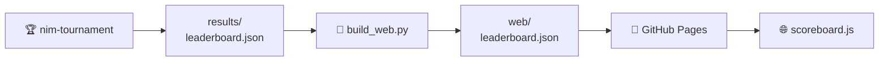

# The scoreboard

The scoreboard is not a program. It is **one JSON file** written by the
tournament and read by the web page. Nothing else connects them: no database, no
backend, no API.

---

## The path the data takes



| Step | What happens |
|---|---|
| 1 · **A run produces it** | `nim-tournament --out results/leaderboard.json` plays every game and dumps one JSON object. The workflow commits the file to the repository |
| 2 · **The build copies it** | `scripts/build_web.py` drops it next to the page as `web/leaderboard.json`. If it does not exist yet, it warns and carries on |
| 3 · **Pages serves it** | the Pages workflow uploads the whole `web/` directory as a static artifact |
| 4 · **The page fetches it** | `scoreboard.js` calls `fetch("leaderboard.json", { cache: "no-cache" })` on load. If it fails, the screen says *“No leaderboard yet…”* instead of breaking |

!!! info "Why a versioned file and not a database"
    A static page cannot query anything. Keeping the results as a file in the
    repository means the scoreboard has no infrastructure to keep alive, the
    history of every published run is in `git log`, and anyone can reproduce a
    run locally and compare.

---

## What is in the file

Eight top-level keys, always present:

| Key | What it holds |
|---|---|
| `generated_at` | UTC timestamp of the run |
| `config` | the settings the run used — enough to reproduce it |
| `players` | the player directory: one entry per **type**, with icon, authors and description |
| `standings` | the ordered ranking — the table itself |
| `matches` | one entry per tie, aggregated over its games |
| `player_stats` | per-player detail, including head-to-head |
| `totals` | whole-run counters for the summary boxes |
| `structure` | format-specific: groups and bracket in a championship |

This is one `standings` row, which is the part you will actually look at:

```json
{
  "rank": 1, "player": "hard_0",
  "points": 117, "wins": 117, "losses": 9, "forfeits": 0,
  "games": 126, "win_rate": 0.929,
  "avg_move_ms": 43.148, "max_move_ms": 855.784,
  "elo": 1998.839
}
```

`elo` only appears in a `league` run with Elo enabled.

??? info "The remaining blocks, with examples"
    **`config`** — how the run was configured. The page reads
    `config.tournament` to decide which blocks to render.

    ```json
    "config": {
      "tournament": "league",
      "starting_states": [[3, 5, 7], [1, 2, 3, 4, 5], [4, 5, 6, 7, 8, 9]],
      "repetitions": 3,
      "game_budget_ms": 2000,
      "build_budget_ms": 2000,
      "player_copies": { "random": 2, "easy": 2, "medium": 2, "hard": 2 }
    }
    ```

    **`players`** — the directory, one entry per type. It exists so the
    scoreboard is **self-contained**: the page renders icons, authors and
    descriptions straight from the file, without importing the Python registry.
    A six-month-old scoreboard still renders correctly.

    ```json
    { "name": "easy", "icon": "🌱", "authors": ["jparisu"],
      "description": "Always empties the largest row…" }
    ```

    **`matches`** — one row per pairing. Timings are **aggregates only** (mean,
    standard deviation and max): a per-move array would produce a file too large
    to download on every page load. `winner` is the empty string on a tie.

    ```json
    { "player_a": "random_0", "player_b": "random_1",
      "games": 18, "a_wins": 9, "b_wins": 9, "winner": "", "forfeits": 0 }
    ```

    **`player_stats`** — everything in `standings`, plus `moves_made`, the build
    timings and an `opponents` list, which is where each card's head-to-head
    breakdown comes from.

    **`totals`** — the counters behind the summary boxes: players, ties, games,
    total moves, longest game and forfeits.

    **`structure`** — for `simple` and `league` it is just a marker
    (`{"type": "league", "elo": true}`). For `championship` it carries the group
    tables, the bracket rounds and the champion.

!!! note "`standings` uses `hard_0`; `players` uses `hard`"
    A type can enter the tournament more than once, and each copy is named
    `<type>_<seed>`. `standings`, `matches` and `player_stats` use those roster
    names; `players` uses the type. The page splits them apart again to draw
    `⚔️ hard₀`.

---

## What the page draws with it

Purely mechanical rendering, no game logic:

- 🏅 a **standings** column with 🥇🥈🥉 for the top three;
- 🎯 a **player filter** and a **radar chart** comparing the selected ones;
- 🗂️ a collapsible **tournament structure** block (championship only);
- ⚔️ a **tie summary** table;
- 🃏 expandable **per-player stats** cards;
- 📈 **total stats** boxes.

---

## Produce one yourself

```bash
nim-tournament --out results/leaderboard.json     # write it
python scripts/build_web.py                       # copy it next to the page
python -m http.server -d web 8000                 # serve it and look
```

---

**Next:** [The web app](web.md) — the page that renders it.
