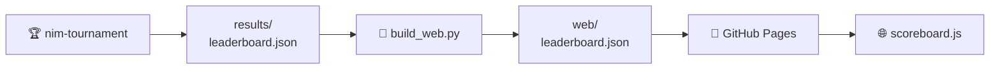

# El marcador

El marcador no es un programa. Es **un archivo JSON** que escribe el torneo y
lee la página web. Nada más los conecta: sin base de datos, sin backend, sin API.

---

## El camino que recorren los datos



| Paso | Qué pasa |
|---|---|
| 1 · **Se produce** | `nim-tournament --out results/leaderboard.json` juega todas las partidas y vuelca un único objeto JSON. El workflow hace commit del archivo en el repositorio |
| 2 · **Se copia** | `scripts/build_web.py` lo pone junto a la página como `web/leaderboard.json`. Si aún no existe, avisa y sigue |
| 3 · **Se sirve** | el workflow de Pages sube todo el directorio `web/` como artefacto estático |
| 4 · **Se pide** | `scoreboard.js` hace `fetch("leaderboard.json", { cache: "no-cache" })` al cargar. Si falla, la pantalla dice *«No leaderboard yet…»* en lugar de romperse |

!!! info "Por qué un archivo versionado y no una base de datos"
    Una página estática no puede consultar nada. Que los resultados sean un
    archivo del repositorio significa que el marcador no tiene infraestructura
    que mantener viva, que el historial de cada ejecución publicada está en
    `git log`, y que cualquiera puede reproducir una ejecución en local y
    comparar.

---

## Qué hay en el archivo

Ocho claves de primer nivel, siempre presentes:

| Clave | Qué contiene |
|---|---|
| `generated_at` | marca de tiempo UTC de la ejecución |
| `config` | los ajustes que usó la ejecución — suficientes para reproducirla |
| `players` | el directorio de jugadores: una entrada por **tipo**, con icono, autores y descripción |
| `standings` | la clasificación ordenada — la tabla en sí |
| `matches` | una entrada por enfrentamiento, agregada sobre sus partidas |
| `player_stats` | detalle por jugador, incluido el cara a cara |
| `totals` | contadores de toda la ejecución para los recuadros resumen |
| `structure` | específico del formato: grupos y cuadro en un campeonato |

Así es una fila de `standings`, que es la parte que vas a mirar:

```json
{
  "rank": 1, "player": "hard_0",
  "points": 117, "wins": 117, "losses": 9, "forfeits": 0,
  "games": 126, "win_rate": 0.929,
  "avg_move_ms": 43.148, "max_move_ms": 855.784,
  "elo": 1998.839
}
```

`elo` solo aparece en una ejecución `league` con Elo activado.

??? info "El resto de bloques, con ejemplos"
    **`config`** — cómo se configuró la ejecución. La página lee
    `config.tournament` para decidir qué bloques renderizar.

    ```json
    "config": {
      "tournament": "league",
      "starting_states": [[3, 5, 7], [1, 2, 3, 4, 5], [4, 5, 6, 7, 8, 9]],
      "repetitions": 3,
      "game_budget_ms": 2000,
      "build_budget_ms": 2000,
      "player_copies": { "random": 2, "easy": 2, "medium": 2, "hard": 2 }
    }
    ```

    **`players`** — el directorio, una entrada por tipo. Existe para que el
    marcador sea **autocontenido**: la página renderiza iconos, autores y
    descripciones desde el archivo, sin importar el registro de Python. Un
    marcador de hace seis meses sigue renderizando bien.

    ```json
    { "name": "easy", "icon": "🌱", "authors": ["jparisu"],
      "description": "Always empties the largest row…" }
    ```

    **`matches`** — una fila por emparejamiento. Los tiempos son **solo
    agregados** (media, desviación típica y máximo): un array por jugada
    produciría un archivo demasiado grande para descargarlo en cada carga de
    página. `winner` es la cadena vacía cuando hay empate.

    ```json
    { "player_a": "random_0", "player_b": "random_1",
      "games": 18, "a_wins": 9, "b_wins": 9, "winner": "", "forfeits": 0 }
    ```

    **`player_stats`** — todo lo de `standings`, más `moves_made`, los tiempos
    de construcción y una lista `opponents` de la que sale el desglose cara a
    cara de cada tarjeta.

    **`totals`** — los contadores de los recuadros resumen: jugadores,
    enfrentamientos, partidas, jugadas totales, partida más larga y
    descalificaciones.

    **`structure`** — para `simple` y `league` es solo un marcador
    (`{"type": "league", "elo": true}`). Para `championship` lleva las tablas de
    grupo, las rondas del cuadro y el campeón.

!!! note "`standings` usa `hard_0`; `players` usa `hard`"
    Un tipo puede entrar en el torneo más de una vez, y cada copia se llama
    `<tipo>_<semilla>`. `standings`, `matches` y `player_stats` usan esos
    nombres de plantilla; `players` usa el tipo. La página los vuelve a separar
    para dibujar `⚔️ hard₀`.

---

## Qué dibuja la página con esto

Renderizado puramente mecánico, sin lógica de juego:

- 🏅 una columna de **clasificación** con 🥇🥈🥉 para los tres primeros;
- 🎯 un **filtro de jugadores** y un **gráfico radar** que compara los
  seleccionados;
- 🗂️ un bloque plegable de **estructura del torneo** (solo en campeonato);
- ⚔️ una tabla de **resumen de enfrentamientos**;
- 🃏 tarjetas desplegables de **estadísticas por jugador**;
- 📈 recuadros de **estadísticas totales**.

---

## Producir uno tú

```bash
nim-tournament --out results/leaderboard.json     # escríbelo
python scripts/build_web.py                       # cópialo junto a la página
python -m http.server -d web 8000                 # sírvelo y míralo
```

---

**Siguiente:** [La página web](web.md) — la página que lo renderiza.
