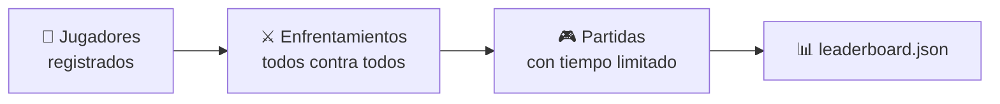

# El torneo

El torneo enfrenta a **todos los jugadores registrados** entre sí y escribe un
archivo de resultados que la [página web](web.md) renderiza como marcador.



Lo ejecutas tú con `nim-tournament`, y lo ejecuta una GitHub Action de forma
programada.

---

## Un «enfrentamiento» son muchas partidas

Dos jugadores no juegan una partida: juegan una **serie**. Para cada tablero
inicial, y con cada uno saliendo primero una vez, se juegan `--repetitions`
partidas.

```text
partidas de un enfrentamiento = nº de tableros × 2 × repeticiones
```

Con los valores por defecto (3 tableros, 3 repeticiones) son **18 partidas** por
pareja.

!!! info "Por qué se alterna quién sale primero"
    En el NIM el primer jugador suele tener una ventaja decisiva. Si no se
    alternara, el torneo mediría el sorteo en vez de la habilidad.

---

## Los tres formatos

| Formato | Emparejamientos | Clasificación |
|---------|-----------------|---------------|
| `simple` *(por defecto)* | todos contra todos, cada par una vez | puntos (uno por victoria) |
| `league` | todos contra todos, cada par una vez | puntuación Elo |
| `championship` | fase de grupos + cuadro eliminatorio | puntos y un campeón |

Se elige con `--tournament`.

??? info "Detalle de `league` y `championship`"
    **`league`** usa el mismo todos contra todos que `simple`, pero ordena por
    una [puntuación Elo][nimarena.elo] actualizada partida a partida (K=32,
    inicio 1500). `--no-elo` vuelve a puntos.

    **`championship`** reparte a los jugadores en **grupos de cuatro**
    equilibrados; cada grupo juega un todos contra todos y sus **dos primeros
    pasan** a un cuadro de eliminación directa con cabezas de serie (con
    exenciones para los mejores cuando el número no es potencia de dos). Cada
    eliminatoria es un enfrentamiento completo.

??? info "Por qué un jugador puede aparecer como `hard_0` y `hard_1`"
    Un tipo de jugador puede inscribirse **más de una vez**, cada copia con su
    propia semilla, que es lo que permite que un tipo compita contra *sí mismo*
    — un todos contra todos nunca empareja una instancia consigo misma. Las
    copias se llaman `<tipo>_<semilla>`, y el marcador renderiza ese sufijo como
    subíndice.

    Los jugadores de referencia entran **dos** veces y los enviados por PR
    **una**, porque el lado de las propuestas crece con cada PR fusionado y el
    trabajo crece con el cuadrado de la plantilla. `--player-repetition` lo
    sobrescribe.

---

## Robustez: un mal bot nunca rompe la ejecución

Incluso los bots bienintencionados pueden colgarse, romperse o devolver una
jugada ilegal en algún caso límite. El torneo sobrevive a todo ello:

| Fallo | Resultado |
|-------|-----------|
| supera su presupuesto de partida, o se cuelga | derrota (`forfeit_timeout`) |
| lanza una excepción jugando | derrota (`forfeit_error`) |
| devuelve una jugada ilegal o malformada | derrota (`forfeit_illegal`) |
| `create()` supera el presupuesto | derrota (`forfeit_build_timeout`) |
| `create()` lanza una excepción | derrota (`forfeit_build_error`) |

En todos los casos se registra el motivo y la ejecución **continúa**.

---

## Los tiempos

Cada jugador recibe **dos presupuestos por partida**, no por jugada:

| Presupuesto | Por defecto | Cubre |
|---|---|---|
| de partida (`--game-time-limit`) | 2 s | todo tu tiempo de pensar en esa partida, acumulado |
| de construcción (`--build-time-limit`) | 2 s | `create()` |

Son acumulativos: un bot puede quemar casi todo su presupuesto en una posición
difícil y jugar el resto al instante. Están separados para que no se pueda colar
precálculo gratis en el constructor.

!!! warning "El tiempo se mide en CI"
    El torneo oficial se ejecuta en los **runners de GitHub**, más lentos y
    variables que un portátil. Un bot que pasa en tu máquina todavía puede
    agotar el tiempo allí. Es una regla declarada, no una sorpresa.

??? info "Cómo se cumple el límite de verdad"
    Cada **partida** se ejecuta en un proceso aparte. Si un bot se cuelga en un
    bucle infinito, el proceso se **termina** y el bot pierde; el torneo sigue.
    Los hilos de Python no se pueden matar a la fuerza, así que un tiempo basado
    en hilos no podría garantizar esto.

    Se bifurca por partida y no por jugada a propósito: las cachés y la posición
    del generador aleatorio de un jugador tienen que sobrevivir de una jugada a
    la siguiente *dentro de su propia partida*.

    `--no-subprocess` da un modo de «tiempo blando» en un solo proceso para
    ejecuciones locales rápidas; sigue descalificando a quien se pase, pero no
    puede interrumpir un bucle infinito real.

---

## Ejecutarlo

```bash
# Lo habitual: torneo simple, escribe la clasificación
nim-tournament --out results/leaderboard.json

# Una liga ordenada por Elo
nim-tournament --tournament league

# Rápido, para probar tu bot mientras lo escribes
nim-tournament --no-subprocess
```

Las opciones que usarás casi siempre:

| Opción | Por defecto | Significado |
|--------|-------------|-------------|
| `--out` | — | dónde escribir el archivo de resultados |
| `--tournament` | `simple` | `simple`, `league` o `championship` |
| `--board` | tres tableros | un tablero inicial, p. ej. `--board 3,5,7`; repetible |
| `--no-subprocess` | off | tiempo blando en un solo proceso (rápido, local) |

??? info "Todas las opciones"
    | Opción | Por defecto | Significado |
    |--------|-------------|-------------|
    | `--time-limit` | `2.0` | presupuesto por jugador en segundos, para una partida entera *y* para construir |
    | `--game-time-limit` | — | sobreescribe solo el presupuesto de pensar |
    | `--build-time-limit` | — | sobreescribe solo el de construcción |
    | `--no-time-limit` | off | no impone nada (nunca con jugadores no confiables) |
    | `--repetitions` | `3` | partidas por (tablero, quién sale primero) |
    | `--player-repetition` | *la de cada tipo* | sobrescribe las copias inscritas |
    | `--group-size` | `4` | solo campeonato: jugadores por grupo |
    | `--advance-per-group` | `2` | solo campeonato: cuántos pasan |
    | `--elo` / `--no-elo` | on | usar Elo para la clasificación de liga |

---

## Cómo se clasifica

`simple` y `championship` clasifican por **puntos** (uno por victoria); `league`
clasifica por **Elo**. Los empates se rompen por **menos derrotas por
descalificación** y luego por **nombre**, de modo que el orden es completamente
determinista.

!!! note "El tiempo por jugada *no* desempata, a propósito"
    Premiaría lo que no toca: un jugador que pierde todas las partidas por
    descalificación no registra ningún tiempo de jugada, así que ganaría
    cualquier desempate por velocidad. Por eso las descalificaciones van
    primero.

### El orden esperado

Con suficientes partidas, los jugadores de referencia quedan así:

```text
⚔️ hard   >   🧠 medium   >   🌱 easy   ≈   🎲 random
```

- **`hard`** explora 4 niveles con poda alfa-beta y reconoce varios finales de
  golpe. Fuerte, pero no calcula el nim-sum, así que sigue siendo batible.
- **`medium`** hace la misma búsqueda a 2 niveles con una heurística
  deliberadamente débil: sólido al final de una partida, poco fiable antes.
- **`easy` y `random` no están ordenados entre sí**, a propósito. Vaciar la fila
  más grande es apenas mejor que jugar al azar, y cuál queda por delante depende
  del sorteo. Si intercambian posiciones entre ejecuciones, no pasa nada.

!!! note "En `league`, los puntos y el puesto pueden discrepar"
    El puesto viene del Elo mientras la tabla también muestra puntos, así que un
    jugador con más puntos puede quedar *por debajo* de otro con menos. Eso es
    el Elo funcionando como debe: pondera *a quién* ganas, no solo cuántas
    veces.

---

**Siguiente:** [El marcador](scoreboard.md) — qué escribe el torneo y cómo se
convierte en la tabla que ves.
