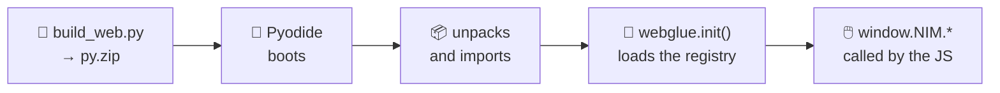

# The web app

The [live page](https://jparisu.github.io/nim-arena) is a **static site** served
by GitHub Pages. It loads [Pyodide](https://pyodide.org) (Python compiled to
WebAssembly) and runs **the same** game engine and the same AI players in your
browser.

!!! quote "One source of truth"
    The rules and the AIs come from the shared Python, executed through Pyodide.
    The rules are **never** re-implemented in JavaScript. The JavaScript job is
    deliberately thin: draw the board, handle clicks, animate, and drive the
    timeline.

---

## How it loads

1. `scripts/build_web.py` bundles the library, the whole `players/` tree and the
   `webglue.py` bridge into `web/py.zip`.
2. In the browser, `pyodide-bootstrap.js` boots Pyodide, loads PyYAML,
   downloads `py.zip`, unpacks it into Pyodide's virtual filesystem and imports
   `webglue`.
3. `webglue.init()` loads the manifest and fills the registry.
4. The page scripts call the bridge (`window.NIM.*`) for every rule check and
   every AI move.

Everything crosses the Python↔JS boundary as **JSON strings**: state is a list of
ints and moves are `[row, count]`. No custom objects.

---

## What you can do on it

| | Feature | What it does |
|---|---|---|
| 🎛️ | **Configurable board** | number of rows and sticks per row |
| 👥 | **Pick each seat** | human or any registered AI |
| 🔄 | **Swap bots mid-game** | takes effect on the next move, no restart |
| ⏯️ | **Paced AI vs AI** | a configurable delay between moves so you can follow them |
| ⏪ | **Replay and time travel** | drag the timeline, step move by move, jump back to live |
| 🔍 | **X-ray mode** | overlays the nim-sum and highlights the row optimal play would touch |
| 🧠 | **“Why did it do that?” panel** | the reasoning the AI publishes: depth, score, nodes and time |
| 💡 | **Hint mode** | shows the optimal move for the human seat |
| 🏆 | **Tournament page** | build your own 4, 8 or 16-entry bracket, mixing bots and people |
| 🔗 | **Shareable game** | the move history is encoded in the URL: share a link and it replays |

!!! info "Hint mode is not a bot"
    `webglue.perfect_analysis` computes the nim-sum move directly. That is how it
    can show you perfect play while the strongest *admitted* player is still
    beatable.

---

## What the page does *not* do

| There is no… | Why |
|---|---|
| **time limit** | live play is best-effort; timing and forfeits belong to the [tournament](tournament.md), which runs in CI |
| **backend, secrets or paid services** | everything is static, plus Pyodide, plus one downloaded JSON file |
| **“run the tournament” button** | triggering it from a static page would mean exposing a token in the browser. Use GitHub's own “Run workflow” UI |

---

## The scoreboard screen

It downloads `leaderboard.json` (copied next to the page by the build) and
renders results produced entirely by the tournament workflow. No game is played
to draw it: it is pure data rendering.

---

**Next:** [The scoreboard](scoreboard.md) — the structure of the file it reads.
