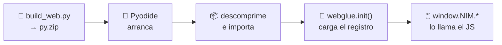

# La página web

La [página en vivo](https://jparisu.github.io/nim-arena) es un **sitio
estático** servido por GitHub Pages. Carga [Pyodide](https://pyodide.org)
(Python compilado a WebAssembly) y ejecuta **el mismo** motor de juego y los
mismos jugadores de IA en tu navegador.

!!! quote "Una única fuente de verdad"
    Las reglas y las IA vienen del Python compartido, ejecutado con Pyodide. Las
    reglas **nunca** se reimplementan en JavaScript. El trabajo de JavaScript es
    deliberadamente fino: dibujar el tablero, gestionar los clics, animar y
    llevar la línea temporal.

---

## Cómo carga

1. `scripts/build_web.py` empaqueta la librería, todo el árbol `players/` y el
   puente `webglue.py` en `web/py.zip`.
2. En el navegador, `pyodide-bootstrap.js` arranca Pyodide, carga PyYAML,
   descarga `py.zip`, lo descomprime en el sistema de archivos virtual de
   Pyodide e importa `webglue`.
3. `webglue.init()` carga el manifiesto y rellena el registro.
4. Los scripts de la página llaman al puente (`window.NIM.*`) para cada
   comprobación de reglas y cada jugada de la IA.

Todo cruza la frontera Python↔JS como **cadenas JSON**: el estado es una lista
de enteros y las jugadas son `[fila, cantidad]`. Nada de objetos propios.

---

## Qué puedes hacer en ella

| | Funcionalidad | Qué hace |
|---|---|---|
| 🎛️ | **Tablero configurable** | número de filas y palos por fila |
| 👥 | **Elige cada asiento** | humano o cualquier IA registrada |
| 🔄 | **Cambiar de bot a mitad de partida** | surte efecto en la jugada siguiente, sin reiniciar |
| ⏯️ | **IA contra IA con ritmo** | un retardo configurable entre jugadas para poder seguirlas |
| ⏪ | **Repetición y viaje en el tiempo** | arrastra la línea temporal, avanza jugada a jugada, vuelve al estado en vivo |
| 🔍 | **Modo rayos X** | superpone el nim-sum y resalta la fila que tocaría el juego óptimo |
| 🧠 | **Panel «¿por qué ha hecho eso?»** | el razonamiento que publica la IA: profundidad, puntuación, nodos y tiempo |
| 💡 | **Modo pista** | muestra la jugada óptima para el asiento humano |
| 🏆 | **Página de torneo** | construye tu propio cuadro de 4, 8 o 16, con bots y personas mezclados |
| 🔗 | **Partida compartible** | el historial se codifica en la URL: compartes un enlace y se repite |

!!! info "El modo pista no es un bot"
    `webglue.perfect_analysis` calcula directamente la jugada del nim-sum. Por
    eso puede enseñarte el juego perfecto aunque el jugador *admitido* más
    fuerte todavía se pueda ganar.

---

## Lo que la página *no* hace

| No hay… | Por qué |
|---|---|
| **tiempos límite** | el juego en vivo es de mejor esfuerzo; los tiempos y las descalificaciones pertenecen al [torneo](tournament.md), que se ejecuta en CI |
| **backend, secretos ni servicios de pago** | todo es estático, más Pyodide, más un archivo JSON descargado |
| **botón de «ejecutar el torneo»** | dispararlo desde una página estática exigiría exponer un token en el navegador. Usa la interfaz «Run workflow» de GitHub |

---

## La pantalla del marcador

Descarga `leaderboard.json` (copiado junto a la página por la construcción) y
renderiza resultados producidos enteramente por el workflow del torneo. No se
juega ninguna partida para dibujarla: es renderizado puro de datos.

---

**Siguiente:** [El marcador](scoreboard.md) — la estructura del archivo que lee.
