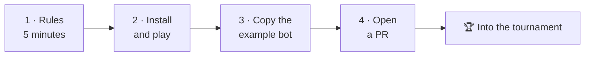

# The game

The manual of **NIM Arena**: what the project contains, how the pieces fit, and
how you add a player of your own.

---

## The shortest path to a player of your own

| Step | What you do | Page |
|---|---|---|
| 1 | Understand NIM and the strategy that wins it | [Game rules](rules.md) |
| 2 | Install the package and play a game | [Getting started](getting-started.md) |
| 3 | Write your AI: one class, one method | [Player API](upload-a-bot/player-api.md) |
| 4 | Send it as a pull request | [Submit a player](upload-a-bot/submit-a-player.md) |

---

## Start here

- :material-book-open-variant:{ .lg .middle } **[Game rules](rules.md)**

    ---

    How NIM works, and the XOR strategy that wins it. Five minutes.

- :material-rocket-launch:{ .lg .middle } **[Getting started](getting-started.md)**

    ---

    Install, play a game, run the tests and the tournament.

---

## Then pick your path

- :material-robot:{ .lg .middle } **[Upload a new bot](upload-a-bot/index.md)**

    ---

    *You want to write an AI.* The
    [player API](upload-a-bot/player-api.md) your class implements, and the
    [Pull Request flow](upload-a-bot/submit-a-player.md) that gets it into the
    next tournament. Two pages, nothing else needed.

- :material-cog-outline:{ .lg .middle } **[Advanced documentation](advanced/index.md)**

    ---

    *You want to understand the machinery.* The
    [code structure](advanced/code-structure.md), the
    [tournament](advanced/tournament.md), the
    [scoreboard](advanced/scoreboard.md), the
    [web app](advanced/web.md) and the full
    [API reference](advanced/api.md).

!!! tip "Are Git, forks or pull requests new to you?"
    The [Guide](../guide/index.md) teaches them from scratch, using this same
    repository as the worked example.
