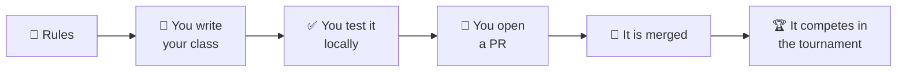

# Upload a new bot

Everything you need to write an AI of your own and get it into the tournament.
Two pages, no detours.

---

## The path

- :material-code-braces:{ .lg .middle } **[1 · Player API](player-api.md)**

    ---

    The exact interface every AI implements, with a minimal example you can
    copy and that already works.

- :material-source-pull:{ .lg .middle } **[2 · Submit a player](submit-a-player.md)**

    ---

    The Pull Request flow that puts it in the next tournament run.

---

## Before you start

| If you do not have… | Go to |
|---|---|
| the rules of NIM clear | [Game rules](../rules.md) |
| the package installed | [Getting started](../getting-started.md) |
| a grip on Git and pull requests | [Guide](../../guide/index.md) |

---

## Once it is merged

- [The tournament](../advanced/tournament.md) — how your bot is scored.
- [The scoreboard](../advanced/scoreboard.md) — where the result shows up.
