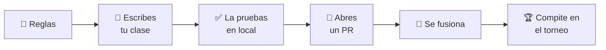

# Subir un bot nuevo

Todo lo que necesitas para escribir una IA propia y meterla en el torneo.

---

## El recorrido

- :material-code-braces:{ .lg .middle } **[1 · API de jugador](player-api.md)**

    ---

    La interfaz exacta que implementa cada IA, con un ejemplo mínimo que
    puedes copiar y que ya funciona.

- :material-source-pull:{ .lg .middle } **[2 · Enviar un jugador](submit-a-player.md)**

    ---

    El flujo de pull request que la mete en la siguiente ejecución del torneo.

---

## Antes de empezar

| Si no tienes… | Ve a |
|---|---|
| claras las reglas del NIM | [Reglas del juego](../rules.md) |
| el paquete instalado | [Primeros pasos](../advanced/getting-started.md) |
| soltura con Git y los pull requests | [Guía](../../guide/index.md) |

---

## Cuando esté fusionado

- [El torneo](../advanced/tournament.md) — cómo se puntúa tu bot.
- [El marcador](../advanced/scoreboard.md) — dónde aparece el resultado.
