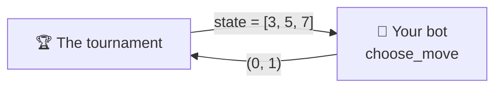

# Player API

A NIM Arena player is **a class with one method that decides the move**. That is
the whole contract. This page walks through it, starting from a bot that already
works.

---

## Start by copying this

The smallest correct player: always take one stick from the first non-empty row.
Copy it, rename it, and you have a valid bot.

```python
from nimarena.game import State
from nimarena.player import Player

class OneStickBot(Player):
    @classmethod
    def get_name(cls) -> str:
        return "OneStickBot"

    @classmethod
    def get_authors(cls) -> list[str]:
        return ["your name"]

    @classmethod
    def get_description(cls) -> str:
        return "Always takes a single stick from the first non-empty row."

    @classmethod
    def get_icon(cls) -> str:
        return "🪄"

    def choose_move(self, state: State) -> tuple[int, int]:
        for row, sticks in enumerate(state):
            if sticks > 0:
                return (row, 1)
        raise AssertionError("never called on an empty board")
```

That bot plays legal games from start to finish. It loses almost all of them,
but it **competes**. From here on you only change `choose_move`.

---

## What you just implemented



Five methods: four say **who you are**, one **plays**.

| Method | Returns | What it is |
|---|---|---|
| `get_name()` | `str` | your name, **unique** across all admitted players |
| `get_authors()` | `list[str]` | a non-empty list of names |
| `get_description()` | `str` | one or two sentences about your *strategy* |
| `get_icon()` | `str` | **one** emoji, shown next to your name |
| `choose_move(state)` | `tuple[int, int]` | the decision: `(row, count)` |

The first four are `@classmethod` because the tournament, the web app and the
docs need to label a player **without constructing one**.

!!! note "Python will not let you forget one"
    All five are abstract, so an incomplete subclass fails to instantiate, with a
    message naming the one you missed:

    ```text
    TypeError: Can't instantiate abstract class MyBot without an
               implementation for abstract method 'get_name'
    ```

!!! tip "Keep the icon to a single glyph"
    It renders in places that cannot handle markup (the scoreboard, a native
    `<select>`), and a two-glyph sequence breaks table alignment. The shipped
    ones use 🎲 `random`, 🌱 `easy`, 🧠 `medium`, ⚔️ `hard`.

---

## The exact types

### What you receive: `state`

A **list of ints**: the sticks left in each row.

```python
state = [3, 0, 4]     # row 0 → 3 sticks, row 1 → empty, row 2 → 4 sticks
```

| Fact | Rule |
|---|---|
| Type | `list[int]` |
| `len(state)` | number of rows |
| `state[i]` | sticks in **row `i`**, **0-indexed** |
| Empty rows | can exist (`0`) |
| Empty board | you **never** receive one: the game is already over |

!!! warning "Treat `state` as read-only"
    Do not mutate it. If you need to change it, copy first: `list(state)`. A bot
    that mutates the board it was given corrupts the game, and the tests reject
    it.

### What you return: the move

A **tuple of two ints**, `(row, count)`.

```python
return (2, 4)         # remove 4 sticks from row 2
```

A move is **legal** exactly when:

```text
0 <= row < len(state)   AND   1 <= count <= state[row]
```

The single source of truth is `nimarena.game.is_legal`. Return a real tuple of
two `int`s: booleans, lists, generators and wrong arities are all rejected.

---

## Helpers you can use

Your bot can import pure functions from `nimarena.game`. You do not have to
reimplement any of these:

| Function | What for |
|---|---|
| `legal_moves(state)` | every legal `(row, count)` move |
| `is_legal(state, move)` | check a move |
| `apply_move(state, move)` | a **new** state with the move applied (no mutation) |
| `is_terminal(state)` | `True` if the board is empty |
| `nim_sum(state)` | bitwise XOR of the rows — the signal behind the [winning strategy](../rules.md) |
| `total_sticks(state)` | total sticks remaining |

---

## The rules of the environment

The contract is tiny, but the tournament that calls your bot has rules of its
own. None of them appear in a method signature, so they are easy to forget.

### You get a time budget per game

**2 seconds for the whole game**, not per move. It is cumulative: you can burn
1.5 s on a hard position and play the rest instantly. There is a separate 2 s
budget for constructing your player.

!!! warning "Timing is measured on GitHub runners"
    They are slower and more variable than your laptop. A bot that fits the
    budget locally can still time out in the official run. Write efficient code.

### Every failure costs that game, never the run

| What you did | Recorded as |
|---|---|
| Went over your game budget, or hung | `forfeit_timeout` |
| Raised an exception while choosing a move | `forfeit_error` |
| Returned something that is not a legal `(row, count)` | `forfeit_illegal` |
| Went over the budget while being constructed | `forfeit_build_timeout` |
| Raised an exception while being constructed | `forfeit_build_error` |

In every case you lose **that** game, the reason is recorded, and the tournament
continues. It never crashes because of you — but a bot that fails is not merged.

### Your state lives inside one game

Caches, memo tables and your random generator's position survive from move to
move **within their own game**, and disappear when it ends. Do not try to carry
anything between games.

!!! warning "Keep it small"
    Do not go looking for move history, timers or the opponent's identity inside
    `choose_move`. That belongs to the *tournament calling you*, not to the
    contract. **A player is a pure function of the board.**

---

## If your bot uses randomness: `create(seed)`

The tournament builds every player by calling `create(seed)`, never the class
directly. It defaults to `cls()`, so **you can ignore it**. If your bot uses
randomness or needs configuration, override it:

```python
@classmethod
def create(cls, seed: int) -> "MyBot":
    return cls(depth=4, seed=seed)
```

Using the seed you are handed makes your games reproducible: the same tournament
run gives the same result twice.

---

## Optional extras

??? tip "Reuse one of our searches instead of writing your own"
    The searches behind the reference players are public API in `nimarena.bots`.
    You can subclass one and override its hooks. This is all of
    `players/builtin/hard.py`:

    ```python
    from nimarena.bots import SmartMinimaxBot

    DEPTH = 4

    class Hard(SmartMinimaxBot):
        @classmethod
        def get_name(cls) -> str:
            return "hard"

        @classmethod
        def get_authors(cls) -> list[str]:
            return ["jparisu"]

        @classmethod
        def get_description(cls) -> str:
            return f"Minimax with alpha-beta pruning, searching {DEPTH} plies."

        @classmethod
        def get_icon(cls) -> str:
            return "⚔️"

        @classmethod
        def create(cls, seed: int) -> "Hard":
            return cls(depth=DEPTH, seed=seed)
    ```

    `MinimaxBot` gives you negamax with alpha-beta pruning and two hooks:

    | Hook | Returns | Meaning |
    |------|---------|---------|
    | `evaluate(state)` | float inside `(LOSS, WIN)` | scores a position at the depth limit |
    | `known_value(state)` | float, or `None` | the **exact** value of a position you already know |

    `known_value` is consulted before the depth cutoff, so a recognized position
    ends that branch immediately. It must be exact, never an estimate.

??? tip "Publish your reasoning for the “why did it do that?” panel"
    The minimax-based players fill a `self.last_info` dictionary after each move
    with the depth searched, the score and the node count. The
    [web app](../advanced/web.md) reads it and displays it. You can do the same,
    but it is never required: the tournament ignores it.

---

**Next:** [Submit a player](submit-a-player.md) — the pull request flow, step by
step.
