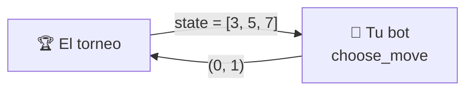

# API de jugador

Para crear tu propio jugador de NIM para este repositorio, solo debes implementar la clase `Player`.
En esta clase tienes un método que decide la jugada, esta será la estrategia de tu jugador.
Esta página te ayuda a escribir tu propio bot desde 0.

---

## Empieza copiando esto

El jugador correcto más pequeño: retirar siempre un palo de la primera fila no
vacía. Cópialo, cámbiale el nombre y ya tienes un bot válido.

```python
from nimarena.game import State
from nimarena.player import Player

class OneStickBot(Player):
    @classmethod
    def get_name(cls) -> str:
        return "OneStickBot"

    @classmethod
    def get_authors(cls) -> list[str]:
        return ["tu nombre"]

    @classmethod
    def get_description(cls) -> str:
        return "Always takes a single stick from the first non-empty row."

    @classmethod
    def get_icon(cls) -> str:
        return "🪄"

    def choose_move(self, state: State) -> tuple[int, int]:
        for row, sticks in enumerate(state):
            if sticks > 0:
                return (row, 1)
        raise AssertionError("never called on an empty board")
```

Ese bot juega partidas legales de principio a fin. Pierde casi todas, pero
**compite**. A partir de aquí solo cambias `choose_move`.

---

## Lo que acabas de implementar



Son cinco métodos: cuatro dicen **quién eres** y uno **juega**.

| Método | Devuelve | Qué es |
|---|---|---|
| `get_name()` | `str` | tu nombre, **único** entre todos los jugadores admitidos |
| `get_authors()` | `list[str]` | lista no vacía de nombres |
| `get_description()` | `str` | una o dos frases sobre tu *estrategia* |
| `get_icon()` | `str` | **un** emoji, que se muestra junto a tu nombre |
| `choose_move(state)` | `tuple[int, int]` | la decisión: `(fila, cantidad)` |

Los cuatro primeros son `@classmethod` porque el torneo, la web y la
documentación necesitan etiquetar a un jugador **sin construir uno**.

!!! note "Python no te deja olvidarte de ninguno"
    Los cinco son abstractos, así que una subclase incompleta falla al
    instanciarse, con un mensaje que dice cuál falta:

    ```text
    TypeError: Can't instantiate abstract class MyBot without an
               implementation for abstract method 'get_name'
    ```

!!! tip "Que el icono sea un solo glifo"
    Se renderiza en sitios que no admiten marcado (el marcador, un `<select>`
    nativo), y una secuencia de dos glifos rompe la alineación de las tablas.
    Los incluidos usan 🎲 `random`, 🌱 `easy`, 🧠 `medium`, ⚔️ `hard`.

---

## Los tipos exactos

### Lo que recibes: `state`

Una **lista de enteros**: los palos que quedan en cada fila.

```python
state = [3, 0, 4]     # fila 0 → 3 palos, fila 1 → vacía, fila 2 → 4 palos
```

| Dato | Regla |
|---|---|
| Tipo | `list[int]` |
| `len(state)` | número de filas |
| `state[i]` | palos en la **fila `i`**, indexada desde **0** |
| Filas vacías | pueden existir (`0`) |
| Tablero vacío | **nunca** lo recibes: ahí la partida ya ha acabado |


### Lo que devuelves: la jugada

Una **tupla de dos enteros**, `(fila, cantidad)`.

```python
return (2, 4)         # retira 4 palos de la fila 2
```

Una jugada es **legal** exactamente cuando:

```text
0 <= fila < len(state)   Y   1 <= cantidad <= state[fila]
```

La única fuente de verdad es `nimarena.game.is_legal`. Devuelve una tupla real
de dos `int`: booleanos, listas, generadores y aridades incorrectas se rechazan.

---

## Utilidades que puedes usar

Tu bot puede importar funciones puras de `nimarena.game`. No tienes que
reimplementar ninguna de estas:

| Función | Para qué |
|---|---|
| `legal_moves(state)` | todas las jugadas `(fila, cantidad)` legales |
| `is_legal(state, move)` | comprobar una jugada |
| `apply_move(state, move)` | un estado **nuevo** con la jugada aplicada (sin mutar) |
| `is_terminal(state)` | `True` si el tablero está vacío |
| `total_sticks(state)` | palos restantes en total |

---

## Las reglas del entorno

El contrato es diminuto, pero el torneo que llama a tu bot tiene sus propias
reglas. No aparecen en ninguna firma de método, así que es fácil olvidarlas.

### Tienes un presupuesto de tiempo por partida

**2 segundos para toda la partida**, no por jugada. Es acumulativo: puedes
quemar 1,5 s en una posición difícil y jugar el resto al instante. Hay un
segundo presupuesto aparte de 2 s para construir tu jugador.

!!! warning "El tiempo se mide en los runners de GitHub"
    Son más lentos y más variables que tu portátil. Un bot que cabe en el
    presupuesto en local todavía puede agotar el tiempo en la ejecución
    oficial. Escribe código eficiente.

### Cada fallo cuesta esa partida, nunca la ejecución

| Qué hiciste | Se registra como |
|---|---|
| Superaste tu presupuesto de partida, o te colgaste | `forfeit_timeout` |
| Lanzaste una excepción al elegir jugada | `forfeit_error` |
| Devolviste algo que no es una `(fila, cantidad)` legal | `forfeit_illegal` |
| Superaste el presupuesto al construirte | `forfeit_build_timeout` |
| Lanzaste una excepción al construirte | `forfeit_build_error` |

En todos los casos pierdes **esa** partida, se registra el motivo y el torneo
continúa. Nunca se cae por tu culpa — pero un bot que falla no se fusiona.

### Tu estado vive dentro de una partida

Las cachés, tablas de memoización y la posición de tu generador aleatorio
persisten de jugada a jugada **dentro de su propia partida**, y desaparecen al
terminarla. No intentes arrastrar nada entre partidas.

!!! warning "Mantenlo pequeño"
    No busques historial de jugadas, temporizadores ni la identidad del rival
    dentro de `choose_move`. Eso pertenece al *torneo que te llama*, no al
    contrato. **Un jugador es una función pura del tablero.**

---

## Si tu bot usa azar: `create(seed)`

El torneo construye todos los jugadores llamando a `create(seed)`, nunca a la
clase directamente. Por defecto hace `cls()`, así que **puedes ignorarlo**. Si
tu bot usa azar o necesita configuración, sobreescríbelo:

```python
@classmethod
def create(cls, seed: int) -> "MyBot":
    return cls(depth=4, seed=seed)
```

Usar la semilla que te dan hace que tus partidas sean reproducibles: la misma
ejecución del torneo da el mismo resultado dos veces.

---

## Extras opcionales

??? tip "Reutilizar una de nuestras búsquedas en vez de escribir la tuya"
    Las búsquedas que hay detrás de los jugadores de referencia son API pública
    en `nimarena.bots`. Puedes heredar de una y sobreescribir sus métodos. Esto
    es `players/builtin/random.py` al completo:

    ```python
    from __future__ import annotations
    import random

    from nimarena.bots import SmartMinimaxBot
    from nimarena.game import Move, State, legal_moves

    DEPTH = 4

    class Random(RandomBot):
        """Picks a legal move uniformly at random."""

        def __init__(self, seed: int | None = None) -> None:
            """Create the bot.

            Args:
                seed: seed for the private RNG. A private RNG keeps the bot
                    reproducible without touching global random state.
            """
            self._rng = random.Random(seed)

        @classmethod
        def create(cls, seed: int) -> RandomBot:
            """Build an instance seeded for one game."""
            return cls(seed=seed)

        @classmethod
        def get_name(cls) -> str:
            return "random"

        @classmethod
        def get_authors(cls) -> list[str]:
            return ["builtin"]

        @classmethod
        def get_icon(cls) -> str:
            return "🎲"

        @classmethod
        def get_description(cls) -> str:
            return (
                "Picks uniformly at random among all legal moves. No strategy at all "
                "— the baseline every other player has to beat."
            )

        def choose_move(self, state: State) -> Move:
            """Return a legal move chosen uniformly at random."""
            return self._rng.choice(legal_moves(state))

    Puedes ver el código fuente [aquí](https://github.com/jparisu/nim-arena/blob/main/players/random.py).

    ```


??? tip "Publicar tu razonamiento para el panel «¿por qué ha hecho eso?»"
    Los jugadores basados en minimax rellenan un diccionario `self.last_info`
    tras cada jugada con la profundidad explorada, la puntuación y el número de
    nodos. La [página web](../advanced/web.md) lo lee y lo muestra. Puedes hacer
    lo mismo, pero nunca es obligatorio: el torneo lo ignora.

---

**Siguiente:** [Enviar un jugador](submit-a-player.md) — el flujo de pull
request, paso a paso.
