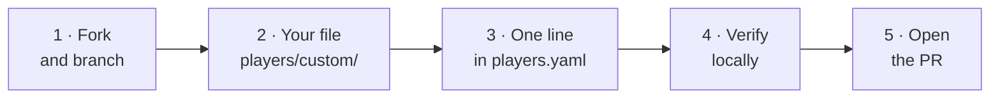

# Submit a new player

New players arrive by **pull request**. There is no separate upload form: you
fork the repo, add a file, add a line to the manifest and open a PR. Someone
reviews it and merges it.



!!! info "Your code only ever runs after a human accepts the PR"
    That is why human review is the project's security gate, and why there are
    explicit acceptance criteria [at the end of this page](#acceptance-criteria).

---

## Step 1 — Fork and branch

Fork [`jparisu/nim-arena`](https://github.com/jparisu/nim-arena), clone your
fork and create a branch:

```bash
git clone https://github.com/<your-user>/nim-arena
cd nim-arena
python -m venv .venv && source .venv/bin/activate
pip install -e ".[dev]"
git checkout -b add-my-bot
```

---

## Step 2 — Add your player file

Create `players/custom/<your_bot>.py`. The easiest start is the
[minimal example from the Player API](player-api.md#start-by-copying-this).

Here is a slightly smarter bot, applying the
[nim-sum strategy](../rules.md#the-winning-strategy-the-nim-sum):

```python
# players/custom/corner_bot.py
from nimarena.game import State, legal_moves, nim_sum
from nimarena.player import Player

class CornerBot(Player):
    @classmethod
    def get_name(cls) -> str:
        return "corner"

    @classmethod
    def get_authors(cls) -> list[str]:
        return ["your-github-handle"]

    @classmethod
    def get_description(cls) -> str:
        return "Reduces a row to leave a zero nim-sum whenever one exists."

    @classmethod
    def get_icon(cls) -> str:
        return "📐"

    def choose_move(self, state: State) -> tuple[int, int]:
        # Try to leave the nim-sum at zero; otherwise take a single stick.
        target = nim_sum(state)
        for row, sticks in enumerate(state):
            reduce_to = sticks ^ target
            if reduce_to < sticks:
                return (row, sticks - reduce_to)
        return legal_moves(state)[0]
```

---

## Step 3 — Register it in the manifest

Add **exactly one entry** to
[`players/custom/players.yaml`](https://github.com/jparisu/nim-arena/blob/main/players/custom/players.yaml):

```yaml
  - file: corner_bot.py
    class: CornerBot
```

There are only **two** fields to write:

| Field | Meaning |
|-------|---------|
| `file` | the `.py` file. A bare name resolves inside `players/custom/`; a path with `/` resolves from the repository root |
| `class` | the `Player` subclass being admitted |

Your name, authors and description come from the class itself, so there is
nothing here to keep in sync.

!!! info "Why a manifest and not a folder scan?"
    The manifest makes the trust boundary **visible**. In a single PR diff the
    reviewer sees both your new file and the one line admitting it. An automatic
    scan would hide what is being admitted, and would run your top-level code
    just to discover it.

---

## Step 4 — Verify locally

```bash
pytest                         # must be green
nim-tournament --no-subprocess # play your bot against the reference players
```

!!! tip "Run the tournament, not just the tests"
    The tournament is what plays your bot, so it is what catches an illegal
    move, a crash or a timeout — and a bot that does any of those is not merged.
    Do it before you open the PR.

---

## Step 5 — Open the pull request

Push your branch and open a PR from your fork. The repository ships a dedicated
new-player template at
[`.github/PULL_REQUEST_TEMPLATE/new_player.md`](https://github.com/jparisu/nim-arena/blob/main/.github/PULL_REQUEST_TEMPLATE/new_player.md);
select it by appending `?template=new_player.md` to the PR URL, or paste it into
the description yourself.

CI runs on every push to the PR:

| Check | What it looks at |
|---|---|
| `ruff` | style and obvious mistakes |
| `mypy` | types |
| `pytest` | the test suite, on three Python versions |
| smoke tournament | that your bot plays legal games |
| docs | that the site builds without warnings |

**A red check is a blocked merge.**

If any of that is new to you, the [Guide](../../guide/index.md) covers
[forking and branching](../../guide/github/workflow.md),
[pull requests](../../guide/github/pull-requests.md) and
[what the CI checks do](../../guide/github/actions.md).

---

## Acceptance criteria { #acceptance-criteria }

Your PR is merged only if it passes **all three**:

| | Criterion | What is checked |
|---|---|---|
| 1 | **Design** | one file in `players/custom/`, one manifest line, subclasses `Player`, unique name, minimal and readable |
| 2 | **Correctness** | CI is green; returns legal moves; never mutates state; does not error or time out |
| 3 | **No malware** | the reviewer reads the code: no network, filesystem, subprocess, `eval`/`exec` or obfuscation |

!!! danger "A player that errors or times out is not merged"
    Robustness of your bot is **your** responsibility. The tournament will
    survive a bad player — it forfeits and the run continues — but we do not
    ship one.

---

## Rules recap

- ✅ Return a legal move `(row, count)`.
- ✅ Declare a unique name; CI rejects a repeated one.
- ✅ Be fast: the budget is measured on GitHub runners, slower than your laptop.
- ❌ Do not mutate `state`.
- ❌ No external dependencies beyond the standard library and `nimarena`.
- ❌ No network, filesystem or subprocess access.

---

**Next:** [The tournament](../advanced/tournament.md) — how your bot is scored
once it is in.
