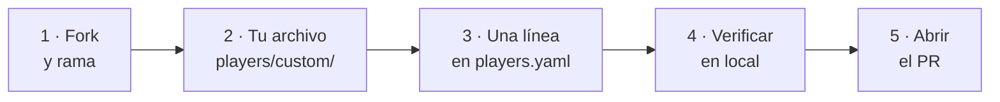

# Enviar un jugador nuevo

Para que tu jugador se publique y evalúe con el resto de jugadores, debes subir una Pull Request al repositorio, esperar que alguien la valide y la mergee.



!!! info "Tu código solo se ejecuta después de que alguien acepte el PR"
    Por eso la revisión humana es la puerta de seguridad del proyecto, y por eso
    hay criterios de aceptación explícitos [al final de esta página](#criterios-de-aceptacion).

---

## Paso 1 — Fork y rama

Haz un fork de [`jparisu/nim-arena`](https://github.com/jparisu/nim-arena), clona
tu fork y crea una rama:

```bash
git clone https://github.com/<tu-usuario>/nim-arena
cd nim-arena
python -m venv .venv && source .venv/bin/activate
pip install -e ".[dev]"
git checkout -b add-my-bot
```

---

## Paso 2 — Añade el archivo de tu jugador

Crea `players/custom/<tu_bot>.py`. Lo más fácil es empezar por el
[ejemplo mínimo de la API de jugador](player-api.md#empieza-copiando-esto).

---

## Paso 3 — Regístralo en el manifiesto

Añade **exactamente una entrada** a
[`players/custom/players.yaml`](https://github.com/jparisu/nim-arena/blob/main/players/custom/players.yaml):

```yaml
  - file: corner_bot.py
    class: CornerBot
```

Solo hay **dos** campos que escribir:

| Campo | Significado |
|-------|-------------|
| `file` | el archivo `.py`. Un nombre suelto se resuelve en `players/custom/`; una ruta con `/` se resuelve desde la raíz del repositorio |
| `class` | la subclase de `Player` que se admite |

Tu nombre, autores y descripción vienen de la propia clase, así que aquí no hay
nada que mantener sincronizado.

---

## Paso 4 — Verifica en local

```bash
pytest tests/test_custom_players.py   # comprueba tu jugador
nim-tournament --no-subprocess # juega tu bot contra los de referencia
```

!!! tip "Ejecuta el torneo, no solo los tests"
    El torneo es lo que juega con tu bot, así que es lo que detecta una jugada
    ilegal, un fallo o un tiempo agotado — y un bot que haga cualquiera de esas
    cosas no se fusiona. Hazlo antes de abrir el PR.

---

## Paso 5 — Abre el pull request

Sube tu rama y abre un PR desde tu fork. El repositorio incluye una plantilla
específica para jugadores nuevos en
[`.github/PULL_REQUEST_TEMPLATE/new_player.md`](https://github.com/jparisu/nim-arena/blob/main/.github/PULL_REQUEST_TEMPLATE/new_player.md);
selecciónala añadiendo `?template=new_player.md` a la URL del PR, o pégala tú en
la descripción.

CI se ejecuta en cada push al PR:

| Comprobación | Qué mira |
|---|---|
| `ruff` | estilo y errores evidentes |
| `mypy` | tipos |
| `pytest` | las pruebas, en tres versiones de Python |
| jugadores enviados | tu jugador: identidad, movimientos legales y partidas contra `random` |
| torneo de humo | que tu bot juegue partidas legales |
| documentación | que el sitio construya sin avisos |

**Una comprobación en rojo es una fusión bloqueada.**

Si todo esto te resulta nuevo, la [Guía](../../guide/index.md) cubre
[forks y ramas](../../guide/github/workflow.md),
[pull requests](../../guide/github/pull-requests.md) y
[qué hacen las comprobaciones de CI](../../guide/github/actions.md).

---

## Criterios de aceptación { #criterios-de-aceptacion }

Tu PR se fusiona solo si pasa **los tres**:

| | Criterio | Qué se mira |
|---|---|---|
| 1 | **Diseño** | un archivo en `players/custom/`, una línea de manifiesto, hereda de `Player`, nombre único, mínimo y legible |
| 2 | **Corrección** | CI en verde; devuelve jugadas legales; nunca muta el estado; no falla ni agota el tiempo |
| 3 | **Sin malware** | quien revisa lee el código: nada de red, sistema de archivos, subprocesos, `eval`/`exec` ni ofuscación |

!!! danger "Un jugador que falla o agota el tiempo no se fusiona"
    La robustez de tu bot es **tu** responsabilidad. El torneo sobrevivirá a un
    jugador malo —pierde la partida y la ejecución continúa— pero no lo
    publicamos.

---

## Resumen de reglas

- ✅ Devuelve una jugada legal `(fila, cantidad)`.
- ✅ Declara un nombre único; CI rechaza uno repetido.
- ✅ Sé rápido: el presupuesto se mide en los runners de GitHub, más lentos que
  tu portátil.
- ❌ No mutes `state`.
- ❌ Sin dependencias externas más allá de la librería estándar y `nimarena`.
- ❌ Sin acceso a red, sistema de archivos ni subprocesos.

---

**Siguiente:** [El torneo](../advanced/tournament.md) — cómo se puntúa tu bot
una vez dentro.
