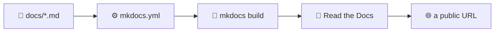

# Documentation

Code nobody can use is not finished. This section is about the other half of a
project: writing documentation, building it as a website, and publishing that
site automatically.

---

## From a folder of Markdown to a published site

Everything here is demonstrated by the site you are reading: it lives in
`docs/`, it is configured by `mkdocs.yml`, a
[GitHub Action](../github/actions.md#building-the-documentation) builds it on
every pull request, and Read the Docs publishes it.

---

## The pages

- :material-pencil-outline:{ .lg .middle } **[1 · Documenting a project](documentation.md)**

    ---

    What to write, where it lives, and why it belongs in the repository.

- :material-file-document-multiple-outline:{ .lg .middle } **[2 · MkDocs](mkdocs.md)**

    ---

    Turning a folder of Markdown into a website, including API pages generated
    from docstrings.

- :material-cloud-upload-outline:{ .lg .middle } **[3 · Read the Docs](readthedocs.md)**

    ---

    Hosting it, versioning it, and building it on every push.

- :material-frequently-asked-questions:{ .lg .middle } **[FAQ](docs-faq.md)**

    ---

    Quick answers to the usual doubts.

!!! info "Two publishing targets, one repository"
    This project publishes **two** sites: the playable web app on
    [GitHub Pages](../github/pages.md) and these docs on Read the Docs. They are
    different artifacts with different needs; the
    [Read the Docs](readthedocs.md) page explains when to pick which.
