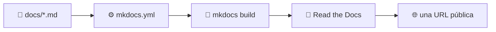

# Documentación

El código que nadie puede usar no está terminado. Esta sección trata de la otra
mitad de un proyecto: escribir documentación, construirla como sitio web y
publicar ese sitio automáticamente.

---

## De una carpeta de Markdown a un sitio publicado

Todo lo de aquí está demostrado por el sitio que estás leyendo: vive en `docs/`,
lo configura `mkdocs.yml`, lo construye una
[GitHub Action](../github/actions.md#construir-la-documentacion) en cada pull
request y lo publica Read the Docs.

---

## Las páginas

- :material-pencil-outline:{ .lg .middle } **[1 · Documentar un proyecto](documentation.md)**

    ---

    Qué escribir, dónde vive y por qué pertenece al repositorio.

- :material-file-document-multiple-outline:{ .lg .middle } **[2 · MkDocs](mkdocs.md)**

    ---

    Convertir una carpeta de Markdown en un sitio web, incluidas páginas de API
    generadas desde los docstrings.

- :material-cloud-upload-outline:{ .lg .middle } **[3 · Read the Docs](readthedocs.md)**

    ---

    Alojarlo, versionarlo y construirlo en cada push.

- :material-frequently-asked-questions:{ .lg .middle } **[Preguntas frecuentes](docs-faq.md)**

    ---

    Respuestas rápidas a las dudas habituales.

!!! info "Dos destinos de publicación, un repositorio"
    Este proyecto publica **dos** sitios: la web jugable en
    [GitHub Pages](../github/pages.md) y esta documentación en Read the Docs. Son
    artefactos distintos con necesidades distintas; la página de
    [Read the Docs](readthedocs.md) explica cuándo elegir cuál.
