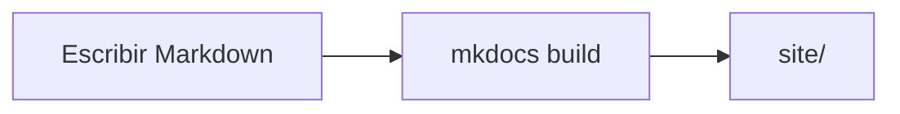

# MkDocs

**MkDocs** convierte una carpeta de archivos Markdown en un sitio web estático.
Tú escribes `docs/*.md`, describes la navegación en `mkdocs.yml`, y un comando
produce un directorio `site/` de HTML que puedes alojar en cualquier parte.

Este sitio es un proyecto MkDocs, así que todos los ejemplos de esta página son
reales.

## Los dos comandos

```bash
pip install -e ".[docs]"    # el extra docs de este proyecto

mkdocs serve                # vista previa recargable en http://127.0.0.1:8000
mkdocs build --strict       # produce site/, y falla ante cualquier aviso
```

`mkdocs serve` reconstruye y refresca el navegador cada vez que guardas. Déjalo
corriendo mientras escribes.

`mkdocs build --strict` es lo que ejecuta CI. Sin `--strict`, un enlace interno
roto es un aviso impreso en un registro que nadie lee; con él, la construcción
falla y el pull request se pone en rojo. Úsalo en local antes de subir.

## `mkdocs.yml`

Un solo archivo lo configura todo. Los bloques, en el orden en que te importarán:

### Identidad

```yaml
site_name: NIM Arena
site_description: >-
  NIM Arena — el manual de referencia del proyecto y una guía del estudiante…
site_url: https://nim-arena.readthedocs.io
repo_url: https://github.com/jparisu/nim-arena
repo_name: jparisu/nim-arena
edit_uri: edit/main/docs/
```

`repo_url` pone un enlace al repositorio en la cabecera; `edit_uri` añade un lápiz
de «editar esta página» en cada página que abre el archivo correcto en GitHub. Dos
líneas, y la barrera para corregir una errata cae casi a cero.

### Tema

```yaml
theme:
  name: material
  palette:
    - media: "(prefers-color-scheme: dark)"
      scheme: slate
      primary: teal
      toggle: { icon: material/weather-sunny, name: Switch to light mode }
    - media: "(prefers-color-scheme: light)"
      scheme: default
      primary: teal
      toggle: { icon: material/weather-night, name: Switch to dark mode }
  features:
    - content.code.copy
    - navigation.indexes
    - navigation.footer
    - navigation.top
    - navigation.tracking
    - search.highlight
    - toc.follow
```

[Material for MkDocs](https://squidfunk.github.io/mkdocs-material/) es el tema que
usa casi todo el mundo. Trae buscador, alternancia claro/oscuro, navegación
adaptable, botones de copia en los bloques de código, y los estilos de aviso y de
tarjetas en los que se apoya esta guía.

### Navegación

```yaml
nav:
  - Home: index.md
  - The game:
      - game/index.md
      - Game rules: game/rules.md
      - Upload a new bot:
          - game/upload-a-bot/index.md
          - 1. Player API: game/upload-a-bot/player-api.md
  - Guide:
      - guide/index.md
      - Step-by-step guide: guide/step-by-step.md
      - Git:
          - guide/git/index.md
          - 1. What is Git: guide/git/git.md
```

El árbol `nav` es la barra lateral, en orden. Tres convenciones que merece la
pena copiar:

- **Divide el sitio en partes de primer nivel que respondan a preguntas
  distintas.** Este tiene dos — *El juego* documenta qué hace el proyecto, la
  *Guía* enseña a construir uno — y ninguna página pertenece a las dos. Anida un
  nivel más cuando una parte tiene dos públicos: *El juego* se divide en *Subir
  un bot nuevo* y *Documentación avanzada*.
- Una ruta suelta como **primera** entrada de una sección (`game/index.md`) hace
  que esa página sea la portada de la sección en lugar de una entrada aparte.
  Combínalo con la característica `navigation.indexes` del tema para que el
  propio título de la sección sea un enlace.
- Numerar los títulos (`1. What is Git`) le dice a quien lee que hay un orden
  previsto, cosa que una lista sin más no hace.

Una página que existe en `docs/` pero falta en `nav` genera un aviso — y con
`--strict`, un fallo. Es una virtud: caza la página que escribiste y olvidaste
enlazar.

### Extensiones de Markdown

El Markdown pelado no basta para escribir documentación técnica. Estas son las
extensiones que activa este sitio, y por qué:

```yaml
markdown_extensions:
  - admonition
  - attr_list
  - md_in_html
  - pymdownx.details
  - pymdownx.emoji: { ... }
  - pymdownx.superfences:
      custom_fences:
        - name: mermaid
          class: mermaid
          format: !!python/name:pymdownx.superfences.fence_code_format
  - pymdownx.tabbed: { alternate_style: true }
  - pymdownx.highlight: { anchor_linenums: true }
  - pymdownx.inlinehilite
  - tables
  - toc: { permalink: true }
```

| Extensión | Te da |
| --- | --- |
| `admonition` + `pymdownx.details` | cajas `!!! tip`, y las plegables `???` |
| `attr_list` + `md_in_html` | los bloques `grid cards` de Material |
| `pymdownx.superfences` + `custom_fences` | diagramas mermaid en vez del código del diagrama |
| `pymdownx.tabbed` | pestañas de contenido `=== "Pestaña"` |
| `toc: permalink` | el ancla ¶ junto a cada encabezado |

Un aviso es una línea marcadora y cuatro espacios de indentación debajo:

```markdown
!!! warning "El tiempo se mide en CI"
    Los runners de GitHub son más lentos que un portátil.

??? question "¿Esto se puede plegar?"
    Sí — `???` empieza plegado, `???+` empieza abierto.
```

Y un diagrama es un bloque cercado:

````markdown

````

!!! danger "La cuadrícula de tarjetas falla en silencio"
    El bloque `<div class="grid cards" markdown>` de Material necesita **las dos**
    extensiones `attr_list` y `md_in_html`. Sin ellas MkDocs emite un `<div>` en
    bruto envolviendo Markdown sin procesar, **no informa de ningún aviso**, y
    `mkdocs build --strict` sigue en verde mientras la página está visiblemente
    rota. Si una cuadrícula de tarjetas se renderiza como una lista de texto
    literal, esa es la causa.

## Páginas de API desde los docstrings

Escribir una referencia a mano garantiza que se quede desfasada.
[mkdocstrings](https://mkdocstrings.github.io/) la genera desde el código:

```yaml
plugins:
  - search
  - mkdocstrings:
      handlers:
        python:
          paths: [src]
          options:
            show_source: true
            show_root_heading: true
            docstring_style: google
```

Después, una única directiva en cualquier página renderiza la firma de un objeto,
sus anotaciones de tipo, su tabla de argumentos y un enlace a las líneas de
código:

```markdown
::: nimarena.player.Player
```

`docstring_style: google` es lo que convierte los bloques `Args:` / `Returns:` /
`Raises:` en tablas. Elige un estilo, decláralo una vez y escribe todos los
docstrings así — véase [API](../python-library/api.md).

## CSS adicional

`extra_css` carga tu propia hoja de estilos al final, para que puedas
sobreescribir el tema:

```yaml
extra_css:
  - stylesheets/extra.css
```

Este proyecto lo usa para dos cosas: dar a los diagramas mermaid suficiente
contraste en modo claro y oscuro, y ensanchar la columna de contenido para que los
bloques YAML de los workflows no queden apretados. Mantenlo pequeño — cada regla
que añades es una regla con la que puede pelearse la siguiente versión del tema.

## Dos idiomas desde un solo árbol

El sitio se publica en inglés y español gracias a
[mkdocs-static-i18n](https://ultrabug.github.io/mkdocs-static-i18n/). La
convención es un **sufijo en el nombre del archivo**: el idioma **por defecto** se
queda con el archivo *sin sufijo* y cada idioma adicional añade el suyo. Aquí el
español es el idioma por defecto, así que `page.md` es el español y `page.en.md`
su gemelo en inglés, uno al lado del otro en la misma carpeta.

```yaml
plugins:
  - search
  - i18n:
      docs_structure: suffix
      fallback_to_default: true
      languages:
        - locale: es
          name: Español
          default: true
          build: true
        - locale: en
          name: English
          build: true
          nav_translations:
            Reglas del juego: Game rules
            Guía: Guide
```

- El idioma **por defecto** se construye en la raíz del sitio; los demás bajo su
  código, aquí `/en/`. Cuál es el idioma por defecto no es una elección libre de
  etiquetas: el plugin exige que el idioma por defecto sea el que no lleva
  sufijo. Cambiar de idioma por defecto obliga a renombrar todos los archivos.
- El `nav` se declara **una sola vez**, con las rutas de los archivos sin sufijo
  y los títulos en el idioma por defecto. `nav_translations` traduce esos títulos
  a cada idioma.
- `fallback_to_default: true` sirve la página en el idioma por defecto cuando
  todavía no existe la traducción — así que un sitio traducido a medias sigue
  construyéndose y sigue navegándose.
- Las etiquetas de la barra lateral están en `mkdocs.yml` y no dentro de ninguna
  página, y por eso hacen falta las `nav_translations`.
- El orden importa: `i18n` reconfigura el índice de búsqueda por idioma, así que
  `search` tiene que estar registrado antes.

Una construcción, un despliegue, y Material pone un **selector de idioma** en la
cabecera — quien lee cambia de idioma sin salir de la página en la que está.

!!! tip "Las páginas de referencia generadas se quedan en inglés"
    Una página cuyo cuerpo sale de los docstrings renderiza el mismo texto en
    todos los idiomas. Traduce la prosa que la rodea y dilo con un aviso corto
    encima de la directiva, en vez de fingir que la referencia es bilingüe.

## Adónde ir después

- [Read the Docs](readthedocs.md) — construir y alojar esto automáticamente.
- [GitHub Actions](../github/actions.md#construir-la-documentacion) — la
  construcción `--strict` que se ejecuta en cada pull request.
- [API](../python-library/api.md) — escribir docstrings que merezca la pena
  generar.
