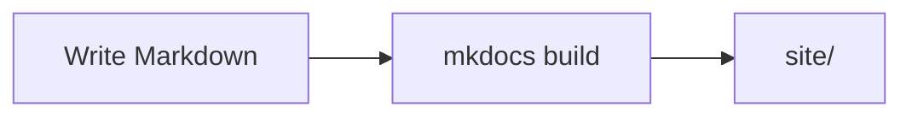

# MkDocs

**MkDocs** turns a folder of Markdown files into a static website. You write
`docs/*.md`, describe the navigation in `mkdocs.yml`, and one command produces a
`site/` directory of HTML you can host anywhere.

This site is a MkDocs project, so every example on this page is real.

## The two commands

```bash
pip install -e ".[docs]"    # the docs extra of this project

mkdocs serve                # live-reloading preview at http://127.0.0.1:8000
mkdocs build --strict       # produce site/, and fail on any warning
```

`mkdocs serve` rebuilds and refreshes the browser as you save. Keep it running
while you write.

`mkdocs build --strict` is what CI runs. Without `--strict`, a broken internal
link is a warning printed into a log nobody reads; with it, the build fails and
the pull request goes red. Use it locally before pushing.

## `mkdocs.yml`

One file configures everything. The blocks, in the order you will care about
them:

### Identity

```yaml
site_name: NIM Arena
site_description: >-
  NIM Arena — the reference manual of the project and a student guide…
site_url: https://nim-arena.readthedocs.io
repo_url: https://github.com/jparisu/nim-arena
repo_name: jparisu/nim-arena
edit_uri: edit/main/docs/
```

`repo_url` puts a link to the repository in the header; `edit_uri` adds an "edit
this page" pencil on every page that opens the right file on GitHub. Two lines,
and the barrier to fixing a typo drops to nearly zero.

### Theme

```yaml
theme:
  name: material
  palette:
    - media: "(prefers-color-scheme: dark)"
      scheme: slate
      primary: teal
      toggle: { icon: material/weather-sunny, name: Switch to light mode }
    - media: "(prefers-color-scheme: light)"
      scheme: default
      primary: teal
      toggle: { icon: material/weather-night, name: Switch to dark mode }
  features:
    - navigation.instant
    - navigation.sections
    - navigation.top
    - content.code.copy
    - toc.integrate
```

[Material for MkDocs](https://squidfunk.github.io/mkdocs-material/) is the theme
almost everyone uses. It brings search, a light/dark toggle, responsive
navigation, copy buttons on code blocks, and the admonition and card styles this
guide relies on.

### Navigation

```yaml
nav:
  - Home: index.md
  - NIM Arena:
      - arena/index.md
      - Game rules: arena/rules.md
      - Player API: arena/player-api.md
  - Student guide:
      - guide/index.md
      - Git:
          - guide/git/index.md
          - 1. What is Git: guide/git/git.md
```

The `nav` tree is the sidebar, in order. Two conventions worth copying:

- A bare path as the **first** entry of a section (`arena/index.md`) makes that
  page the section's landing page instead of a separate entry.
- Numbering the titles (`1. What is Git`) tells a reader there is an intended
  order, which a plain list does not.

A page that exists in `docs/` but is missing from `nav` is a warning — and with
`--strict`, a failure. That is a feature: it catches the page you wrote and
forgot to link.

### Markdown extensions

Plain Markdown is not enough for technical writing. These are the ones this site
enables and why:

```yaml
markdown_extensions:
  - admonition
  - attr_list
  - md_in_html
  - pymdownx.details
  - pymdownx.emoji: { ... }
  - pymdownx.superfences:
      custom_fences:
        - name: mermaid
          class: mermaid
          format: !!python/name:pymdownx.superfences.fence_code_format
  - pymdownx.tabbed: { alternate_style: true }
  - pymdownx.highlight: { anchor_linenums: true }
  - pymdownx.inlinehilite
  - tables
  - toc: { permalink: true }
```

| Extension | Gives you |
| --- | --- |
| `admonition` + `pymdownx.details` | `!!! tip` boxes, and collapsible `???` ones |
| `attr_list` + `md_in_html` | Material's `grid cards` blocks |
| `pymdownx.superfences` + `custom_fences` | mermaid diagrams instead of printed diagram source |
| `pymdownx.tabbed` | `=== "Tab"` content tabs |
| `toc: permalink` | the ¶ anchor beside every heading |

An admonition is four spaces of indentation under a marker line:

```markdown
!!! warning "Timing is measured in CI"
    GitHub's runners are slower than a laptop.

??? question "Is this collapsible?"
    Yes — `???` starts collapsed, `???+` starts open.
```

And a diagram is a fenced block:

````markdown

````

!!! danger "The card grid fails silently"
    Material's `<div class="grid cards" markdown>` needs **both** `attr_list` and
    `md_in_html`. Without them MkDocs emits a raw `<div>` wrapping unprocessed
    Markdown, reports **no warning**, and `mkdocs build --strict` stays green
    while the page is visibly broken. If a card grid renders as a bullet list of
    literal text, that is the cause.

## API pages from docstrings

Writing a reference by hand guarantees it goes stale.
[mkdocstrings](https://mkdocstrings.github.io/) generates it from the source
instead:

```yaml
plugins:
  - search
  - mkdocstrings:
      handlers:
        python:
          paths: [src]
          options:
            show_source: true
            show_root_heading: true
            docstring_style: google
```

Then a single directive in any page renders an object's signature, type hints,
argument table and a link to the source lines:

```markdown
::: nimarena.player.Player
```

`docstring_style: google` is what parses `Args:` / `Returns:` / `Raises:` blocks
into tables. Pick a style, declare it once, and write every docstring that way —
see [API](../python-library/api.md).

## Extra CSS

`extra_css` loads your own stylesheet last, so you can override the theme:

```yaml
extra_css:
  - stylesheets/extra.css
```

This project uses it for two things: giving mermaid diagrams enough contrast in
both light and dark mode, and widening the content column so the workflow YAML
blocks are not cramped. Keep it small — every rule you add is one the theme's
next version can fight with.

## Two languages from one tree

The site ships in English and Spanish through
[mkdocs-static-i18n](https://ultrabug.github.io/mkdocs-static-i18n/). The
convention is a **filename suffix**: `page.md` is English, `page.es.md` is its
Spanish twin, side by side in the same folder.

```yaml
plugins:
  - search
  - i18n:
      docs_structure: suffix
      languages:
        - locale: en
          name: English
          default: true
          build: true
        - locale: es
          name: Español
          build: true
          nav_translations:
            Game rules: Reglas del juego
            Student guide: Guía del estudiante
```

- The **default** language is built at the site root; the others under `/es/`.
- The `nav` is declared **once**, with English paths. The plugin substitutes the
  translated file when one exists and falls back to the English page when it does
  not — so a half-translated site still builds and still navigates.
- `nav_translations` translates the sidebar labels, which are in `mkdocs.yml`
  rather than in any page.
- Order matters: `i18n` reconfigures the search index per language, so `search`
  must already be registered above it.

!!! tip "Generated reference pages stay in English"
    A page whose body comes from docstrings renders the same text in every
    locale. Translate the prose around it, and say so with a short banner above
    the directive rather than pretending the reference is bilingual.

## Where to go next

- [Read the Docs](readthedocs.md) — building and hosting this automatically.
- [GitHub Actions](../github/actions.md#building-the-documentation) — the
  `--strict` build that runs on every pull request.
- [API](../python-library/api.md) — writing docstrings worth generating from.
