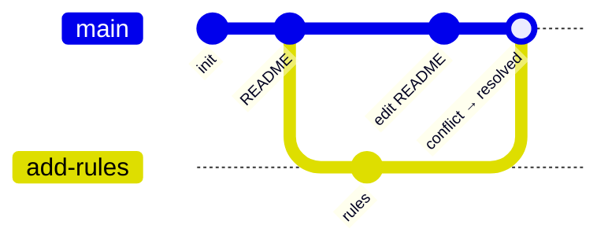

# Example

This page ties the whole section together by **recreating how this very project,
`nim-arena`, was started** — from an empty folder to a repository pushed
to GitHub, with a branch and a merge conflict along the way.

You can follow along in an empty folder and reproduce every step. Commands are
the lines starting with `$`; everything else is output. The hashes come from one
such run — yours will differ, because a hash is computed from the content, the
author and the timestamp.

!!! info "What you need"
    Git installed (`git --version` should print a version) and, for the last
    step, a GitHub account. Configure your identity once, so your commits are
    attributed to you:

    ```console
    $ git config --global user.name "Your Name"
    $ git config --global user.email "you@example.com"
    ```

---

## What you are going to build



Six steps: create the repository, make commits, branch, cause a conflict on
purpose, resolve it, and push it to GitHub.

---

## 1. Create the repository

Start in an empty folder and turn it into a Git repository:

```console
$ mkdir nim-arena
$ cd nim-arena
$ git init
Initialized empty Git repository in /home/user/nim-arena/.git/
```

Before adding anything, create a **`.gitignore`** so generated files never enter
the history (see [Commands § .gitignore](commands.md#the-gitignore-file)):

```console
$ printf '__pycache__/\n.venv/\nsite/\n' > .gitignore
```

---

## 2. Add files and make the first commit

Create a first file — the project's README:

```console
$ printf '# NIM Arena\n' > README.md
```

Check the state. Git sees two new files it is not yet tracking:

```console
$ git status
On branch main

No commits yet

Untracked files:
  (use "git add <file>..." to include in what will be committed)
        .gitignore
        README.md

nothing added to commit but untracked files present
```

Stage both files and record the first commit:

```console
$ git add .
$ git commit -m "Initial commit"
[main (root-commit) 29434cf] Initial commit
 2 files changed, 4 insertions(+)
 create mode 100644 .gitignore
 create mode 100644 README.md
```

Add a bit more to the README and make a second commit, so we have some history:

```console
$ printf '\nA parametrized NIM engine with a player API and a tournament.\n' >> README.md
$ git add README.md
$ git commit -m "Add README"
[main 7b0978f] Add README
 1 file changed, 2 insertions(+)
```

---

## 3. Inspect the state

Three commands answer "where am I?":

```console
$ git log --oneline
7b0978f Add README
29434cf Initial commit

$ git status
On branch main
nothing to commit, working tree clean

$ git diff
```

`git log` shows the two commits, `git status` confirms there is nothing pending,
and `git diff` prints nothing because there are no uncommitted changes. This is
the clean starting point for new work.

---

## 4. Create a branch and work on it

New work goes on its own **branch**, not directly on `main`. Create one and
switch to it:

```console
$ git checkout -b rules-page
Switched to a new branch 'rules-page'
```

Add a page describing the game rules and commit it:

```console
$ printf '# Rules\n\nRemove sticks from one row. Taking the last stick wins.\n' > RULES.md
$ git add RULES.md
$ git commit -m "docs: add the game rules"
[rules-page 5f46a63] docs: add the game rules
 1 file changed, 3 insertions(+)
```

The `rules-page` branch is now one commit ahead of `main`. Nothing on `main`
changed — you can switch back and forth to confirm:

```console
$ git checkout main
Switched to branch 'main'
$ ls
README.md          # RULES.md is not here; it lives on the other branch

$ git checkout rules-page
Switched to branch 'rules-page'
```

---

## 5. Merge the branch back — and resolve a conflict

To make a conflict happen, let both branches change **the same line** of the
README.

On `main`, tweak the description line:

```console
$ git checkout main
$ printf '# NIM Arena\n\nA NIM engine with a tournament runner.\n' > README.md
$ git commit -am "docs: reword the README description"
[main a1b2c3d] docs: reword the README description
```

On `rules-page`, change *the same line* differently:

```console
$ git checkout rules-page
$ printf '# NIM Arena\n\nA parametrized NIM game and a player API.\n' > README.md
$ git commit -am "docs: reword the README description"
[rules-page e4f5a6b] docs: reword the README description
```

Now merge `rules-page` into `main`. Git cannot decide which wording wins:

```console
$ git checkout main
$ git merge rules-page
Auto-merging README.md
CONFLICT (content): Merge conflict in README.md
Automatic merge failed; fix conflicts and then commit the result.
```

Open `README.md`. Git has marked the conflicting region:

```text
# NIM Arena

<<<<<<< HEAD
A NIM engine with a tournament runner.
=======
A parametrized NIM game and a player API.
>>>>>>> rules-page
```

- Everything between `<<<<<<< HEAD` and `=======` is **your** version (`main`).
- Everything between `=======` and `>>>>>>> rules-page` is the **incoming**
  version.

**Resolve** it by editing the file into the final text you want and deleting all
three marker lines:

```text
# NIM Arena

A parametrized NIM engine, a player API and a tournament runner.
```

Then stage the resolved file and complete the merge:

```console
$ git add README.md
$ git commit -m "Merge rules-page into main"
[main 4d9b2fe] Merge rules-page into main
```

The history now shows both lines of work joined by a **merge commit**:

```console
$ git log --oneline --graph
*   4d9b2fe Merge rules-page into main
|\
| * e4f5a6b docs: reword the README description
* | a1b2c3d docs: reword the README description
|/
* 7b0978f Add README
* 29434cf Initial commit
```

The `rules-page` branch has served its purpose and can be deleted:

```console
$ git branch -d rules-page
Deleted branch rules-page (was e4f5a6b).
```

---

## 6. Connect a remote and push

So far everything lives on your machine. To share it, create an empty repository
on GitHub (see the [GitHub section](../github/first-steps.md)), then connect it
as the remote **`origin`** and push:

```console
$ git remote add origin https://github.com/jparisu/nim-arena.git
$ git push -u origin main
Enumerating objects: 12, done.
Writing objects: 100% (12/12), 1.24 KiB, done.
To https://github.com/jparisu/nim-arena.git
 * [new branch]      main -> main
branch 'main' set up to track 'origin/main'.
```

The `-u` flag links your local `main` to `origin/main`, so from now on a plain
`git push` and `git pull` are enough.

---

## Recap

In one short session you have used every core idea of this section:

- **`init`** to create a repository and **`.gitignore`** to keep it clean,
- **`add`** and **`commit`** to record snapshots,
- **`status`**, **`log`** and **`diff`** to inspect state,
- **`branch`** / **`checkout`** to work in isolation,
- **`merge`** — including **resolving a conflict** — to bring work together,
- **`remote`** and **`push`** to share it with the world.

This is exactly the loop you will repeat, over and over, for the rest of the
project. The next step is doing it *as a team*, which is what the
[GitHub section](../github/index.md) is about.
