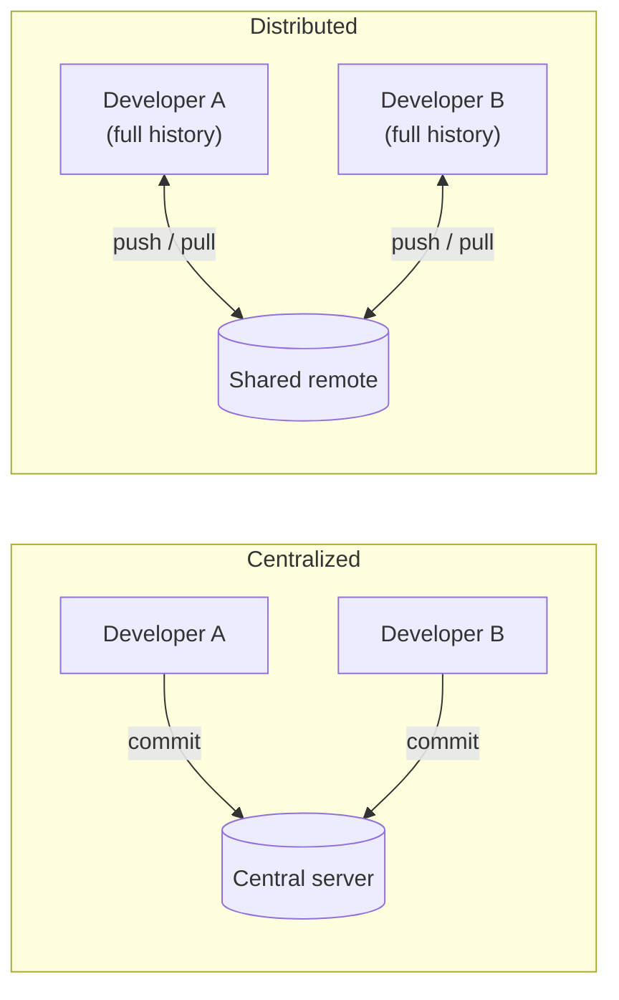
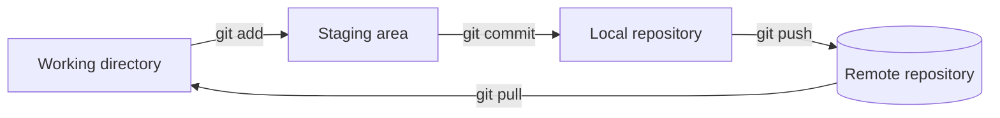

# What is Git

**Git** is a *version control system*: a tool that records the history of a set
of files, so that every change can be inspected, shared and, if needed, undone.
It is the standard way software is written today, used by most companies and
developers.

This page explains where Git comes from, what problem it solves, and the mental
model you need before learning any command.

---

## A bit of history

Before version control, keeping the history of a project meant copying folders
by hand: `project/`, `project-final/`, `project-final-REAL/`.

Git was written by **Linus Torvalds in 2005** for the Linux kernel, which
thousands of people develop at once. He needed something fast, able to handle a
huge history, and above all **distributed**.

Distributed is the key word, and it is still the difference you notice most:

| | Centralized (CVS, Subversion) | Distributed (Git) |
|---|---|---|
| Who holds the history | one central server | **every clone, in full** |
| To make a commit | you must be connected | you work offline |
| Sharing | is the same as saving | is a separate, explicit step |

---

## Why version control

Even working alone, version control gives you three things that are hard to live
without once you have them:

- **A history.** Every saved change is recorded with an author, a date and a
  message. You can read *how* and *why* the project reached its current state.
- **A safety net.** Because every state is stored, you can always go back to a
  version that worked. Experiments become cheap: try something, and if it goes
  wrong, discard it.
- **Collaboration without overwriting.** Several people can work on the same
  files at the same time. Git merges their changes together and, when two people
  edit the same lines, tells you exactly where a human decision is needed.

---

## The three areas

The single most useful thing to understand before touching a command is that a
file in a Git project lives in one of **three areas**:

| Area | What it is |
| --- | --- |
| **Working directory** | The actual files on your disk, the ones you edit. |
| **Staging area** (or *index*) | A drafting space where you assemble the *next* commit. |
| **Repository** | The permanent, recorded history of commits. |

Changes flow from one area to the next through commands, and a fourth area — the
**remote** — is a copy of the repository shared with other people (this is where
GitHub comes in).

Reading the diagram left to right:

1. You **edit** files in the working directory.
2. `git add` moves a snapshot of the changes you want to keep into the **staging
   area**. This lets you commit *part* of your work and leave the rest for
   later.
3. `git commit` records everything staged as a permanent point in the **local
   repository**, with a message describing it.
4. `git push` sends your commits to the **remote**, so others can see them; `git
   pull` brings their commits down to you.

!!! tip "Why a staging area?"
    The staging area feels like an extra step at first, but it is what lets you
    craft clean commits: you can review exactly what will be recorded and split
    unrelated changes into separate, meaningful commits instead of one big
    dump.

---

**Next:** [Organization](organization.md) — how commits, branches and history are actually structured.

**Also:** [Commands](commands.md) · [Example](example.md)
