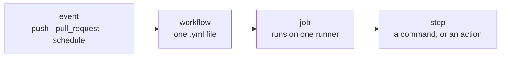

# GitHub Actions

**GitHub Actions** is the automation built into GitHub. You describe jobs in YAML
files under `.github/workflows/`, and GitHub runs them on its own machines
whenever something happens in the repository: a push, a pull request, a schedule,
a button press.

It is what turns "the tests pass on my laptop" into "the tests pass, provably, on
a clean machine, for every version we claim to support" — which is the only claim
a reviewer can act on.

---

## The vocabulary



| Term | What it is |
| --- | --- |
| **Workflow** | one YAML file in `.github/workflows/`. It has a `name`, an `on:` block and one or more jobs. |
| **Event** (`on:`) | what starts it: `push`, `pull_request`, `schedule`, `workflow_dispatch`, `workflow_run`. |
| **Job** | a unit that runs on one fresh virtual machine (`runs-on: ubuntu-latest`). Jobs run in parallel unless one `needs:` another. |
| **Step** | one thing inside a job: either `run:` (a shell command) or `uses:` (a reusable **action** from the marketplace, e.g. `actions/checkout@v4`). |
| **Runner** | the machine. GitHub's hosted Linux runners are free for public repositories. |
| **Matrix** | run the same job several times with different values — three Python versions, say. |
| **Secret** | an encrypted value (`${{ secrets.NAME }}`) available to workflows, but **not** to workflows triggered by a fork. |

Three settings appear in every workflow in this repository and are worth learning
early:

- **`permissions:`** — what the automatic `GITHUB_TOKEN` may do. Start from
  `contents: read` and grant more only where it is needed. The Tournament needs
  `contents: write` because it commits a file; nothing else does.
- **`concurrency:`** — a named queue. `cancel-in-progress: true` kills an older
  run of the same group when a new one starts, which is what you want for tests
  on a branch you are still pushing to.
- **`timeout-minutes:`** — a ceiling. Without one, a hung job burns until
  GitHub's own six-hour limit and tells you nothing useful.

---

## The workflows of this repository

Four files, each with a different trigger and a different job.

| Workflow | Runs when | Does |
| --- | --- | --- |
| [`tests.yml`](https://github.com/jparisu/nim-arena/blob/main/.github/workflows/tests.yml) | every push to `main`, every PR | lint, type-check, test on 3 Python versions, smoke-run a tournament |
| [`docs.yml`](https://github.com/jparisu/nim-arena/blob/main/.github/workflows/docs.yml) | every push to `main`, every PR | build this site with `--strict` |
| [`tournament.yml`](https://github.com/jparisu/nim-arena/blob/main/.github/workflows/tournament.yml) | weekly, or on demand | play the tournament, commit the leaderboard |
| [`pages.yml`](https://github.com/jparisu/nim-arena/blob/main/.github/workflows/pages.yml) | web/source changes, or after a Tournament | build the web app and deploy it to Pages |

---

## Running the tests

The everyday workflow. Note the matrix, and note what it is checking.

```yaml
name: Tests

on:
  push:
    branches: [main]
    paths-ignore:
      - "results/**"
  pull_request:

permissions:
  contents: read

concurrency:
  group: tests-${{ github.ref }}
  cancel-in-progress: true

jobs:
  test:
    runs-on: ubuntu-latest
    timeout-minutes: 20
    strategy:
      matrix:
        python-version: ["3.10", "3.12", "3.14"]
    steps:
      - uses: actions/checkout@v4

      - name: Set up Python ${{ matrix.python-version }}
        uses: actions/setup-python@v5
        with:
          python-version: ${{ matrix.python-version }}
          cache: pip

      - name: Install
        run: |
          python -m pip install --upgrade pip
          pip install -e ".[dev]"

      - name: Lint (ruff)
        run: ruff check .

      - name: Type check (mypy)
        run: mypy

      - name: Run tests
        run: pytest -q

      - name: Smoke-run the tournament (soft timeout, fast)
        run: nim-tournament --no-subprocess --repetitions 1 --out "$RUNNER_TEMP/leaderboard-smoke.json"
```

Four decisions in there are worth stealing:

- **The matrix is the floor, the middle and the ceiling.** `pyproject.toml`
  promises `requires-python = ">=3.10"`. Testing 3.10 is what makes that promise
  true; testing 3.14 is what tells you early that it is about to stop being true.
- **`paths-ignore: results/**`.** The Tournament commits a data file on a
  schedule. Rerunning the whole suite for it would burn minutes and could not
  change the outcome.
- **The smoke run writes to `$RUNNER_TEMP`, not to `results/leaderboard.json`.**
  The committed leaderboard is a published artifact. A CI step that overwrote it
  would leave the working tree dirty on every run.
- **`--repetitions 1`.** The default is 10, which is over a thousand games on
  every push. A smoke test proves the runner starts and finishes; it is not the
  official run.

---

## Building the documentation

```yaml
name: Docs

on:
  push:
    branches: [main]
    paths-ignore:
      - "results/**"
  pull_request:

jobs:
  build-docs:
    runs-on: ubuntu-latest
    steps:
      - uses: actions/checkout@v4
      - uses: actions/setup-python@v5
        with:
          python-version: "3.12"
          cache: pip
      - name: Install
        run: pip install -e ".[docs]"
      - name: Build (strict)
        run: mkdocs build --strict
```

`--strict` turns MkDocs warnings — a broken internal link, a page missing from
the nav — into a failed build. Catching those in CI is the whole point; see
[MkDocs](../documentation/mkdocs.md).

!!! warning "Do not path-filter a required check"
    The `pull_request` trigger here is deliberately **not** filtered to `docs/**`.

    A workflow that is a *required status check* but does not run leaves its check
    permanently in the "Expected" state — and a check that is expected and never
    arrives blocks the merge **forever**. A player submission touches only
    `players/` and `players.yaml`, so a `docs/**` filter would make every single
    one of those PRs unmergeable. The build takes about 25 seconds; running it always is
    cheaper than the confusion.

---

## Running the tournament on a schedule

This one is different: it is triggered by time or by a human, and it **writes**
to the repository.

```yaml
name: Tournament

on:
  workflow_dispatch:
    inputs:
      tournament:
        description: "Tournament format"
        type: choice
        options: [simple, league, championship]
        default: league
      time_limit:
        description: "Per-player budget in seconds"
        default: "2.0"
  schedule:
    - cron: "0 6 * * 1"   # every Monday 06:00 UTC

permissions:
  contents: write         # needed to commit the results file back

concurrency:
  group: tournament
  cancel-in-progress: false

jobs:
  tournament:
    runs-on: ubuntu-latest
    timeout-minutes: 90
    steps:
      # ... checkout, set up Python, install ...
      - name: Run the tournament
        run: |
          nim-tournament \
            --out results/leaderboard.json \
            --tournament "${{ github.event.inputs.tournament || 'league' }}" \
            --time-limit "${{ github.event.inputs.time_limit || '2.0' }}"

      - name: Commit updated leaderboard
        run: |
          git config user.name  "github-actions[bot]"
          git config user.email "github-actions[bot]@users.noreply.github.com"
          if git diff --quiet -- results/leaderboard.json; then
            echo "Leaderboard unchanged; nothing to commit."
          else
            git add results/leaderboard.json
            git commit -m "chore(tournament): update leaderboard"
            git push
          fi
```

- **`workflow_dispatch` with `inputs`** puts a "Run workflow" button in the
  Actions tab, with a dropdown and a text box. This is how you give someone a
  manual control without giving them a shell.
- **`schedule` uses cron in UTC.** GitHub disables scheduled workflows in a
  repository with **no activity for 60 days** — a real trap for a project that
  goes quiet over a holiday.
- **`timeout-minutes: 90` is a deliberate choice, not a guess.** The per-game
  budget bounds one game; nothing bounds games × matchups, which grows as
  O(roster²). Past about five player kinds the theoretical worst case exceeds
  GitHub's six-hour job limit — and a job killed at six hours produces no
  leaderboard at all. Failing at 90 minutes is a visible, diagnosable failure
  instead of a silent one.
- **The commit step checks for a diff first.** Committing nothing is an error;
  checking is one line.

!!! danger "Never write a CI-skip marker in an automated commit message"
    Putting `[skip ci]` in a commit message suppresses **every** workflow for
    that push, not just the one you had in mind. The history of this repository
    still contains such commits — that is why the message here is a plain
    `chore(tournament): update leaderboard`.

---

## Deploying the web app — and the trap in it

```yaml
name: Pages

on:
  push:
    branches: [main]
    paths:
      - "web/**"
      - "src/**"
      - "players/**"
      - "players.yaml"
      - "results/leaderboard.json"
      - "scripts/build_web.py"
      - ".github/workflows/pages.yml"

  workflow_run:
    workflows: ["Tournament"]
    types: [completed]

  workflow_dispatch:

permissions:
  contents: read
  pages: write
  id-token: write

concurrency:
  group: pages
  cancel-in-progress: false

jobs:
  build:
    runs-on: ubuntu-latest
    if: >-
      github.event_name != 'workflow_run' ||
      github.event.workflow_run.conclusion == 'success'
    steps:
      - uses: actions/checkout@v4
      - uses: actions/setup-python@v5
        with:
          python-version: "3.12"
      - name: Assemble web assets
        run: python scripts/build_web.py
      - uses: actions/upload-pages-artifact@v3
        with:
          path: web

  deploy:
    needs: build
    runs-on: ubuntu-latest
    environment:
      name: github-pages
      url: ${{ steps.deployment.outputs.page_url }}
    steps:
      - id: deployment
        uses: actions/deploy-pages@v4
```

The `push` trigger lists `results/leaderboard.json`, so that a fresh tournament
result redeploys the scoreboard. **It does not work on its own**, and the reason
is the single most useful GitHub Actions fact on this page:

!!! warning "A commit pushed with `GITHUB_TOKEN` raises no `push` event"
    GitHub deliberately suppresses workflow events for commits made with the
    default `GITHUB_TOKEN`. It is how infinite workflow loops are prevented — a
    workflow that commits would otherwise trigger itself forever.

    So the `push` trigger above is silently dead for exactly the case it was
    written for. The documented way out is **`workflow_run`**: react to the
    Tournament *workflow finishing* rather than to its commit.

Two more details:

- **The `if:` guard** stops a failed tournament from publishing a broken
  scoreboard. Non-`workflow_run` triggers carry no conclusion, so they always
  pass the condition.
- **`cancel-in-progress: false`**, per GitHub's own Pages guidance: cancelling
  mid-publish can leave a deployment half-applied. Queue instead of cancelling.

---

## Keeping actions up to date

`.github/dependabot.yml` asks GitHub to open a pull request when an action or a
dependency has a new version:

```yaml
version: 2
updates:
  - package-ecosystem: github-actions
    directory: "/"
    schedule:
      interval: monthly
    groups:
      actions:
        patterns: ["*"]
```

Grouping the bumps into one PR per month is the difference between a useful
reminder and a stream of noise you learn to ignore.

---

## Reading a failed run

1. The PR shows a red ✗. Click **Details**.
2. Pick the failed job in the left column; the failed step is expanded already.
3. Read the **first** error, not the last. Everything after it is usually fallout.
4. Reproduce it locally with the exact command from the step — `pytest -q`,
   `ruff check .`, `mkdocs build --strict`. They are the same commands on purpose.
5. **Re-run jobs** in the top right is for genuinely flaky infrastructure, not for
   hoping a real failure goes away.

---

**Next:** [GitHub Pages](pages.md) — where the Pages workflow publishes to.

**Also:** [Repository configuration](repository-configuration.md) · [Testing](../python-library/testing.md)
