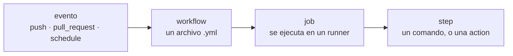

# GitHub Actions

**GitHub Actions** es la automatización integrada en GitHub. Describes trabajos
en archivos YAML dentro de `.github/workflows/`, y GitHub los ejecuta en sus
propias máquinas cuando ocurre algo en el repositorio: un push, un pull request,
una programación horaria, la pulsación de un botón.

Es lo que convierte "las pruebas pasan en mi portátil" en "las pruebas pasan,
demostrablemente, en una máquina limpia, para todas las versiones que decimos
soportar" — que es la única afirmación sobre la que quien revisa puede actuar.

## El vocabulario



| Término | Qué es |
| --- | --- |
| **Workflow** | un archivo YAML en `.github/workflows/`. Tiene `name`, un bloque `on:` y uno o más jobs. |
| **Evento** (`on:`) | lo que lo arranca: `push`, `pull_request`, `schedule`, `workflow_dispatch`, `workflow_run`. |
| **Job** | una unidad que se ejecuta en una máquina virtual nueva (`runs-on: ubuntu-latest`). Los jobs corren en paralelo salvo que uno declare `needs:`. |
| **Step** | una cosa dentro de un job: o `run:` (un comando de shell) o `uses:` (una **action** reutilizable, p. ej. `actions/checkout@v4`). |
| **Runner** | la máquina. Los runners Linux de GitHub son gratis para repositorios públicos. |
| **Matriz** | ejecutar el mismo job varias veces con valores distintos — tres versiones de Python, por ejemplo. |
| **Secreto** | un valor cifrado (`${{ secrets.NAME }}`) disponible para los workflows, pero **no** para los disparados desde un fork. |

Tres ajustes aparecen en todos los workflows de este repositorio y conviene
aprenderlos pronto:

- **`permissions:`** — qué puede hacer el `GITHUB_TOKEN` automático. Empieza por
  `contents: read` y concede más solo donde haga falta. El torneo necesita
  `contents: write` porque hace commit de un archivo; nada más lo necesita.
- **`concurrency:`** — una cola con nombre. `cancel-in-progress: true` mata una
  ejecución anterior del mismo grupo cuando arranca otra, que es lo que quieres
  para las pruebas de una rama a la que sigues subiendo cambios.
- **`timeout-minutes:`** — un techo. Sin él, un job colgado consume hasta el
  límite de seis horas de GitHub y no te dice nada útil.

## Los workflows de este repositorio

Cuatro archivos, cada uno con un disparador y un trabajo distintos.

| Workflow | Se ejecuta cuando | Hace |
| --- | --- | --- |
| [`tests.yml`](https://github.com/jparisu/nim-arena/blob/main/.github/workflows/tests.yml) | cada push a `main`, cada PR | lint, comprobación de tipos, pruebas en 3 versiones de Python, torneo de humo |
| [`docs.yml`](https://github.com/jparisu/nim-arena/blob/main/.github/workflows/docs.yml) | cada push a `main`, cada PR | construir este sitio con `--strict` |
| [`tournament.yml`](https://github.com/jparisu/nim-arena/blob/main/.github/workflows/tournament.yml) | semanalmente, o bajo demanda | jugar el torneo, hacer commit del marcador |
| [`pages.yml`](https://github.com/jparisu/nim-arena/blob/main/.github/workflows/pages.yml) | cambios en web/fuentes, o tras un torneo | construir la web y desplegarla en Pages |

## Ejecutar las pruebas

El workflow del día a día. Fíjate en la matriz, y en qué está comprobando.

```yaml
name: Tests

on:
  push:
    branches: [main]
    paths-ignore:
      - "results/**"
  pull_request:

permissions:
  contents: read

concurrency:
  group: tests-${{ github.ref }}
  cancel-in-progress: true

jobs:
  test:
    runs-on: ubuntu-latest
    timeout-minutes: 20
    strategy:
      matrix:
        python-version: ["3.10", "3.12", "3.14"]
    steps:
      - uses: actions/checkout@v4

      - name: Set up Python ${{ matrix.python-version }}
        uses: actions/setup-python@v5
        with:
          python-version: ${{ matrix.python-version }}
          cache: pip

      - name: Install
        run: |
          python -m pip install --upgrade pip
          pip install -e ".[dev]"

      - name: Lint (ruff)
        run: ruff check .

      - name: Type check (mypy)
        run: mypy

      - name: Run tests
        run: pytest -q

      - name: Smoke-run the tournament (soft timeout, fast)
        run: nim-tournament --no-subprocess --repetitions 1 --out "$RUNNER_TEMP/leaderboard-smoke.json"
```

Cuatro decisiones ahí dentro merecen copiarse:

- **La matriz es el suelo, el medio y el techo.** `pyproject.toml` promete
  `requires-python = ">=3.10"`. Probar en 3.10 es lo que hace que esa promesa sea
  cierta; probar en 3.14 es lo que te avisa pronto de que va a dejar de serlo.
- **`paths-ignore: results/**`.** El torneo hace commit de un archivo de datos de
  forma programada. Reejecutar toda la suite por eso gastaría minutos y no podría
  cambiar el resultado.
- **El torneo de humo escribe en `$RUNNER_TEMP`, no en
  `results/leaderboard.json`.** El marcador versionado es un artefacto publicado.
  Un paso de CI que lo sobrescribiera dejaría el árbol de trabajo sucio en cada
  ejecución.
- **`--repetitions 1`.** El valor por defecto es 10, que son más de mil partidas
  en cada push. Una prueba de humo demuestra que el runner arranca y termina; no
  es la ejecución evaluada.

## Construir la documentación

```yaml
name: Docs

on:
  push:
    branches: [main]
    paths-ignore:
      - "results/**"
  pull_request:

jobs:
  build-docs:
    runs-on: ubuntu-latest
    steps:
      - uses: actions/checkout@v4
      - uses: actions/setup-python@v5
        with:
          python-version: "3.12"
          cache: pip
      - name: Install
        run: pip install -e ".[docs]"
      - name: Build (strict)
        run: mkdocs build --strict
```

`--strict` convierte los avisos de MkDocs —un enlace interno roto, una página
ausente del `nav`— en una construcción fallida. Cazarlos en CI es justamente el
objetivo; véase [MkDocs](../documentation/mkdocs.md).

!!! warning "No filtres por rutas una comprobación obligatoria"
    El disparador `pull_request` de aquí **no** está filtrado a `docs/**`, y es
    deliberado.

    Un workflow que es una *comprobación de estado obligatoria* pero no se ejecuta
    deja su check permanentemente en estado "Expected" — y una comprobación
    esperada que nunca llega bloquea la fusión **para siempre**. Un envío de
    jugador toca solo `players/` y `players.yaml`, así que un filtro `docs/**`
    aquí haría imposible fusionar absolutamente todos los PR de estudiantes. La
    construcción tarda unos 25 segundos; ejecutarla siempre sale más barato que
    la confusión.

## Ejecutar el torneo de forma programada

Este es distinto: lo dispara el tiempo o una persona, y **escribe** en el
repositorio.

```yaml
name: Tournament

on:
  workflow_dispatch:
    inputs:
      tournament:
        description: "Tournament format"
        type: choice
        options: [simple, league, championship]
        default: league
      time_limit:
        description: "Per-player budget in seconds"
        default: "2.0"
  schedule:
    - cron: "0 6 * * 1"   # cada lunes a las 06:00 UTC

permissions:
  contents: write         # necesario para hacer commit del archivo de resultados

concurrency:
  group: tournament
  cancel-in-progress: false

jobs:
  tournament:
    runs-on: ubuntu-latest
    timeout-minutes: 90
    steps:
      # ... checkout, preparar Python, instalar ...
      - name: Run the tournament
        run: |
          nim-tournament \
            --out results/leaderboard.json \
            --tournament "${{ github.event.inputs.tournament || 'league' }}" \
            --time-limit "${{ github.event.inputs.time_limit || '2.0' }}"

      - name: Commit updated leaderboard
        run: |
          git config user.name  "github-actions[bot]"
          git config user.email "github-actions[bot]@users.noreply.github.com"
          if git diff --quiet -- results/leaderboard.json; then
            echo "Leaderboard unchanged; nothing to commit."
          else
            git add results/leaderboard.json
            git commit -m "chore(tournament): update leaderboard"
            git push
          fi
```

- **`workflow_dispatch` con `inputs`** pone un botón "Run workflow" en la pestaña
  Actions, con un desplegable y una caja de texto. Así se da a alguien un control
  manual sin darle una terminal.
- **`schedule` usa cron en UTC.** GitHub desactiva los workflows programados en un
  repositorio **sin actividad durante 60 días** — una trampa real para un proyecto
  que se queda en silencio en vacaciones.
- **`timeout-minutes: 90` es una decisión deliberada, no una suposición.** El
  presupuesto por partida acota *una* partida; nada acota partidas × emparejamientos,
  que crece como O(plantilla²). Pasados unos cinco tipos de jugador, el peor caso
  teórico supera el límite de seis horas de GitHub — y un job matado a las seis
  horas no produce marcador ninguno. Fallar a los 90 minutos es un fallo visible y
  diagnosticable en lugar de uno silencioso.
- **El paso de commit comprueba primero si hay diferencias.** Hacer commit de nada
  es un error; comprobarlo es una línea.

!!! danger "Nunca escribas un marcador de omisión de CI en un commit automático"
    Poner `[skip ci]` en un mensaje de commit suprime **todos** los workflows de
    ese push, no solo el que tenías en mente. El historial de este repositorio
    todavía contiene commits así — por eso el mensaje de aquí es un simple
    `chore(tournament): update leaderboard`.

## Desplegar la web — y la trampa que tiene

```yaml
name: Pages

on:
  push:
    branches: [main]
    paths:
      - "web/**"
      - "src/**"
      - "players/**"
      - "players.yaml"
      - "results/leaderboard.json"
      - "scripts/build_web.py"
      - ".github/workflows/pages.yml"

  workflow_run:
    workflows: ["Tournament"]
    types: [completed]

  workflow_dispatch:

permissions:
  contents: read
  pages: write
  id-token: write

concurrency:
  group: pages
  cancel-in-progress: false

jobs:
  build:
    runs-on: ubuntu-latest
    if: >-
      github.event_name != 'workflow_run' ||
      github.event.workflow_run.conclusion == 'success'
    steps:
      - uses: actions/checkout@v4
      - uses: actions/setup-python@v5
        with:
          python-version: "3.12"
      - name: Assemble web assets
        run: python scripts/build_web.py
      - uses: actions/upload-pages-artifact@v3
        with:
          path: web

  deploy:
    needs: build
    runs-on: ubuntu-latest
    environment:
      name: github-pages
      url: ${{ steps.deployment.outputs.page_url }}
    steps:
      - id: deployment
        uses: actions/deploy-pages@v4
```

El disparador `push` incluye `results/leaderboard.json` para que un resultado
nuevo del torneo vuelva a desplegar el marcador. **No funciona por sí solo**, y la
razón es el dato más útil sobre GitHub Actions de toda esta página:

!!! warning "Un commit hecho con `GITHUB_TOKEN` no genera evento `push`"
    GitHub suprime deliberadamente los eventos de workflow para los commits hechos
    con el `GITHUB_TOKEN` por defecto. Es la forma de evitar bucles infinitos de
    workflows: uno que hiciera commit se dispararía a sí mismo eternamente.

    Así que el disparador `push` de arriba está silenciosamente muerto justo para
    el caso para el que se escribió. La salida documentada es **`workflow_run`**:
    reaccionar a que el *workflow* del torneo termine, y no a su commit.

Dos detalles más:

- **El guardián `if:`** impide que un torneo fallido publique un marcador roto.
  Los disparadores que no son `workflow_run` no llevan conclusión, así que siempre
  pasan la condición.
- **`cancel-in-progress: false`**, siguiendo la propia guía de Pages de GitHub:
  cancelar a mitad de publicación puede dejar un despliegue a medio aplicar. Mejor
  encolar que cancelar.

## Mantener las actions al día

`.github/dependabot.yml` pide a GitHub que abra un pull request cuando una action
o una dependencia tiene versión nueva:

```yaml
version: 2
updates:
  - package-ecosystem: github-actions
    directory: "/"
    schedule:
      interval: monthly
    groups:
      actions:
        patterns: ["*"]
```

Agrupar las subidas en un PR al mes es la diferencia entre un recordatorio útil y
un flujo de ruido que aprendes a ignorar.

## Leer una ejecución fallida

1. El PR muestra una ✗ roja. Pulsa **Details**.
2. Elige el job fallido en la columna izquierda; el paso que falló ya viene
   desplegado.
3. Lee el **primer** error, no el último. Todo lo posterior suele ser
   consecuencia.
4. Reprodúcelo en local con el comando exacto del paso — `pytest -q`,
   `ruff check .`, `mkdocs build --strict`. Son los mismos comandos a propósito.
5. **Re-run jobs**, arriba a la derecha, es para infraestructura genuinamente
   inestable, no para confiar en que un fallo real desaparezca.

## Adónde ir después

- [GitHub Pages](pages.md) — dónde publica el workflow de Pages.
- [Configuración del repositorio](repository-configuration.md) — hacer que estas
  comprobaciones sean *obligatorias* antes de fusionar.
- [Tests](../python-library/testing.md) — qué está ejecutando `pytest` en realidad.
