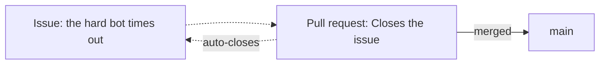

# First steps

This page takes you from *no account* to *a repository of your own on GitHub*,
ready for the [workflow](workflow.md) that follows. If you already have an
account and a repository, you can skim it and jump ahead.

---

## Create an account

Go to [github.com](https://github.com) and sign up. A free account is enough for
everything in this guide, including private repositories and GitHub Actions.

Two early steps are worth doing well:

- **Your profile.** Use a recognisable username and a real name — on a team
  project, your teammates and instructors need to know who is who. Your commits
  are linked to the email address configured in
  [`git config`](../git/example.md), so use the same email here.
- **Authentication for pushing.** Signing in to the website uses a password;
  pushing from the command line does **not**. You need one of:
    - a **Personal Access Token (PAT)**, used in place of a password over HTTPS,
      or
    - an **SSH key**, a key pair whose public half you add to GitHub.

!!! tip "If you have no preference, use a PAT"
    A **PAT over HTTPS** is the shortest path: create it on the website, paste
    it when Git asks for a password, done. An **SSH key** is a bit more setup up
    front and more comfortable afterwards, if you work locally every day.

    | | PAT over HTTPS | SSH key |
    |---|---|---|
    | Setting it up | paste a token | generate a key pair |
    | Expires | yes, needs renewing | no |
    | Best for | notebooks, occasional pushes | daily local work |

    **Pick one and move on.** You can switch later without re-cloning.

### Set up authentication on your machine

Pick one of the two tabs. You do not need both.

=== "PAT over HTTPS (recommended)"

    **1. Create the token.** On GitHub, **Settings → Developer settings →
    Personal access tokens → Fine-grained tokens → Generate new token**. Give it
    a name, an expiry date and, under **Repository access**, choose the
    repositories it reaches. Under **Permissions → Repository permissions** you
    need at least **Contents: Read and write**.

    **2. Copy it now.** The token is shown once. If you lose it, you have to
    generate another one.

    **3. Clone over HTTPS.** Git will ask for a username and a password: paste
    the token as the password, not your account one.

    ```bash
    git clone https://github.com/<user>/<repository>.git
    ```

    **4. Avoid repeating it on every push.** Store the credentials with a
    *credential helper*:

    ```bash
    # Windows: ships with Git for Windows, encrypted
    git config --global credential.helper manager

    # macOS: stores them in the system keychain
    git config --global credential.helper osxkeychain

    # Linux: in plain text, in ~/.git-credentials
    git config --global credential.helper store
    ```

    !!! warning "`store` keeps the token unencrypted"
        On Linux, `store` leaves the token readable in `~/.git-credentials`.
        That is fine on a personal machine; on a shared computer use
        `credential.helper cache`, which only keeps it in memory for a while.

    Official documentation:
    [Managing your personal access tokens](https://docs.github.com/en/authentication/keeping-your-account-and-data-secure/managing-your-personal-access-tokens).

=== "SSH key"

    **1. Generate the key pair.** Accept the path it suggests. The *passphrase*
    is optional, but worth setting: it protects the key if someone reaches your
    disk.

    ```bash
    ssh-keygen -t ed25519 -C "your-email@example.com"
    ```

    **2. Register the key with the agent**, so you do not type the passphrase on
    every operation:

    ```bash
    eval "$(ssh-agent -s)"
    ssh-add ~/.ssh/id_ed25519
    ```

    **3. Copy the public key.** It is the one ending in `.pub`; the other never
    leaves your machine.

    ```bash
    cat ~/.ssh/id_ed25519.pub
    ```

    **4. Add it to GitHub.** Under **Settings → SSH and GPG keys → New SSH
    key**, paste the contents, give it a name that identifies the computer and
    save.

    **5. Check it and clone over SSH.** The first connection asks you to confirm
    the server fingerprint.

    ```bash
    ssh -T git@github.com
    git clone git@github.com:<user>/<repository>.git
    ```

    Official documentation:
    [Generating a new SSH key](https://docs.github.com/en/authentication/connecting-to-github-with-ssh/generating-a-new-ssh-key-and-adding-it-to-the-ssh-agent)
    and
    [Adding a new SSH key to your GitHub account](https://docs.github.com/en/authentication/connecting-to-github-with-ssh/adding-a-new-ssh-key-to-your-github-account).

!!! tip "Already cloned with the wrong method?"
    No need to clone again. The authentication method is decided by the remote
    URL, and it can be changed:

    ```bash
    git remote -v                                          # see the current one
    git remote set-url origin git@github.com:<user>/<repository>.git
    ```

With either of the two, identify yourself to Git before the first commit — the
same address you used on GitHub, so that commits are attributed to you:

```bash
git config --global user.name "Your Name"
git config --global user.email "your-email@example.com"
```

---

## Create a repository

Click **New** (the green button on your repositories page) and fill in:

- **Name** — short and descriptive, e.g. `nim-arena`.
- **Visibility** — **public** (anyone can see it) or **private** (only you and
  invited collaborators). You can change this later.
- **Initialize with** — GitHub can add three files for you at creation time:
    - a **README**, the front page of the repository;
    - a **`.gitignore`**, pre-filled for a language of your choice (pick
      *Python*);
    - a **license**, which states how others may use your code.

!!! note "README, .gitignore and license"
    Letting GitHub create these means the repository starts with one commit
    already in it. If instead you built the repository locally (as in the
    [Git example](../git/example.md)), leave these unchecked and push your own
    history up.

### Choosing a license

A public repository without a license is **not** open source. Copyright is the
default, so code with no license is code nobody else may legally reuse — which
is the opposite of what a public project usually intends.

Pick one at creation time. For a project like this, three are worth knowing:

| License | In one line |
| --- | --- |
| **MIT** | do anything, keep the copyright notice. Short, permissive, the common default. |
| **Apache 2.0** | MIT plus an explicit patent grant and a notice requirement. |
| **GPL-3.0** | anyone distributing a derived work must publish its source under the GPL too. |

**MIT unless you have a reason.** It is three paragraphs long, everybody
understands it, and it puts no obligation on the people you want writing bots
for your game. This repository uses it.

The license is a plain `LICENSE` file at the root — GitHub offers a picker when
you create the repository, and **Add file → Create new file** named `LICENSE`
offers the same picker afterwards. Name it in `pyproject.toml` as well, so the
packaged distribution carries it:

```toml
license = "MIT"
```

!!! tip "One decision, made once"
    [choosealicense.com](https://choosealicense.com) exists for exactly this and
    takes about a minute. Do not spend an afternoon on it, and do not leave it
    empty — an unlicensed public repository is the one mistake here that has
    real consequences.

---

## Set it up

A few settings are worth changing early, from the repository's **Settings** tab
and its main page:

- **Description and topics.** A one-line description and a few topic tags make
  the repository easier to find and understand.
- **Collaborators.** In **Settings → Collaborators**, invite your teammates so
  they can push to branches and review pull requests.
- **Default branch.** Confirm it is called `main`.

Configuration that *enforces* a healthy team workflow — protecting `main`,
requiring reviews and passing checks — is important enough to have its own page:
[Repository configuration](repository-configuration.md). Set that up once the
workflow and Actions are in place.

---

## Explore

Most of your time on GitHub is spent reading *other people's* repositories.
Every repository has the same tabs, and knowing them makes any project readable:

| Tab |  |
| --- | --- |
| **Code** | The files, the README, the branch selector and the commit history. |
| **Issues** | Reported bugs, tasks and feature requests, open and closed. |
| **Pull requests** | Proposed changes under review, and past merged ones. |
| **Actions** | The automated runs (tests, builds) and whether they passed. |
| **Insights** | Contribution activity, and a picture of how the project moves. |

Browsing a well-run project — reading how its pull requests are described and how
its issues are discussed — is one of the best ways to learn the conventions of
software collaboration.

---

## Issues and pull requests

These two are the backbone of collaboration on GitHub, and they play different
roles:

- An **issue** describes *something to do or fix*: a bug, a task, a question. It
  is a conversation, not code. Issues are numbered (`#12`) and can be labeled
  and assigned.
- A **pull request** (PR) proposes *an actual change to the code*: "here is a
  branch with commits, please review and merge it." It is also numbered and
  discussed, but it carries a diff.

The two reference each other. A pull request can say *"Closes #12"* in its
description, and when it is merged, GitHub automatically closes issue #12 and
links the two together. This is what ties the *plan* (issues) to the *work*
(pull requests) into a traceable history.



The pull request itself — how to open, describe, review and merge it — is the
subject of the next page.

!!! tip "Issue templates"
    A repository can pre-fill new issues from `.github/ISSUE_TEMPLATE/*.md`.
    This one ships three — a bug report, a new-player idea and a conduct report —
    and GitHub shows a chooser when there is more than one. See
    [Pull requests](pull-requests.md#pull-request-templates), where the same
    mechanism is covered for PRs.

---

**Next:** [Workflow](workflow.md) — the full branch → commit → pull request → merge cycle.

**Also:** [Pull requests](pull-requests.md)
