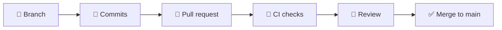

# GitHub

GitHub and the collaborative workflow built around it. This very repository is
used as the live example throughout the section.

It builds directly on the [Git section](../git/index.md): make sure you are
comfortable with commits and branches first.

---

## The cycle you will repeat

---

## The pages

- :material-help-circle-outline:{ .lg .middle } **[1 · What is GitHub](github.md)**

    ---

    What it adds on top of Git, and why they are not the same thing.

- :material-account-plus-outline:{ .lg .middle } **[2 · First steps](first-steps.md)**

    ---

    Account, authentication, your first repository, and issues.

- :material-sync:{ .lg .middle } **[3 · Workflow](workflow.md)**

    ---

    The day-to-day Git + GitHub cycle.

- :material-source-pull:{ .lg .middle } **[4 · Pull requests](pull-requests.md)**

    ---

    Opening one, using templates, and reviewing someone else's.

- :material-shield-lock-outline:{ .lg .middle } **[5 · Repository configuration](repository-configuration.md)**

    ---

    Protecting `main` and requiring reviews and checks.

- :material-robot-outline:{ .lg .middle } **[6 · GitHub Actions](actions.md)**

    ---

    The automation that runs on every push.

- :material-web:{ .lg .middle } **[7 · GitHub Pages](pages.md)**

    ---

    Publishing a static site from the repository, for free.

- :material-frequently-asked-questions:{ .lg .middle } **[FAQ](github-faq.md)**

    ---

    Quick answers to the usual doubts.

