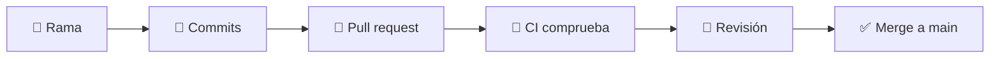

# GitHub

GitHub y el flujo de trabajo colaborativo construido a su alrededor. Este mismo
repositorio se usa como ejemplo vivo a lo largo de toda la sección.

Se construye directamente sobre la [sección de Git](../git/index.md): asegúrate
primero de sentirte cómodo con los commits y las ramas.

---

## El ciclo que vas a repetir

---

## Las páginas

- :material-help-circle-outline:{ .lg .middle } **[1 · Qué es GitHub](github.md)**

    ---

    Qué añade sobre Git, y por qué no son lo mismo.

- :material-account-plus-outline:{ .lg .middle } **[2 · Primeros pasos](first-steps.md)**

    ---

    Cuenta, autenticación, tu primer repositorio e issues.

- :material-sync:{ .lg .middle } **[3 · Flujo de trabajo](workflow.md)**

    ---

    El ciclo Git + GitHub del día a día.

- :material-source-pull:{ .lg .middle } **[4 · Pull requests](pull-requests.md)**

    ---

    Abrir uno, usar plantillas y revisar el de otra persona.

- :material-shield-lock-outline:{ .lg .middle } **[5 · Configuración del repositorio](repository-configuration.md)**

    ---

    Proteger `main` y exigir revisiones y comprobaciones.

- :material-robot-outline:{ .lg .middle } **[6 · GitHub Actions](actions.md)**

    ---

    La automatización que se ejecuta en cada push.

- :material-web:{ .lg .middle } **[7 · GitHub Pages](pages.md)**

    ---

    Publicar un sitio estático desde el repositorio, gratis.

- :material-frequently-asked-questions:{ .lg .middle } **[Preguntas frecuentes](github-faq.md)**

    ---

    Respuestas rápidas a las dudas habituales.

