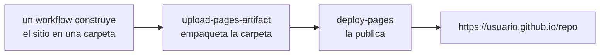

# GitHub Pages

**GitHub Pages** sirve archivos estáticos de un repositorio como un sitio web
público, gratis, en `https://<usuario>.github.io/<repositorio>/`. Sin servidor,
sin base de datos, sin factura.

Este repositorio lo usa para la página jugable —
[jparisu.github.io/nim-arena](https://jparisu.github.io/nim-arena) — mientras que
la documentación que estás leyendo se publica aparte en
[Read the Docs](../documentation/readthedocs.md). Dos artefactos, dos servicios,
un repositorio.

## Qué significa "estático", y por qué basta

Pages sirve HTML, CSS, JavaScript, imágenes y JSON. No ejecuta código en el
servidor. Cualquier cosa dinámica tiene que ocurrir en el navegador de quien
visita.

Suena limitante hasta que te fijas en cuánto cabe dentro. La página de NIM Arena
ejecuta el **Python real** del proyecto —el motor del juego y todas las IA— en el
navegador a través de [Pyodide](https://pyodide.org), una compilación de CPython
a WebAssembly. El marcador es un `fetch()` de un archivo JSON del que un
[workflow programado](actions.md) ha hecho commit en el repositorio. Nada se
sirve dinámicamente y, aun así, nada se reimplementa.

La regla práctica: si tu sitio puede ser una carpeta de archivos, Pages es la
respuesta correcta más simple.

## Activarlo

**Settings → Pages**. La única decisión es **Source**:

| Source | Significa |
| --- | --- |
| **Deploy from a branch** | Pages sirve lo que haya en una rama (clásicamente `gh-pages`, o `/docs` en `main`). |
| **GitHub Actions** | un workflow construye el sitio y lo sube como artefacto; Pages lo sirve. |

Elige **GitHub Actions**. Es lo que esperan las actions modernas de despliegue,
mantiene los archivos generados completamente fuera del repositorio y permite que
el sitio se *construya* —empaquetado, compilado, ensamblado— en lugar de
subirse a mano.

!!! warning "Este ajuste no está en ningún archivo"
    La elección entre rama y Actions vive en la configuración del repositorio, no
    en el YAML. Un workflow correcto desplegando en un repositorio que sigue
    puesto en "deploy from a branch" falla con un error de permisos que no
    menciona la causa. Si un despliegue de Pages falla sin motivo visible,
    comprueba esto primero.

## Cómo funciona un despliegue de Pages

Tres piezas, en este orden:



El bloque de permisos es lo que lo hace legal:

```yaml
permissions:
  contents: read      # para descargar el repositorio
  pages: write        # para publicar
  id-token: write     # para demostrarle a Pages que esta ejecución es quien dice
```

Y los dos jobs:

```yaml
jobs:
  build:
    runs-on: ubuntu-latest
    steps:
      - uses: actions/checkout@v4
      - uses: actions/setup-python@v5
        with:
          python-version: "3.12"
      - name: Assemble web assets
        run: python scripts/build_web.py      # empaqueta el Python en web/py.zip
      - uses: actions/upload-pages-artifact@v3
        with:
          path: web                            # la carpeta a publicar

  deploy:
    needs: build
    runs-on: ubuntu-latest
    environment:
      name: github-pages
      url: ${{ steps.deployment.outputs.page_url }}
    steps:
      - id: deployment
        uses: actions/deploy-pages@v4
```

Separar construcción y despliegue no es ceremonia: el job `deploy` es el único
que necesita el permiso de publicación, y `needs: build` garantiza que no se
publique nada de una construcción fallida.

**`concurrency: { group: pages, cancel-in-progress: false }`** va en el workflow.
Cancelar un despliegue a medias puede dejar el sitio a medio aplicar, así que las
ejecuciones se encolan en vez de interrumpirse.

## Cuando el sitio no se vuelve a desplegar

Dos causas explican casi todos los casos.

**Un filtro de rutas que nunca coincide.** `on: push: paths:` solo se dispara
cuando cambia alguna de esas rutas. Añade el propio archivo del workflow a la
lista, o no podrás arreglar el workflow editándolo.

**Un commit hecho por un workflow.** GitHub no genera evento `push` para un commit
subido con el `GITHUB_TOKEN` por defecto, así que un disparador `push:` no puede
verlo. Por eso el workflow de Pages de este repositorio también escucha a que
termine el workflow del torneo:

```yaml
  workflow_run:
    workflows: ["Tournament"]
    types: [completed]
```

La historia completa está en
[GitHub Actions](actions.md#desplegar-la-web-y-la-trampa-que-tiene).

## Los pull requests no pueden desplegar

Un workflow disparado por un pull request **desde un fork** se ejecuta sin
secretos y sin permisos de escritura, porque el código que ejecutaría lo controla
quien abrió el PR. De ahí se sigue que un PR de fork no puede publicar en Pages, y
no hay que esperar que lo haga.

Consecuencias prácticas:

- Revisa el cambio **construyéndolo en local** (`python -m http.server -d web 8000`,
  o `mkdocs serve` para un cambio de documentación), no buscando un enlace de
  previsualización.
- Todo lo que deba verificarse antes de fusionar va en una comprobación que *sí*
  pueda ejecutarse en un PR de fork —las pruebas, la construcción estricta de la
  documentación— y no en el despliegue.

## Publicar un sitio propio

La versión mínima: sube un `index.html`, pon Source en una rama, listo. La versión
que merece la pena aprender:

1. Pon las fuentes del sitio en el repositorio (`web/`, o `docs/` para MkDocs).
2. Escribe un workflow que lo **construya** en una carpeta.
3. Sube esa carpeta con `upload-pages-artifact` y publícala con `deploy-pages`.
4. Pon **Settings → Pages → Source** en **GitHub Actions**.
5. Añade la URL resultante al panel "About" del repositorio para que se encuentre.

!!! tip "Los archivos generados no van en Git"
    Este repositorio ignora `web/py.zip` y `web/leaderboard.json`: los dos los
    ensambla `scripts/build_web.py` durante el despliegue. Versionar la salida de
    una construcción convierte cada reconstrucción en un diff y cada fusión en un
    conflicto.

## Adónde ir después

- [GitHub Actions](actions.md) — el workflow que hace el despliegue.
- [Read the Docs](../documentation/readthedocs.md) — la otra forma de publicar un
  sitio de documentación, y cuándo preferirla.
- [La página web](../../arena/web.md) — qué publica realmente este repositorio.
