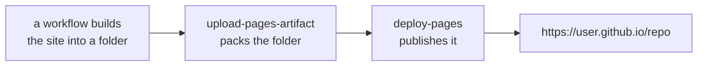

# GitHub Pages

**GitHub Pages** serves static files from a repository as a public website, for
free, at `https://<user>.github.io/<repository>/`. No server, no database, no
bill.

This repository uses it for the playable web app —
[jparisu.github.io/nim-arena](https://jparisu.github.io/nim-arena) — while the
documentation you are reading is published separately on
[Read the Docs](../documentation/readthedocs.md). Two artifacts, two hosts, one
repository.

## What "static" means, and why it is enough

Pages will serve HTML, CSS, JavaScript, images and JSON. It will not run code on
the server. Anything dynamic has to happen in the visitor's browser.

That sounds limiting until you notice how much fits inside it. The NIM Arena page
runs the project's **actual Python** — the game engine and every AI — in the
browser through [Pyodide](https://pyodide.org), a build of CPython compiled to
WebAssembly. The scoreboard is a `fetch()` of a JSON file that a
[scheduled workflow](actions.md) committed to the repository. Nothing is served
dynamically, and yet nothing is re-implemented either.

The rule of thumb: if your site can be a folder of files, Pages is the simplest
correct answer.

## Enabling it

**Settings → Pages**. The one decision is **Source**:

| Source | Means |
| --- | --- |
| **Deploy from a branch** | Pages serves whatever is in a branch (classically `gh-pages`, or `/docs` on `main`). |
| **GitHub Actions** | a workflow builds the site and uploads it as an artifact; Pages serves that. |

Choose **GitHub Actions**. It is what the modern deploy actions expect, it keeps
generated files out of the repository entirely, and it lets the site be built —
bundled, compiled, assembled — rather than committed by hand.

!!! warning "This setting is not in a file"
    Branch-versus-Actions lives in the repository settings, not in YAML. A
    correct workflow deploying to a repository still set to "deploy from a
    branch" fails with a permissions error that does not mention the cause. If a
    Pages deploy fails for no visible reason, check this first.

## How a Pages deploy works

Three moving parts, in this order:



The permissions block is what makes it legal:

```yaml
permissions:
  contents: read      # to check the repository out
  pages: write        # to publish
  id-token: write     # to prove to Pages that this run is who it says it is
```

And the two jobs:

```yaml
jobs:
  build:
    runs-on: ubuntu-latest
    steps:
      - uses: actions/checkout@v4
      - uses: actions/setup-python@v5
        with:
          python-version: "3.12"
      - name: Assemble web assets
        run: python scripts/build_web.py      # bundles the Python into web/py.zip
      - uses: actions/upload-pages-artifact@v3
        with:
          path: web                            # the folder to publish

  deploy:
    needs: build
    runs-on: ubuntu-latest
    environment:
      name: github-pages
      url: ${{ steps.deployment.outputs.page_url }}
    steps:
      - id: deployment
        uses: actions/deploy-pages@v4
```

Splitting build from deploy is not ceremony: the `deploy` job is the only one
that needs the publishing permission, and `needs: build` guarantees nothing is
published from a build that failed.

**`concurrency: { group: pages, cancel-in-progress: false }`** belongs on the
workflow. Cancelling a deploy halfway can leave the site in a half-applied state,
so runs queue rather than interrupt each other.

## When the site does not redeploy

Two failure modes account for almost all of them.

**A path filter that never matches.** `on: push: paths:` only fires when one of
those paths changed. Add the workflow file itself to the list, or you cannot fix
the workflow by editing it.

**A commit made by a workflow.** GitHub raises no `push` event for a commit
pushed with the default `GITHUB_TOKEN`, so a `push:` trigger cannot see it. That
is why this repository's Pages workflow also listens for the Tournament workflow
finishing:

```yaml
  workflow_run:
    workflows: ["Tournament"]
    types: [completed]
```

The full story is in [GitHub Actions](actions.md#deploying-the-web-app-and-the-trap-in-it).

## Pull requests cannot deploy

A workflow triggered by a pull request **from a fork** runs without secrets and
without write permissions, because the code it would run is controlled by whoever
opened the PR. It follows that a fork PR cannot publish to Pages, and should not
be expected to.

Practical consequences:

- Review the change by **building locally** (`python -m http.server -d web 8000`,
  or `mkdocs serve` for a docs change), not by looking for a preview link.
- Anything that must be verified before merge belongs in a check that *can* run
  on a fork PR — the tests, the strict docs build — not in the deploy.

## Publishing a site of your own

The smallest possible version: commit an `index.html`, set Source to a branch,
done. The version worth learning:

1. Put the site's sources in the repository (`web/`, or `docs/` for MkDocs).
2. Write a workflow that **builds** it into a folder.
3. Upload that folder with `upload-pages-artifact` and publish it with
   `deploy-pages`.
4. Set **Settings → Pages → Source** to **GitHub Actions**.
5. Add the resulting URL to the repository's "About" panel so people can find it.

!!! tip "Generated files do not belong in Git"
    This repository ignores `web/py.zip` and `web/leaderboard.json`: both are
    assembled by `scripts/build_web.py` during the deploy. Committing build
    output makes every rebuild a diff, and every merge a conflict.

## Where to go next

- [GitHub Actions](actions.md) — the workflow that does the deploying.
- [Read the Docs](../documentation/readthedocs.md) — the other way to publish a
  documentation site, and when to prefer it.
- [The web app](../../arena/web.md) — what this repository actually publishes.
