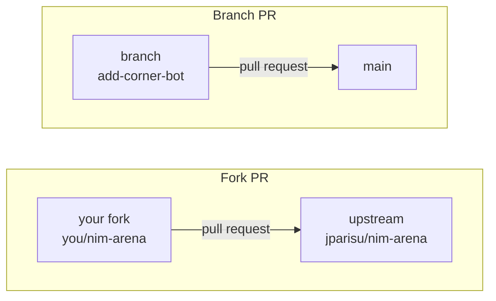

# Pull requests

A **pull request** (PR) is a proposal: *"here are some commits; please put them
in your `main`."* It is the unit of collaboration on GitHub. Everything that
matters — the diff, the discussion, the automated checks, the decision — happens
in one place and stays in the record afterwards.

This page covers both halves of the job: **opening** a good pull request, and
**handling** one that somebody else opened.

---

## Branch PR or fork PR

Which one you can open depends on whether you can write to the target repository.

| | Branch PR | Fork PR |
| --- | --- | --- |
| You need | write access to the repository | nothing but a GitHub account |
| Your commits live in | a branch of the same repository | your own copy of the repository |
| Typical case | your own team's project | contributing to someone else's project |
| Secrets in CI | available | **not** available |
| Can deploy Pages | yes | no |



Forking is a one-click operation on the repository page. After forking, clone
*your* copy and add the original as a second remote so you can keep up with it:

```console
$ git clone https://github.com/<you>/nim-arena
$ cd nim-arena
$ git remote add upstream https://github.com/jparisu/nim-arena.git
$ git fetch upstream
$ git checkout -b add-corner-bot upstream/main
```

!!! warning "A fork PR runs with reduced permissions"
    GitHub deliberately withholds repository secrets and write tokens from
    workflows triggered by a fork, because the PR author controls the code that
    would run. This is why a fork PR can run the tests but cannot publish a site
    or push a commit. It is a feature, not a misconfiguration.

---

## Opening one

1. **Push your branch.** The push output prints a link that opens the PR form;
   GitHub also shows a "Compare & pull request" button on the repository page.
2. **Check the base.** The form has two sides: *base* (where it goes) and
   *compare* (where it comes from). On a fork PR, confirm the base is the
   original repository's `main` and not your own.
3. **Write the title and description.** The template (below) tells you what is
   expected.
4. **Open it** — as a normal PR when you want review, or as a **draft** when you
   want the checks to run on work that is not finished.

A pull request worth reviewing is:

- **Small.** One coherent change. A 40-line PR gets a real review; a 2000-line
  one gets an approval nobody actually earned.
- **Explained.** What changed, and *why*. The diff shows the what; only you know
  the why.
- **Linked.** `Closes #12` in the description closes issue 12 automatically when
  the PR merges.
- **Green.** Push until the checks pass. A red PR is not ready, even if you are
  sure the failure is unrelated.

!!! tip "Keep pushing to the same branch"
    You do not open a second PR to fix review comments. Commit on the same branch
    and push; the open PR updates itself, and the conversation stays in one
    place.

---

## Pull request templates

A **PR template** is a Markdown file in the repository that GitHub pre-fills into
the description box of every new pull request. It costs one file and it changes
the quality of what you receive: contributors answer the questions you actually
need answered, and reviewers get a checklist instead of a blank page.

### The default template

Put it at **`.github/pull_request_template.md`**. Every PR opened against the
repository starts with its contents. This repository's, in full:

```markdown
<!--
Default PR template. Submitting a NEW PLAYER? Use the dedicated checklist:
append ?template=new_player.md to the PR URL, or copy it from
.github/PULL_REQUEST_TEMPLATE/new_player.md
-->

## What does this PR do?

<!-- A short description of the change. -->

## Type

- [ ] New AI player (see the new-player template)
- [ ] Bug fix
- [ ] Library / engine change
- [ ] Docs
- [ ] Web app
- [ ] CI / tooling

## Checklist

- [ ] `pytest` passes locally.
- [ ] `ruff check .` is clean.
- [ ] Docs updated if behavior changed.
```

Two details worth copying:

- **HTML comments do not render.** Everything between `<!--` and `-->` is
  instructions to the author and disappears from the posted description.
- **`- [ ]` renders as a real checkbox** that anyone can tick after the PR is
  open. This is what makes a checklist useful rather than decorative.

### More than one template

One template cannot fit every kind of contribution. Additional templates go in a
**directory**, `.github/PULL_REQUEST_TEMPLATE/`, one file per kind. They are not
offered in a menu — you select one by adding a query parameter to the PR URL:

```text
https://github.com/jparisu/nim-arena/compare/main...you:add-corner-bot?template=new_player.md
```

Because that is easy to miss, the default template's first line tells the author
the other one exists. This repository ships
`.github/PULL_REQUEST_TEMPLATE/new_player.md` for player submissions:

```markdown
## New player: <!-- your bot's name -->

**Author:** <!-- your GitHub handle -->
**Strategy in one sentence:** <!-- what does your bot do? -->

### Submission checklist

- [ ] Added a single file `players/<my_bot>.py`.
- [ ] The class subclasses `nimarena.player.Player`.
- [ ] `get_name`, `get_authors`, `get_description` and `get_icon` are implemented.
- [ ] The icon is a **single** emoji, and not already used by another player.
- [ ] The name is **unique** — no admitted player already uses it.
- [ ] `choose_move(self, state) -> (row, count)` returns a **legal** move.
- [ ] Does **not** mutate the `state` it receives.
- [ ] Added **exactly one** entry to `players.yaml` (`file` and `class`).
- [ ] No external dependencies beyond the standard library and `nimarena`.
- [ ] No network / filesystem / subprocess / `eval` / `exec`.
- [ ] Runs locally: `pytest tests/test_custom_players.py` is green and `nim-tournament --no-subprocess` works.

### Maintainer review (acceptance criteria)

- [ ] **Design** — one file + one manifest line, minimal and readable.
- [ ] **Correctness** — CI green; legal moves; no mutation; no errors/timeouts vs
      the reference bots.
- [ ] **No malware** — code read in full; nothing suspicious.
```

### Writing a checklist that is worth having

- **Every item must be checkable by someone.** "Runs locally: `pytest` is green"
  can be verified. "Code is high quality" cannot.
- **Separate author items from reviewer items.** The template above has two
  sections for exactly that reason: the submitter certifies facts, the maintainer
  certifies judgment.
- **Keep it short enough to be read.** A twenty-item list gets ticked without
  being read, which is worse than no list.
- **Say what makes a PR *rejected*, not just what makes it complete.** The
  new-player template's last section is the acceptance gate, written down.

!!! info "Issue templates work the same way"
    `.github/ISSUE_TEMPLATE/*.md` pre-fills new issues, and unlike PR templates
    GitHub *does* show a chooser when there is more than one. This repository has
    three: a bug report, a new-player idea and a conduct report.

---

## Reviewing someone else's pull request

Opening a PR is the easy half. If your project accepts contributions, most of
your GitHub time goes here.

### Read the diff

The **Files changed** tab is the review. Read all of it — a PR you have not read
is a PR you cannot approve. Useful controls on that tab:

- **Hide whitespace** — removes reindentation noise.
- **Viewed** — a per-file checkbox; large PRs become manageable when you can mark
  files off.
- **Comment on a line** — click the line number. The comment anchors there and
  stays attached as the code moves.

### Leave a review, not scattered comments

Individual comments post immediately and arrive one notification at a time.
Instead, click **Review changes** and submit them together with one of three
verdicts:

| Verdict | Means |
| --- | --- |
| **Comment** | feedback, no judgment — questions, notes, praise |
| **Approve** | you are happy for this to merge |
| **Request changes** | this must not merge until something is addressed |

"Request changes" is a **block** when the repository requires reviews. Use it for
things that are actually wrong, not for preferences — a preference belongs in a
plain comment so the author can decide.

### Suggested changes

For anything small, do not describe the fix — write it. In a line comment, use a
`suggestion` block:

````markdown
```suggestion
    return legal_moves(state)[0]
```
````

The author gets a **Commit suggestion** button. A typo round-trip drops from two
days to one click.

### Re-reviewing

When the author pushes new commits, the PR updates in place. Use the **compare**
selector at the top of *Files changed* to see only what changed since your last
review, instead of re-reading everything. Then re-submit the review.

### Be specific and be kind

Review comments are read by a person, often a beginner, often in public.

- Say what is wrong **and why it matters**: "this mutates `state`, and the
  tournament forfeits a player that does" beats "don't do this".
- Prefix opinions honestly: "nit:" for something you would not block on.
- Approve when it is good enough, not when it is what you would have written.
  A PR is not an audition.

### The review is the security gate

This point is specific to a project that accepts code from strangers, and it is
the reason this repository's review checklist has a "No malware" item.

A merged player **runs in CI**, in a process with the repository checked out.
Discovery here is an explicit manifest rather than a folder scan precisely so
that the trust decision is visible in one diff: the reviewer sees the new file
*and* the single line that admits it, side by side.

So when you review a contributed player, read the code for what it *does*, not
only for whether it works:

- no network, filesystem, subprocess, `eval`/`exec`;
- no attempt to read environment variables or repository secrets;
- no obfuscation — encoded strings, dynamic imports, anything you cannot follow.

Anything suspicious is rejected on sight. There is no obligation to explain
yourself past that.

---

## Merging

Three buttons, three histories:

| Strategy | What lands on `main` | Use when |
| --- | --- | --- |
| **Squash and merge** | one commit containing the whole PR | the default — the branch's intermediate commits are noise |
| **Merge commit** | every commit, plus a merge commit | the individual commits are meaningful on their own |
| **Rebase and merge** | every commit, replayed linearly | you want no merge commits at all |

Squash is the safe default for a small project: the PR is the unit of work, and
`main` reads as one line per change. Whichever you pick, be consistent —
repository settings can disable the other two.

After merging:

- **Delete the branch.** GitHub offers a button; the repository can also do it
  automatically (see [Repository configuration](repository-configuration.md)).
- **Pull `main` locally** before starting the next task.

### Closing a PR you will not take

Not every proposal should be merged. Closing one is a normal outcome, not a
failure — say why in a comment, thank the author, and close it. Leaving it open
for months is worse for everyone than a clear "no".

---

**Next:** [Repository configuration](repository-configuration.md) — requiring reviews and green checks before the merge button unlocks.

**Also:** [GitHub Actions](actions.md) · [Submit a player](../../game/upload-a-bot/submit-a-player.md)
