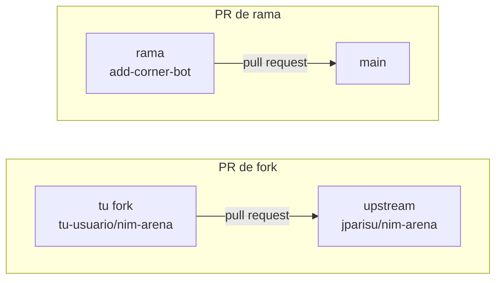

# Pull requests

Un **pull request** (PR) es una propuesta: *"aquí tienes unos commits; por favor,
ponlos en tu `main`"*. Es la unidad de colaboración en GitHub. Todo lo que
importa —el diff, la discusión, las comprobaciones automáticas, la decisión—
ocurre en un solo sitio y queda registrado después.

Esta página cubre las dos mitades del trabajo: **abrir** un buen pull request y
**gestionar** el que ha abierto otra persona.

---

## PR de rama o PR de fork

Cuál puedes abrir depende de si tienes permiso de escritura en el repositorio de
destino.

| | PR de rama | PR de fork |
| --- | --- | --- |
| Necesitas | permiso de escritura en el repositorio | solo una cuenta de GitHub |
| Tus commits viven en | una rama del mismo repositorio | tu propia copia del repositorio |
| Caso típico | el proyecto de tu equipo | contribuir al proyecto de otra persona |
| Secretos en CI | disponibles | **no** disponibles |
| Puede desplegar Pages | sí | no |



Hacer un fork es un clic en la página del repositorio. Después clona *tu* copia y
añade el original como un segundo remoto para poder mantenerte al día:

```console
$ git clone https://github.com/<tu-usuario>/nim-arena
$ cd nim-arena
$ git remote add upstream https://github.com/jparisu/nim-arena.git
$ git fetch upstream
$ git checkout -b add-corner-bot upstream/main
```

!!! warning "Un PR de fork se ejecuta con permisos reducidos"
    GitHub retiene deliberadamente los secretos del repositorio y los tokens de
    escritura en los workflows disparados por un fork, porque quien abre el PR
    controla el código que se ejecutaría. Por eso un PR de fork puede ejecutar
    las pruebas pero no publicar un sitio ni hacer un commit. Es una
    característica, no un error de configuración.

---

## Abrir uno

1. **Sube tu rama.** La salida del push imprime un enlace que abre el formulario
   del PR; GitHub también muestra un botón "Compare & pull request" en la página
   del repositorio.
2. **Comprueba la base.** El formulario tiene dos lados: *base* (a dónde va) y
   *compare* (de dónde viene). En un PR de fork, confirma que la base es el `main`
   del repositorio original y no el tuyo.
3. **Escribe el título y la descripción.** La plantilla (más abajo) te dice qué
   se espera.
4. **Ábrelo** — como PR normal cuando quieres revisión, o como **borrador**
   (*draft*) cuando solo quieres que se ejecuten las comprobaciones sobre trabajo
   sin terminar.

Un pull request que merece la pena revisar es:

- **Pequeño.** Un cambio coherente. Un PR de 40 líneas recibe una revisión de
  verdad; uno de 2000 recibe una aprobación que nadie se ha ganado.
- **Explicado.** Qué cambió, y *por qué*. El diff muestra el qué; el porqué solo
  lo sabes tú.
- **Enlazado.** `Closes #12` en la descripción cierra automáticamente el issue 12
  al fusionar el PR.
- **Verde.** Sigue subiendo commits hasta que las comprobaciones pasen. Un PR en
  rojo no está listo, aunque estés seguro de que el fallo no tiene relación.

!!! tip "Sigue subiendo a la misma rama"
    No se abre un segundo PR para corregir los comentarios de revisión. Haz
    commit en la misma rama y súbelo; el PR abierto se actualiza solo y la
    conversación se queda en un único sitio.

---

## Plantillas de pull request

Una **plantilla de PR** es un archivo Markdown del repositorio que GitHub
prerrellena en la descripción de cada pull request nuevo. Cuesta un archivo y
cambia la calidad de lo que recibes: quien contribuye responde a las preguntas
que de verdad necesitas y quien revisa recibe una lista de comprobación en lugar
de una página en blanco.

### La plantilla por defecto

Va en **`.github/pull_request_template.md`**. Todo PR abierto contra el
repositorio empieza con su contenido. La de este repositorio, completa:

```markdown
<!--
Default PR template. Submitting a NEW PLAYER? Use the dedicated checklist:
append ?template=new_player.md to the PR URL, or copy it from
.github/PULL_REQUEST_TEMPLATE/new_player.md
-->

## What does this PR do?

<!-- A short description of the change. -->

## Type

- [ ] New AI player (see the new-player template)
- [ ] Bug fix
- [ ] Library / engine change
- [ ] Docs
- [ ] Web app
- [ ] CI / tooling

## Checklist

- [ ] `pytest` passes locally.
- [ ] `ruff check .` is clean.
- [ ] Docs updated if behavior changed.
```

Dos detalles que merece la pena copiar:

- **Los comentarios HTML no se renderizan.** Todo lo que está entre `<!--` y
  `-->` son instrucciones para quien escribe y desaparece de la descripción
  publicada.
- **`- [ ]` se renderiza como una casilla real** que cualquiera puede marcar una
  vez abierto el PR. Eso es lo que hace que una lista sea útil y no decorativa.

### Más de una plantilla

Una sola plantilla no encaja con todo tipo de contribución. Las plantillas
adicionales van en un **directorio**, `.github/PULL_REQUEST_TEMPLATE/`, un
archivo por tipo. No aparecen en un menú: se selecciona una añadiendo un
parámetro a la URL del PR:

```text
https://github.com/jparisu/nim-arena/compare/main...tu-usuario:add-corner-bot?template=new_player.md
```

Como eso es fácil de pasar por alto, la primera línea de la plantilla por defecto
avisa de que existe la otra. Este repositorio incluye
`.github/PULL_REQUEST_TEMPLATE/new_player.md` para el envío de jugadores:

```markdown
## New player: <!-- your bot's name -->

**Author:** <!-- your GitHub handle -->
**Strategy in one sentence:** <!-- what does your bot do? -->

### Submission checklist

- [ ] Added a single file `players/<my_bot>.py`.
- [ ] The class subclasses `nimarena.player.Player`.
- [ ] `get_name`, `get_authors`, `get_description` and `get_icon` are implemented.
- [ ] The icon is a **single** emoji, and not already used by another player.
- [ ] The name is **unique** — no admitted player already uses it.
- [ ] `choose_move(self, state) -> (row, count)` returns a **legal** move.
- [ ] Does **not** mutate the `state` it receives.
- [ ] Added **exactly one** entry to `players.yaml` (`file` and `class`).
- [ ] No external dependencies beyond the standard library and `nimarena`.
- [ ] No network / filesystem / subprocess / `eval` / `exec`.
- [ ] Runs locally: `pytest` is green and `nim-tournament --no-subprocess` works.

### Maintainer review (acceptance criteria)

- [ ] **Design** — one file + one manifest line, minimal and readable.
- [ ] **Correctness** — CI green; legal moves; no mutation; no errors/timeouts vs
      the reference bots.
- [ ] **No malware** — code read in full; nothing suspicious.
```

### Escribir una lista de comprobación que sirva

- **Cada punto tiene que poder comprobarlo alguien.** "Funciona en local:
  `pytest` está en verde" se puede verificar. "El código es de alta calidad" no.
- **Separa los puntos del autor de los del revisor.** La plantilla de arriba
  tiene dos secciones exactamente por eso: quien envía certifica hechos, quien
  mantiene certifica criterio.
- **Que sea corta como para leerse.** Una lista de veinte puntos se marca sin
  leerse, lo cual es peor que no tener lista.
- **Di qué hace que un PR se *rechace*, no solo qué lo hace completo.** La última
  sección de la plantilla de jugadores es la puerta de aceptación, por escrito.

!!! info "Las plantillas de issue funcionan igual"
    `.github/ISSUE_TEMPLATE/*.md` prerrellena los issues nuevos y, a diferencia de
    las plantillas de PR, GitHub *sí* muestra un selector cuando hay más de una.
    Este repositorio tiene tres: informe de error, idea de jugador e informe de
    conducta.

---

## Revisar el pull request de otra persona

Abrir un PR es la mitad fácil. Si tu proyecto acepta contribuciones, la mayor
parte de tu tiempo en GitHub se va aquí.

### Lee el diff

La pestaña **Files changed** *es* la revisión. Léela entera: un PR que no has
leído es un PR que no puedes aprobar. Controles útiles de esa pestaña:

- **Hide whitespace** — elimina el ruido de reindentaciones.
- **Viewed** — una casilla por archivo; los PR grandes se vuelven manejables
  cuando puedes ir tachando archivos.
- **Comentar una línea** — pulsa en el número de línea. El comentario se ancla
  ahí y sigue al código cuando se mueve.

### Deja una revisión, no comentarios sueltos

Los comentarios individuales se publican al instante y llegan de uno en uno.
En su lugar, pulsa **Review changes** y envíalos juntos con uno de tres
veredictos:

| Veredicto | Significa |
| --- | --- |
| **Comment** | opinión, sin juicio — preguntas, notas, elogios |
| **Approve** | te parece bien que esto se fusione |
| **Request changes** | esto no debe fusionarse hasta que se atienda algo |

"Request changes" **bloquea** cuando el repositorio exige revisiones. Úsalo para
cosas que están realmente mal, no para preferencias — una preferencia va en un
comentario normal para que quien escribe decida.

### Cambios sugeridos

Para cualquier cosa pequeña, no describas el arreglo: escríbelo. En un comentario
de línea, usa un bloque `suggestion`:

````markdown
```suggestion
    return legal_moves(state)[0]
```
````

Quien escribe recibe un botón **Commit suggestion**. Una errata pasa de dos días
de ida y vuelta a un clic.

### Volver a revisar

Cuando el autor sube commits nuevos, el PR se actualiza en el sitio. Usa el
selector de **comparación** en la parte superior de *Files changed* para ver solo
lo que ha cambiado desde tu última revisión, en lugar de releerlo todo. Después
envía la revisión de nuevo.

### Sé concreto y sé amable

Los comentarios de revisión los lee una persona, a menudo principiante, a menudo
en público.

- Di qué está mal **y por qué importa**: "esto muta `state`, y el torneo declara
  perdedor a un jugador que lo haga" es mejor que "no hagas esto".
- Marca las opiniones con honestidad: "nit:" para algo que no bloquearías.
- Aprueba cuando está suficientemente bien, no cuando es lo que tú habrías
  escrito. Un PR no es una audición.

### La revisión es la puerta de seguridad

Este punto es específico de un proyecto que acepta código de desconocidos, y es
la razón de que la lista de este repositorio tenga un punto "No malware".

Un jugador fusionado **se ejecuta en CI**, en un proceso con el repositorio
descargado. El descubrimiento aquí es un manifiesto explícito y no un escaneo de
carpeta precisamente para que la decisión de confianza sea visible en un único
diff: quien revisa ve el archivo nuevo *y* la única línea que lo admite, uno al
lado del otro.

Así que cuando revises un jugador enviado, lee el código por lo que *hace*, no
solo por si funciona:

- nada de red, sistema de archivos, subprocesos, `eval`/`exec`;
- ningún intento de leer variables de entorno o secretos del repositorio;
- nada de ofuscación — cadenas codificadas, importaciones dinámicas, cualquier
  cosa que no puedas seguir.

Cualquier cosa sospechosa se rechaza a la vista. No hay obligación de explicarse
más allá de eso.

---

## Fusionar

Tres botones, tres historiales:

| Estrategia | Qué entra en `main` | Úsalo cuando |
| --- | --- | --- |
| **Squash and merge** | un commit con todo el PR | por defecto — los commits intermedios de la rama son ruido |
| **Merge commit** | todos los commits, más un commit de fusión | los commits tienen sentido por sí solos |
| **Rebase and merge** | todos los commits, reproducidos en línea | no quieres ningún commit de fusión |

*Squash* es el valor por defecto seguro para un proyecto pequeño: el PR es
la unidad de trabajo y `main` se lee como una línea por cambio. Elijas la que
elijas, sé consistente — la configuración del repositorio puede desactivar las
otras dos.

Después de fusionar:

- **Borra la rama.** GitHub ofrece un botón; el repositorio también puede hacerlo
  automáticamente (véase
  [Configuración del repositorio](repository-configuration.md)).
- **Haz `pull` de `main`** en local antes de empezar la siguiente tarea.

### Cerrar un PR que no vas a aceptar

No toda propuesta debe fusionarse. Cerrar una es un desenlace normal, no un
fracaso: di por qué en un comentario, agradece el trabajo y ciérralo. Dejarlo
abierto durante meses es peor para todos que un "no" claro.

---

**Siguiente:** [Configuración del repositorio](repository-configuration.md) — exigir revisiones y comprobaciones en verde antes de desbloquear el botón de fusión.

**También:** [GitHub Actions](actions.md) · [Enviar un jugador](../../game/upload-a-bot/submit-a-player.md)
