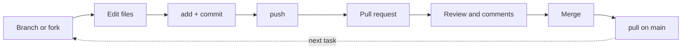

# Workflow

This is the page to internalize. Almost all day-to-day work on a shared project
follows the same cycle: **start from a branch, commit your work, push it, open a
pull request, get it reviewed, and merge it.** Everything else in this section
supports this loop.



---

## Branch or fork

There are two ways to get your own copy to work on, depending on whether you can
write to the repository:

- **You have write access** (your own or your team's repository) → create a
  **branch**. Everyone works in the same repository, on separate branches off
  `main`. This is the normal case for a team project.

    ```console
    $ git checkout main
    $ git pull                       # start from the latest main
    $ git checkout -b add-corner-bot  # your branch for this task
    ```

- **You do not have write access** (someone else's public repository) → **fork**
  it. A fork is your personal copy of the whole repository under your account.
  You branch and commit there, then open a pull request *back to the original*.

!!! tip "Name your branch for its task"
    A branch name like `add-corner-bot` or `fix-championship-seeding` tells everyone
    what it is for at a glance. Avoid `patch-1` or `test`.

---

## Commit best practices

The [Git section](../git/organization.md#history) introduced *why* a clean
history matters; here is *how* to produce one.

| A good commit is… | In practice | ❌ What does not count |
|---|---|---|
| **Atomic** | one coherent change per commit | "Add the corner bot **and** fix typo in README" |
| **Well-described** | the message says what it does, in the imperative | `changes`, `wip`, `.` |
| **Self-contained** | the project still works after each commit | a commit that only compiles alongside the next one |

A widely used convention is **Conventional Commits**, which prefixes the message
with a type:

```text
feat(players): add a nim-sum player
fix(tournament): blame a hung constructor on its own player
docs: write the Git section of the guide
test: cover the build-time budget
```

The four most recent commits of this repository follow exactly that shape:

```console
$ git log --oneline -4
a9d292d Remove internal design files
f72f09e Fixes for first project version (#1)
6238876 feat(tournament)!: one process per game, chess-clock budgets, exact hang blame
10be002 feat(players)!: replace the roster with a random/easy/medium/hard ladder
```

The `!` marks a breaking change.

Adopting a convention is optional, but it makes the history skimmable and can
even drive automation later. What matters most is **consistency within the
team**.

---

## Commit signing

Anyone can set `user.name` and `user.email` to anything, so by default a commit's
author is just unverified text. **Signing** a commit attaches a cryptographic
signature proving it really came from you; GitHub then shows a green
**`Verified`** badge next to it.

You sign with a key GitHub knows about — either **GPG** or, more simply, the
**SSH key** you may already use for pushing:

```console
$ git config --global gpg.format ssh
$ git config --global user.signingkey ~/.ssh/id_ed25519.pub
$ git config --global commit.gpgsign true   # sign every commit automatically
```

Then add that key a second time on GitHub, as a **Signing Key**, in
**Settings → SSH and GPG keys**.

!!! note "Is signing required?"
    For this project, signing is a good practice, not a hard requirement.
    Understand what the `Verified` badge means and how to enable it; a team can
    then decide whether to require it (see
    [Repository configuration](repository-configuration.md)).

---

## Pull request

Once your branch is pushed, open a **pull request** (PR) to propose merging it
into `main`. On GitHub, pushing a new branch shows a **"Compare & pull request"**
button; from the command line the push output prints a link that opens the same
form.

A good pull request:

- has a **clear title** and a **description** of what changed and why;
- **links the issue** it resolves with `Closes #12`, so the issue closes
  automatically on merge (see [First steps](first-steps.md#issues-and-pull-requests));
- is **small enough to review** — a focused PR gets better review than a huge
  one.

Opening the PR is what triggers the automated checks
([GitHub Actions](actions.md)): in this repository that means `ruff`, `mypy` and
`pytest` on three Python versions, a smoke tournament, and a strict documentation
build — all against your branch, all reported back on the PR.

Pull requests have a page of their own: see
[**Pull requests**](pull-requests.md) for templates, review mechanics and merge
strategies.

---

## Review and merge

A pull request is a **conversation**, not a formality:

1. A teammate **reviews** the diff, leaving comments on specific lines and either
   **approving** or **requesting changes**.
2. You respond by pushing more commits to the same branch — the PR updates
   automatically — until the reviewer is satisfied and the checks are green.
3. The PR is **merged** into `main`, usually with the **"Squash and merge"** or
   **"Merge"** button.

After the merge, bring the change back to your local `main` and delete the
finished branch:

```console
$ git checkout main
$ git pull                       # main now includes the merged work
$ git branch -d add-corner-bot   # tidy up
```

Then the cycle starts again with the next task.

!!! tip "Always pull before branching"
    The first command of every task is `git checkout main && git pull`. Starting
    each branch from an up-to-date `main` avoids most merge conflicts before they
    can happen.

---

**Next:** [Pull requests](pull-requests.md) — the anatomy of a PR, its template, and how to review one.

**Also:** [Repository configuration](repository-configuration.md) · [GitHub Actions](actions.md)
