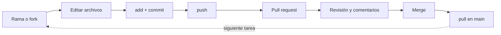

# Flujo de trabajo

Esta es la página que hay que interiorizar. Casi todo el trabajo diario en un
proyecto compartido sigue el mismo ciclo: **parte de una rama, confirma tu
trabajo, súbelo, abre un pull request, consigue que lo revisen y fusiónalo.**
Todo lo demás en esta sección da soporte a este bucle.



---

## Rama o fork

Hay dos maneras de conseguir tu propia copia para trabajar, según si puedes
escribir en el repositorio:

- **Tienes acceso de escritura** (tu repositorio o el de tu equipo) → crea una
  **rama**. Todos trabajan en el mismo repositorio, en ramas separadas a partir de
  `main`. Es el caso normal en un proyecto de equipo.

    ```console
    $ git checkout main
    $ git pull                       # parte del main más reciente
    $ git checkout -b add-corner-bot  # tu rama para esta tarea
    ```

- **No tienes acceso de escritura** (el repositorio público de otra persona) →
  haz un **fork**. Un fork es tu copia personal de todo el repositorio bajo tu
  cuenta. Ramificas y confirmas ahí, y luego abres un pull request *de vuelta al
  original*.

!!! tip "Nombra la rama por su tarea"
    Un nombre de rama como `add-corner-bot` o `fix-championship-seeding` le dice a
    todo el mundo para qué es de un vistazo. Evita `patch-1` o `test`.

---

## Buenas prácticas de commit

La [sección de Git](../git/organization.md#historial) presentó *por qué* importa
un historial limpio; aquí está *cómo* producirlo.

| Un buen commit es… | En la práctica | ❌ Lo que no vale |
|---|---|---|
| **Atómico** | un cambio coherente por commit | "Add the corner bot **y** fix typo in README" |
| **Bien descrito** | el mensaje dice qué hace, en imperativo | `changes`, `wip`, `.` |
| **Autocontenido** | el proyecto sigue funcionando tras cada commit | un commit que solo compila junto al siguiente |

Una convención muy usada es **Conventional Commits**, que antepone al mensaje un
tipo:

```text
feat(players): add a nim-sum player
fix(tournament): blame a hung constructor on its own player
docs: write the Git section of the guide
test: cover the build-time budget
```

Los cuatro commits más recientes de este repositorio siguen exactamente esa
forma:

```console
$ git log --oneline -4
a9d292d Remove internal design files
f72f09e Fixes for first project version (#1)
6238876 feat(tournament)!: one process per game, chess-clock budgets, exact hang blame
10be002 feat(players)!: replace the roster with a random/easy/medium/hard ladder
```

El `!` marca un cambio incompatible.

Adoptar una convención es opcional, pero hace el historial fácil de ojear e
incluso puede impulsar automatización más adelante. Lo que más importa es la
**consistencia dentro del equipo**.

---

## Firma de commits

Cualquiera puede poner lo que quiera en `user.name` y `user.email`, así que por
defecto el autor de un commit es solo texto sin verificar. **Firmar** un commit le
adjunta una firma criptográfica que demuestra que realmente viene de ti; GitHub
muestra entonces una insignia verde **`Verified`** junto a él.

Firmas con una clave que GitHub conoce — o bien **GPG** o, más sencillo, la
**clave SSH** que quizá ya usas para hacer push:

```console
$ git config --global gpg.format ssh
$ git config --global user.signingkey ~/.ssh/id_ed25519.pub
$ git config --global commit.gpgsign true   # firma cada commit automáticamente
```

Luego añade esa clave una segunda vez en GitHub, como **Signing Key**, en
**Settings → SSH and GPG keys**.

!!! note "¿Es obligatorio firmar?"
    Para este proyecto, firmar es una buena práctica, no un requisito estricto.
    Entiende qué significa la insignia `Verified` y cómo activarla; un equipo puede
    luego decidir si exigirla (véase
    [Configuración del repositorio](repository-configuration.md)).

---

## Pull request

Una vez subida tu rama, abre un **pull request** (PR) para proponer fusionarla en
`main`. En GitHub, subir una rama nueva muestra un botón **"Compare & pull
request"**; desde la línea de comandos, la salida del push imprime un enlace que
abre el mismo formulario.

Un buen pull request:

- tiene un **título claro** y una **descripción** de qué cambió y por qué;
- **enlaza el issue** que resuelve con `Closes #12`, para que el issue se cierre
  automáticamente al fusionar (véase [Primeros pasos](first-steps.md#issues-y-pull-requests));
- es **lo bastante pequeño para revisarlo** — un PR enfocado se revisa mejor que
  uno enorme.

Abrir el PR es lo que dispara las comprobaciones automatizadas
([GitHub Actions](actions.md)): en este repositorio eso significa `ruff`, `mypy`
y `pytest` en tres versiones de Python, un torneo de humo y una construcción
estricta de la documentación — todo sobre tu rama, todo informado en el PR.

Los pull requests tienen su propia página: consulta
[**Pull requests**](pull-requests.md) para plantillas, mecánica de revisión y
estrategias de fusión.

---

## Revisión y merge

Un pull request es una **conversación**, no una formalidad:

1. Un compañero **revisa** el diff, dejando comentarios en líneas concretas y o
   bien **aprobando** o bien **pidiendo cambios**.
2. Tú respondes subiendo más commits a la misma rama —el PR se actualiza
   automáticamente— hasta que quien revisa queda satisfecho y las comprobaciones
   están en verde.
3. El PR se **fusiona** en `main`, normalmente con el botón **"Squash and merge"**
   o **"Merge"**.

Tras la fusión, trae el cambio de vuelta a tu `main` local y borra la rama
terminada:

```console
$ git checkout main
$ git pull                       # main ya incluye el trabajo fusionado
$ git branch -d add-corner-bot   # a limpiar
```

Y el ciclo vuelve a empezar con la siguiente tarea.

!!! tip "Haz siempre pull antes de ramificar"
    El primer comando de cada tarea es `git checkout main && git pull`. Empezar
    cada rama desde un `main` actualizado evita la mayoría de los conflictos de
    fusión antes de que puedan ocurrir.

---

**Siguiente:** [Pull requests](pull-requests.md) — la anatomía de un PR, su plantilla y cómo revisar uno.

**También:** [Configuración del repositorio](repository-configuration.md) · [GitHub Actions](actions.md)
