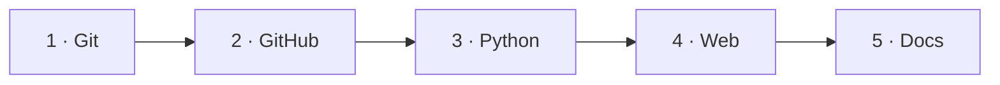

# Guide

The tools a project like this is built and shipped with: version control,
collaborative work on GitHub, Python packaging and testing, the web app people
actually open, and the documentation site.

None of it is specific to NIM: the same steps apply to the next project you
build.

---

## Start here

- :material-format-list-checks:{ .lg .middle } **[Step-by-step guide](step-by-step.md)**

    ---

    The whole project, from an empty repository to a published tournament, as one
    ordered list of tasks. Each task says what to do, links to the section that
    covers it, and ends with the result you should be able to see.

    **If you do not know where to start, start here.**

---

## The five sections

- :material-source-branch:{ .lg .middle } **[1 · Git](git/index.md)**

    ---

    Version control: how it works, the commands you need, and how to undo
    changes.

- :material-github:{ .lg .middle } **[2 · GitHub](github/index.md)**

    ---

    The collaborative flow: pull requests, reviews, Actions, repository
    protection, Pages.

- :material-language-python:{ .lg .middle } **[3 · Python library](python-library/index.md)**

    ---

    Packaging, structure, API design, installation and testing.

- :material-web:{ .lg .middle } **[4 · Web app](web-app/index.md)**

    ---

    Putting a face on the project: [Streamlit](web-app/streamlit/index.md) or a
    [static page](web-app/static-web/index.md), and where each one is hosted.

- :material-book-open-page-variant:{ .lg .middle } **[5 · Documentation](documentation/index.md)**

    ---

    Docs that live in the repository, built with MkDocs and published on Read
    the Docs.

!!! tip "You do not have to read them in order"
    The sections are mostly independent. Read them in order if you are starting
    from scratch; jump straight to [Python library](python-library/index.md) or
    [Documentation](documentation/index.md) if you already know Git and GitHub.

---

## This repository is the worked example

Wherever the guide shows a file, a workflow or a commit, it is a real one from
this repository — not an invented snippet. The
[The game](../game/index.md) section documents the result.

| The guide explains | You can see it running in |
| --- | --- |
| [`pyproject.toml` and the `src/` layout](python-library/organization.md) | [`pyproject.toml`](https://github.com/jparisu/nim-arena/blob/main/pyproject.toml) |
| [Designing a public API](python-library/api.md) | [The game → Player API](../game/upload-a-bot/player-api.md) |
| [Writing tests](python-library/testing.md) | [`tests/test_players.py`](https://github.com/jparisu/nim-arena/blob/main/tests/test_players.py) |
| [Pull requests and their templates](github/pull-requests.md) | [`.github/PULL_REQUEST_TEMPLATE/`](https://github.com/jparisu/nim-arena/tree/main/.github/PULL_REQUEST_TEMPLATE) |
| [GitHub Actions](github/actions.md) | [`.github/workflows/`](https://github.com/jparisu/nim-arena/tree/main/.github/workflows) |
| [GitHub Pages](github/pages.md) and a [static web app](web-app/static-web/index.md) | [the live game](https://jparisu.github.io/nim-arena) |
| [MkDocs](documentation/mkdocs.md) and [Read the Docs](documentation/readthedocs.md) | this site |
