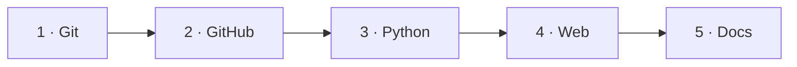

# Guía

Las herramientas con las que se construye y se publica un proyecto como este: el
control de versiones, el trabajo colaborativo en GitHub, el empaquetado y las
pruebas en Python, la aplicación web que la gente abre de verdad, y el sitio de
documentación.

Nada de esto es específico del NIM: los mismos pasos valen para el siguiente
proyecto que construyas.

---

## Empieza aquí

- :material-format-list-checks:{ .lg .middle } **[Guía paso a paso](step-by-step.md)**

    ---

    Todo el proyecto, desde un repositorio vacío hasta un torneo publicado, como
    una única lista ordenada de tareas. Cada tarea dice qué hacer, enlaza con la
    sección que la cubre y termina con el resultado que deberías poder ver.

    **Si no sabes por dónde empezar, empieza aquí.**

---

## Las cinco secciones

- :material-source-branch:{ .lg .middle } **[1 · Git](git/index.md)**

    ---

    Control de versiones: cómo funciona, los comandos que necesitas y cómo
    deshacer cambios.

- :material-github:{ .lg .middle } **[2 · GitHub](github/index.md)**

    ---

    El flujo colaborativo: pull requests, revisiones, Actions, protección del
    repositorio, Pages.

- :material-language-python:{ .lg .middle } **[3 · Librería Python](python-library/index.md)**

    ---

    Empaquetado, estructura, diseño de la API, instalación y pruebas.

- :material-web:{ .lg .middle } **[4 · Aplicación web](web-app/index.md)**

    ---

    Ponerle cara al proyecto: [Streamlit](web-app/streamlit/index.md) o una
    [página estática](web-app/static-web/index.md), y dónde se aloja cada una.

- :material-book-open-page-variant:{ .lg .middle } **[5 · Documentación](documentation/index.md)**

    ---

    Documentación que vive en el repositorio, construida con MkDocs y publicada
    en Read the Docs.

!!! tip "No hace falta leerlas en orden"
    Las secciones son en gran medida independientes. Léelas en orden si empiezas
    de cero; salta directamente a [Librería Python](python-library/index.md) o a
    [Documentación](documentation/index.md) si ya conoces Git y GitHub.

---

## Este repositorio es el ejemplo

Cada vez que la guía muestra un archivo, un workflow o un commit, es uno real de
este repositorio, no un fragmento inventado. La sección
[El juego](../game/index.md) documenta el resultado.

| La guía explica | Puedes verlo funcionando en |
| --- | --- |
| [`pyproject.toml` y la estructura `src/`](python-library/organization.md) | [`pyproject.toml`](https://github.com/jparisu/nim-arena/blob/main/pyproject.toml) |
| [Diseñar una API pública](python-library/api.md) | [El juego → API de jugador](../game/upload-a-bot/player-api.md) |
| [Escribir pruebas](python-library/testing.md) | [`tests/test_players.py`](https://github.com/jparisu/nim-arena/blob/main/tests/test_players.py) |
| [Pull requests y sus plantillas](github/pull-requests.md) | [`.github/PULL_REQUEST_TEMPLATE/`](https://github.com/jparisu/nim-arena/tree/main/.github/PULL_REQUEST_TEMPLATE) |
| [GitHub Actions](github/actions.md) | [`.github/workflows/`](https://github.com/jparisu/nim-arena/tree/main/.github/workflows) |
| [GitHub Pages](github/pages.md) y una [web estática](web-app/static-web/index.md) | [el juego en vivo](https://jparisu.github.io/nim-arena) |
| [MkDocs](documentation/mkdocs.md) y [Read the Docs](documentation/readthedocs.md) | este sitio |
