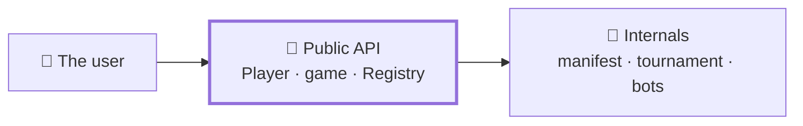
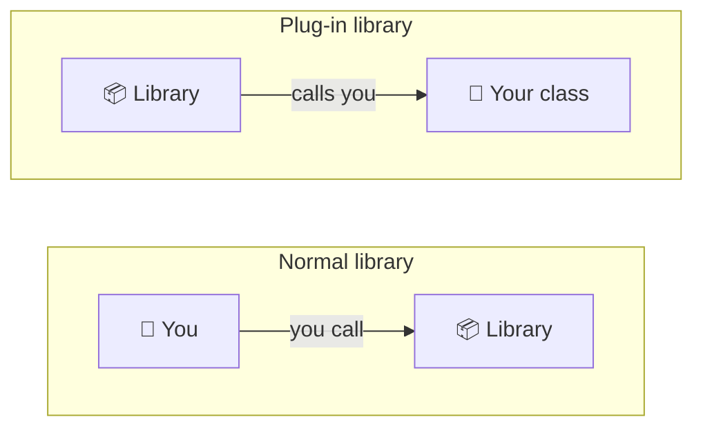

# API

The **API** (Application Programming Interface) of a library is its *public
face*: the objects, functions and methods that users are meant to touch.
Everything else is an implementation detail you are free to change. Designing
that *face* well is what separates a library people enjoy using from one they
fight with.

!!! tip "The part that already exists"
    Everything below is illustrated by real, shipped code. The
    [Player API](../../game/upload-a-bot/player-api.md) page is the current public contract of
    `nimarena`, generated in part from its docstrings. Read this page for *why* an
    API looks the way it does, and that one for *what* the library offers today.

---

## What an API is here

Think of a library as having two sides:



| | Public API | Internals |
|---|---|---|
| Who touches it | anyone importing your package | only you |
| Can you change it | not without breaking someone | whenever you like |
| How it is marked | listed in `__all__`, documented | a leading `_underscore` |

The value of the distinction is freedom: as long as the public API keeps its
shape, you can refactor everything behind it without breaking a single user. The
first job of API design is therefore to **decide what is public** and to make
that boundary obvious.

In Python, the boundary is drawn by convention and by `__all__`:

- Names prefixed with an underscore (`_helper`, `_Cache`) are **private** — a
  signal that users should not rely on them.
- The `__all__` list in a module names its **public** objects. It documents the
  intended surface and controls what `from nimarena import *` brings in.

This is how `nimarena` does it, with its public API stated explicitly in
`__init__.py`:

```python
# src/nimarena/__init__.py
from . import game
from .player import Player
from .registry import REGISTRY, Registry

__all__ = ["game", "Player", "Registry", "REGISTRY", "__version__"]
__version__ = "0.1.0"
```

Five names. A user writes `from nimarena import Player` and never has to know
which module it lives in — nor that the tournament, right next door, is a
1600-line file full of process forking and shared-memory accounting that they are
promised nothing about.

---

## Designing a good one

Five principles make an interface predictable and pleasant:

| Principle | What it means in practice |
|---|---|
| **Consistency** | similar things look similar. In `nimarena.game` every function takes the state as its first argument and none of them mutate it: once you have called one, you can predict the rest |
| **Small signatures** | few parameters, sensible defaults, no surprises |
| **Meaningful names** | `legal_moves`, `is_terminal`, `nim_sum` say what they are. Avoid abbreviations only the author understands |
| **Type hints** | they document the interface, enable autocompletion and catch mistakes before runtime. Add `py.typed` so users get the benefit too |
| **Docstrings** | every public object says what it does, what it takes and what it returns |

```python
def apply_move(state: State, move: Move) -> State:
    """Return a **new** state with ``move`` applied.

    Args:
        state: the current board; never mutated.
        move: the ``(row, count)`` to apply.

    Returns:
        A new list of ints.

    Raises:
        ValueError: if the move is not legal from ``state``.
    """
```

The type hints and the docstring together tell a user everything they need in
order to call `apply_move` correctly, without reading its body.

---

## Designing a plug-in API

Some libraries are called *by* users. Others are **implemented by** them: the
library defines a shape, and users supply the code that fills it. A game arena is
the second kind — an outsider writes a class, the library runs it.



That inverts the design problem, and three decisions carry most of the weight:

| Decision | Because the caller needs… |
|---|---|
| **abstract base class** | Python to reject an incomplete implementation, at the point of failure |
| **identity on classmethods** | to label a player **without constructing one** |
| **`create(seed)` factory** | a single construction path, the same for everyone |

### An abstract base class is a contract Python enforces

```python
from abc import ABC, abstractmethod

class Player(ABC):
    @classmethod
    @abstractmethod
    def get_name(cls) -> str: ...

    @abstractmethod
    def choose_move(self, state: State) -> tuple[int, int]: ...
```

Subclassing `ABC` and marking methods `@abstractmethod` means Python itself
refuses to build an incomplete implementation:

```text
TypeError: Can't instantiate abstract class MyBot without an
           implementation for abstract method 'get_name'
```

That error arrives at the moment of the mistake, with the name of the missing
method in it. A `NotImplementedError` raised from a base method would arrive
later, from somewhere else, during a tournament.

### Keep the contract as small as the job allows

`Player` asks for four identity accessors and **one** playing method. There is
deliberately no `on_game_start`, no move history, no opponent identity, no timer.

Every parameter in an interface is one more thing an outsider can misunderstand,
and one more thing you can never remove. Concerns that belong to the *caller* —
time control, pairing, reproducibility — stay in the caller. The result is a
player that is a pure function of the board, which is also the easiest thing to
test.

### Put identity on classmethods, and construction behind a factory

```python
@classmethod
def get_name(cls) -> str: ...

@classmethod
def create(cls, seed: int) -> "Player":
    return cls()
```

Both choices exist because of what the *caller* needs:

- **Classmethod identity** lets the tournament, the documentation and the web
  page label a player **without constructing one**. Building an object just to
  ask its name is a surprising cost and a surprising failure mode.
- **A `create(seed)` factory** gives the caller one uniform construction path.
  The alternative — a `seed` parameter on every `__init__` — puts a tournament
  concern in the signature every author has to write, and forces the caller to
  inspect signatures to find out which classes accept what. The default
  implementation ignores the seed, so a deterministic bot writes nothing.

### Discovery: an explicit list beats a folder scan

`nimarena` finds players through one hand-edited file:

```yaml
players:
  - file: hard.py
    class: Hard
```

Scanning `players/*.py` would have been less typing. It would also mean **running
a stranger's top-level code merely to discover it**, and it would hide what is
being admitted. With a manifest, a reviewer sees the new file and the single line
that admits it in one diff — the trust boundary is the review, and the review is
visible.

Note also what the manifest does *not* contain: the player's name, authors and
description. Those come from the class, because duplicating them here would give
two sources of truth and one of them would drift.

!!! tip "The general rule"
    When a design choice is not obvious, write down *why* in the module
    docstring. `nimarena/player.py` opens with thirty lines explaining exactly
    the four decisions above. The next person to touch it — very possibly you —
    will not have to re-derive them.

---

## Documenting the API automatically

An API reference written by hand goes stale quickly: someone renames a parameter
and the page still shows the old one. The fix is to generate the page **from the
docstrings**, so there is only ever one copy of the truth.

[mkdocstrings](https://mkdocstrings.github.io/) does that for MkDocs. A directive
in a page:

```markdown
::: nimarena.game
```

renders the signature, the type hints, the argument table and the examples of
every listed object, each with a link to the source lines it came from. That is
how the bottom half of
[Code structure](../../game/advanced/code-structure.md) and
[Player API](../../game/upload-a-bot/player-api.md) are built.

Two habits make the generated page worth reading:

- **Write docstrings in a consistent style.** This project uses the Google style
  shown above (`Args:`, `Returns:`, `Raises:`), declared once in `mkdocs.yml`.
- **Document the *why*, not the signature.** The signature is already on the
  page. What the reader cannot see is why the parameter exists.

---

**Next:** [Player API](../../game/upload-a-bot/player-api.md) — the same ideas, applied: the real public contract of `nimarena`.

**Also:** [Testing](testing.md) · [MkDocs](../documentation/mkdocs.md)
