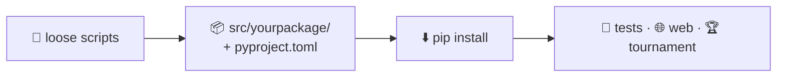

# Python library

How to build a Python library: how to organize it, how to design its API, how to
test it, and how to install and use it. We use `nimarena`, the package this
project ships, as the example.

---

## From a pile of scripts to a library

What that step buys: any part of the project — and anyone outside it — can write
`import yourpackage` and have all of it.

---

## The pages

- :material-package-variant:{ .lg .middle } **[1 · What is a library](library.md)**

    ---

    Modules, packages and distributions, and how they differ.

- :material-file-tree:{ .lg .middle } **[2 · Organization](organization.md)**

    ---

    `pyproject.toml`, the `src/` layout and `tests/`.

- :material-download:{ .lg .middle } **[3 · Installation and usage](installation-and-usage.md)**

    ---

    From GitHub, in a notebook, and locally in editable mode.

- :material-api:{ .lg .middle } **[4 · API](api.md)**

    ---

    Designing a clean public interface, including one other people implement.

- :material-test-tube:{ .lg .middle } **[5 · Tests](testing.md)**

    ---

    `pytest` and continuous integration.

- :material-frequently-asked-questions:{ .lg .middle } **[FAQ](python-faq.md)**

    ---

    Quick answers to the usual doubts.

!!! tip "See the result"
    Every technique on these pages is applied in this repository. The
    [The game](../../game/index.md) section is the result: the reference manual
    of `nimarena`, with API blocks generated from the very docstrings this
    section teaches you to write.
