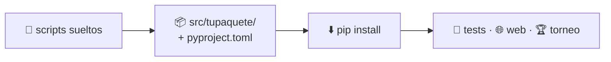

# Librería Python

Cómo construir una librería de Python: cómo organizarla, cómo diseñar su API,
cómo probarla y cómo instalarla y usarla. Usaremos `nimarena`, el propio paquete
que distribuye este proyecto, como ejemplo.

---

## De un montón de scripts a una librería

Lo que compra ese paso: cualquier parte del proyecto —y cualquier persona de
fuera— puede escribir `import tupaquete` y tenerlo todo.

---

## Las páginas

- :material-package-variant:{ .lg .middle } **[1 · Qué es una librería](library.md)**

    ---

    Módulos, paquetes y distribuciones, y en qué se diferencian.

- :material-file-tree:{ .lg .middle } **[2 · Organización](organization.md)**

    ---

    `pyproject.toml`, la estructura `src/` y `tests/`.

- :material-download:{ .lg .middle } **[3 · Instalación y uso](installation-and-usage.md)**

    ---

    Desde GitHub, en un notebook y en local en modo editable.

- :material-api:{ .lg .middle } **[4 · API](api.md)**

    ---

    Diseñar una interfaz pública clara, incluida una que implementan otras
    personas.

- :material-test-tube:{ .lg .middle } **[5 · Tests](testing.md)**

    ---

    `pytest` e integración continua.

- :material-frequently-asked-questions:{ .lg .middle } **[Preguntas frecuentes](python-faq.md)**

    ---

    Respuestas rápidas a las dudas habituales.

!!! tip "Mira el resultado"
    Cada técnica de estas páginas se aplica en este repositorio. La sección
    [El juego](../../game/index.md) es el resultado: el manual de referencia de
    `nimarena`, con bloques de API generados a partir de los mismos docstrings
    que esta sección te enseña a escribir.
