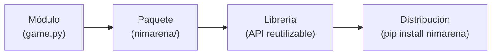

# Qué es una librería

Una **librería** es un fragmento de código escrito para ser *reutilizado* por
otro código. En lugar de copiar funciones entre proyectos, las empaquetas una vez,
les das una interfaz pública clara, y dejas que cualquier proyecto las instale e
importe. `nimarena` —la librería que distribuye este repositorio— es una: un
motor de juego de NIM, una interfaz de jugador y un ejecutor de torneos que un
notebook, una batería de pruebas, una GitHub Action y una página web instalan e
importan exactamente igual.

Esta página ordena el vocabulario, explica qué te aporta una librería y muestra
un ejemplo conocido a imitar.

---

## Módulo, paquete, librería, distribución

Estas cuatro palabras se usan a menudo de forma imprecisa. En Python significan
cosas concretas:

| Término | Qué es |
| --- | --- |
| **Módulo** | Un único archivo `.py`. Importarlo lo ejecuta una vez y expone sus nombres. |
| **Paquete** | Una *carpeta* de módulos importada como una unidad, normalmente marcada por un `__init__.py`. |
| **Librería** | Un paquete (o conjunto de paquetes) pensado para ser reutilizado por otro código. |
| **Distribución** | El artefacto empaquetado que instalas — lo que `pip install` descarga. |

La progresión es de escala: un **módulo** es un archivo, un **paquete** agrupa
módulos en una carpeta, una **librería** es un paquete diseñado para
reutilizarse, y una **distribución** es esa librería empaquetada para poder
instalarse en otro sitio.



En este proyecto, `src/nimarena/` es el **paquete**, la API que expone lo
convierte en una **librería**, y `pyproject.toml` es lo que lo convierte en una
**distribución** instalable (véase [Organización](organization.md)).

---

## Qué te aporta una librería

¿Por qué empaquetar código en lugar de tener por ahí un simple `utils.py`? Una
librería te da cuatro cosas:

- **Reutilización.** Escribe las reglas del juego una vez; impórtalas desde el
  torneo, las pruebas y el navegador sin copiar y pegar. En este proyecto eso no
  es un eslogan: las reglas nunca se reimplementan en JavaScript, porque la
  página web importa el mismo Python a través de Pyodide.
- **Una interfaz estable.** Los usuarios dependen de la API *pública*, no de los
  detalles internos. Puedes reescribir el interior libremente mientras la interfaz
  se mantenga (de eso trata [la página de la API](api.md)).
- **Versionado.** Las versiones se numeran (`0.1.0`, `0.2.0`, …), de modo que los
  usuarios pueden decir "necesito la versión 0.1" y obtener un comportamiento
  reproducible.
- **Distribución.** Un solo comando `pip install` entrega el código y sus
  dependencias a cualquiera, en cualquier lugar — incluido un notebook de Google
  Colab.

---

## Un ejemplo concreto

La forma más clara de ver qué significa "una buena librería" es usar una.
**scikit-learn** es una librería de machine learning muy usada y un modelo de
diseño agradable. La instalas una vez:

```bash
pip install scikit-learn
```

importas una pieza pequeña y bien nombrada:

```python
from sklearn.linear_model import LogisticRegression

model = LogisticRegression()
model.fit(X_train, y_train)      # entrenar
predictions = model.predict(X_test)  # usar
```

y eres productivo de inmediato — sin leer su código fuente. De eso se trata una
librería. Vale la pena nombrar qué hace que funcione, porque son exactamente las
cualidades a las que aspirar en `nimarena`:

- **Una interfaz consistente.** Casi todos los estimadores de scikit-learn tienen
  los mismos métodos `.fit()` / `.predict()`, así que en cuanto aprendes uno,
  puedes adivinar los demás.
- **Valores por defecto sensatos.** `LogisticRegression()` funciona sin
  argumentos; solo tocas los parámetros cuando lo necesitas.
- **Nombres y documentación claros.** `fit`, `predict`, `LogisticRegression` dicen
  lo que hacen, y cada objeto público tiene documentación.

`nimarena` apunta a esas mismas tres cualidades. `nimarena.game` es un puñado de
funciones puras que reciben todas el estado primero y ninguna lo muta;
`Player.create` funciona sin argumentos; y `legal_moves`, `is_terminal` y
`nim_sum` no necesitan glosario. Diseñar esa superficie deliberadamente es de lo
que trata [la página de API](api.md).

---

**Siguiente:** [Organización](organization.md) — los archivos y carpetas que convierten este código en una librería instalable.

**También:** [Instalación y uso](installation-and-usage.md)
