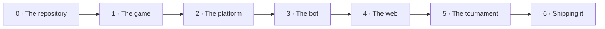

# Step-by-step guide

The project is about building a **two-player turn-based game**: the rules as a
Python library, an interface for other people's bots to plug into, a bot of your
own, a page where anyone can play, and a tournament that ranks every bot and
publishes the result.
This guide is here to help you tick off the project's tasks at each of its
phases.

The work is split into seven steps, numbered 0 to 6, and each step into several
tasks. Each task builds on the one before it, so skipping one forces you back to
it later with more code on top.

## How to use it

Each task describes what has to be done by that point.
Deciding *how* to do it is part of the exercise, and the technique you need is
explained in the section of the [Guide](index.md) that each task links to.

Every task ends in an observable result —a URL that opens, a command that
answers, a test that passes— marked in a green box. Until that result can be
demonstrated, the task is still open.

---

## The whole path

| Step | What you build | When it ends, you have |
|---|---|---|
| **0** | the repository | an empty project that is public, installable, protected and documented |
| **1** | the rules | a correct game, playable from a Python prompt |
| **2** | the `Player` interface | a platform someone from outside can plug a bot into |
| **3** | your AI | a bot worth playing against, with measured results |
| **4** | the web page | a public URL where anyone plays against it |
| **5** | the tournament | a ranking that publishes itself |
| **6** | shipping it | a project somebody else can use and the team can explain |

---

## Three rules, before you start

These three rules apply from Step 1 to the end of the project. They are how any
team that shares a repository works.

**1. Everything arrives by pull request. Nobody writes to `main` directly.**
Every change lives on a branch first and reaches `main` through a pull request
that somebody else approves. `main` is the version that works, the one that gets
deployed and the one an outsider sees, so it should never hold half-finished
work. The only exception is Step 0, where there is nothing to protect yet.

**2. Nothing is merged without review, without tests and without documentation.**
A pull request is ready when somebody else has read and approved it, when the
automatic checks are green, and when the documentation reflects what the change
does. Reviewing is not distrusting your teammate: it is the cheapest way to find
bugs, and the only way for the whole team to know the whole codebase.

**3. Every step ends in a stable state.**
When a step closes, the project has to be whole: the tests pass, the
documentation is published, and what used to work still works. A step that
leaves the repository half-done turns the next one into a repair job, and the
problem drags on to the end.

---

## Step 0 — The repository

The repository is where the project lives, and it gets configured before a
single line of game exists: public, installable, protected, with automatic tests
and with a published documentation site.

It is the only step worked on directly against `main`. From Step 1 onwards,
every change arrives by pull request.

---

### 📌 **0.1 — The repository**

The repository is created **public** on GitHub, with a short, descriptive name,
and with the three files GitHub offers when you create it: a `README`, a
`.gitignore` for Python and a license. Teammates are invited as collaborators
from the very first moment.

The license is the part most people skip and the one with the most
consequences. A public repository with no license is not open source, because
copyright applies by default and nobody may legally reuse the code. The
recommended license is **MIT**, unless the team has a specific reason to choose
another.

**References.** [First steps](github/first-steps.md) ·
[Choosing a license](github/first-steps.md#choosing-a-license)

!!! check "Result"
    A public repository URL exists, and teammates can clone it and push a
    branch.

---

### 📌 **0.2 — The installable package**

The project stops being a folder of scripts and becomes an installable Python
package. That means a `pyproject.toml` file describing it and the code placed
under `src/yourgame/`, then installed in editable mode inside a virtual
environment.

The `src/` layout is not decoration. It stops Python from importing the source
folder by accident, so the tests run against the package exactly as whoever
installs it receives it, and not against the loose files in the working
directory. From here on, everything that comes next —the tests, the web app, the
tournament and somebody else's bot— can import the game with a single line.

**References.** [What is a library](python-library/library.md) ·
[Organization](python-library/organization.md#the-src-layout) ·
[Installation and usage](python-library/installation-and-usage.md)

!!! check "Result"
    The statement `import yourgame` works from any directory on the system, not
    just from the project folder.

---

### 📌 **0.3 — The workflow**

The `main` branch is protected in the repository settings: it starts requiring a
pull request and at least one approving review, and stops accepting direct
pushes. The repository also gets a pull request template, so that every change
answers the same questions: what the change does, and whether the tests and the
documentation have been updated.

It is worth doing while the repository is empty and the rule bothers nobody.
Applying it halfway through the project means undoing weeks of habits already
formed, and by then the protection feels like an obstacle instead of the normal
way to work.

**References.**
[Repository configuration](github/repository-configuration.md) ·
[Pull requests](github/pull-requests.md#pull-request-templates)

!!! check "Result"
    An attempt to `git push origin main` is rejected, and a pull request states
    clearly that it needs an approving review before it can be merged.

---

### 📌 **0.4 — The automatic checks**

The repository gets a GitHub Actions workflow, defined in
`.github/workflows/tests.yml`, that on every change installs the package and
runs the tests with `pytest` alongside a style checker. That workflow is then
declared as a **required status check** in the rules for the `main` branch.

There is nothing worth testing yet, so a single test checking that the package
imports correctly is enough. What this task builds is the mechanism, not the
coverage. Once it is declared required, a red test suite stops being a warning
somebody has to remember to look at and becomes a blocked merge button.

**References.** [GitHub Actions](github/actions.md#running-the-tests) ·
[Required status checks](github/repository-configuration.md#required-status-checks)

!!! check "Result"
    A pull request shows a green check, and a deliberately broken test turns it
    red and prevents the change from being merged.

---

### 📌 **0.5 — The documentation site**

The project publishes a documentation site from the start. You need a
`mkdocs.yml` file, a `docs/index.md` with at least a paragraph inside it, the
repository imported into Read the Docs, and the build badge added to the
`README`.

Documentation is written better as the project advances, because every next step
already has somewhere to write down what it has just decided. The alternative is
leaving it for the end, and documentation written all at once in the final week
describes the project somebody remembers, not the one that exists.

**References.** [Documenting a project](documentation/documentation.md) ·
[MkDocs](documentation/mkdocs.md) ·
[Read the Docs](documentation/readthedocs.md)

!!! check "Result"
    A live documentation URL exists, with a page inside it, and it rebuilds
    automatically on every change.

!!! success "End of Step 0"
    An empty project that is already professional: public, installable,
    protected, tested on every change and documented at a real URL. Nothing
    works yet. Everything is ready for something to work.

---

## Step 1 — The game

The game starts from its rules, with no interface, no bots and no decoration.
When it ends there is a correct, complete game, playable from a Python
interpreter.

---

### 📌 **1.1 — The rules, before the code**

The game is described first in prose, in a `docs/rules.md` file, for somebody
who has never heard of it. The description covers the starting position, what a
turn consists of, what makes a move legal, when the game ends and who wins.

Writing this page brings the game's ambiguities to the surface —*can you pass?,
what happens on a draw?, who starts?*— at the moment when they still cost
nothing. If they do not come up here, they come up halfway through the web app,
with three files already built on top of the wrong answer.

If the game has **hidden information** or **chance**, the page says so
explicitly. Those two properties shape the design of everything that comes
afterwards, and they are decisions to take now rather than discover later.

**References.** [Documenting a project](documentation/documentation.md) ·
[Game rules](../game/rules.md)

!!! check "Result"
    A rules page exists that somebody outside the team could use to play a
    complete game on paper.

---

### 📌 **1.2 — The state and the move**

The team decides what the smallest piece of data is that fully describes a
position of the game, and what the smallest one is that describes a move. It is
worth choosing basic types —a list of integers, a tuple, a string— over classes
that are not needed yet, because a simple state can be printed, compared, copied
and sent as JSON to a browser with no extra work.

Two decisions deserve an explicit discussion. The first is **where the
information about whose turn it is lives**: it can be part of the state, or it
can be carried by whoever runs the game. The second is **whether the state is
immutable**, and this one has a recommended answer: applying a move returns a
new state instead of modifying the one it received. A bot that accidentally
modifies the board it was handed produces a bug that is hard to track down.

The chosen shapes are given a name through type aliases, such as
`State = list[int]` or `Move = tuple[int, int]`, so that every function
signature in the project reads the same way.

**References.** [Organization](python-library/organization.md)

!!! check "Result"
    A starting position can be written as a literal in a Python interpreter and
    printed to the screen.

---

### 📌 **1.3 — The rules as pure functions**

The rules are implemented as a small set of functions. Four hold up any
turn-based game: `legal_moves(state)`, `apply_move(state, move)`,
`is_terminal(state)` and `winner(state)`. A fifth, `is_legal(state, move)`, is
useful when generating every legal move is too expensive.

These functions must be **pure**: they do not print, do not read from standard
input, do not touch files and do not depend on any global state. They receive a
position and return an answer. Everything else in the project —the terminal
loop, the bots, the web app and the tournament— calls these functions, and they
can only agree with each other if there is a single place where the rules live.

The boundary has to be strict: `apply_move` raises an exception when it receives
an illegal move, instead of silently doing something reasonable. That way a
bot's mistake fails immediately and at the place where it happened, instead of
corrupting the game and showing up three moves later.

**References.** [API](python-library/api.md) ·
[Code structure](../game/advanced/code-structure.md)

!!! check "Result"
    In a Python interpreter, applying a move to a position returns the next
    position, and the original position remains untouched.

---

### 📌 **1.4 — The tests for the rules**

The rules are tested in a `tests/test_game.py` file that mirrors the name of
`src/yourgame/game.py`. One code module corresponds to one test module, and that
correspondence makes it obvious at a glance when a test is missing.

The first things checked are the properties that hold in any game: the legal
moves of a hand-computed position, that `apply_move` does not modify its input,
that an illegal move raises an exception, that a terminal position is detected
as such, and that a predefined sequence of moves ends with the expected winner.

Then come the awkward cases, which is where the bugs concentrate: the empty
board, the position with a single legal move, the move at the edge of the board
and, if the game allows for them, draws and the position where a player cannot
move.

**References.** [Testing](python-library/testing.md)

!!! check "Result"
    The `pytest` command finishes green locally, and the automatic check shows
    green on the pull request.

---

### 📌 **1.5 — A complete game from Python**

A short loop lets you play a whole game from the terminal: it prints the state,
reads a move from the keyboard, applies it and repeats until it reaches a
terminal position, at which point it announces the winner. Two people, one
keyboard and no graphical interface.

The loop puts everything above it to the test. If it turns out to be awkward to
write —because it forces you to reach into the internals of the structures, or
to keep a variable outside that should be part of the state, or to treat the
first turn as a special case— then the API is badly designed, and fixing it now
is far easier than doing it with a web app built on top.

The loop lives outside the library, as a script or as a small console entry
point. The package must remain importable and silent.

**References.**
[Installation and usage](python-library/installation-and-usage.md)

!!! check "Result"
    Two people from the team play a complete game in a terminal, from start to
    finish.

!!! success "End of Step 1"
    Your game exists and is correct, with no interface at all. Anyone who
    installs your package can play from a Python prompt.

---

## Step 2 — The platform

The platform is the point where a bot plugs in, including one written by
somebody who has never seen the project's code.

---

### 📌 **2.1 — The `Player` interface**

The platform defines an abstract base class with a single mandatory method,
`choose_move(self, state) -> Move`. The class also adds a class-level identity
—a name, the authors and a one-line description— and a factory
`create(cls, seed)`, so that a bot using randomness can be built
reproducibly.

The contract must be as small as the job allows. Every method the interface
demands is a method somebody from outside has to implement correctly, and
therefore one more way for their bot to arrive broken. A single method is
usually enough, and a second method to signal the end of the game is a
reasonable extension.

This is also where you decide **what a player is allowed to see**. In a
perfect-information game, the whole state. In a game with hidden information, a
*view* of the state built for that specific player, never the complete position.
It is the one decision in the project that cannot be added later without redoing
whatever sits on top of it.

**References.**
[Designing a plug-in API](python-library/api.md#designing-a-plug-in-api) ·
[Player API](../game/upload-a-bot/player-api.md)

!!! check "Result"
    An abstract class exists that refuses to be instantiated when a subclass
    does not implement `choose_move`.

---

### 📌 **2.2 — The reference player**

The first implementation of the interface is a `RandomPlayer`: it asks for the
legal moves, picks one at random with its own seeded generator, and returns it.

This player serves two purposes. It proves the interface is implementable, and
if writing the simplest possible bot turns out to be awkward, the interface gets
fixed now, while there is still only one implementation. And it works as a
measuring stick: every bot in the rest of the project is compared against the
random one, and beating it is the first meaningful achievement of any AI.

It is worth writing it the way somebody outside the team would, importing only
the public API. If the player needs a private helper function, that function is
part of the API and should be public.

!!! check "Result"
    Two random players play a game against each other and finish it without
    making a single illegal move.

---

### 📌 **2.3 — The game runner**

One function, `play_game(player_a, player_b, state)`, is responsible for
directing a complete game: it alternates turns, asks the player whose turn it is
for their move, checks that move, applies it and repeats the cycle until it
reaches a terminal position. When it finishes it returns the winner and the move
history.

The runner validates **every** move before applying it, because it is the border
between the team's code and a stranger's. And it hands each player a copy of the
state, so that a bot that modifies what it receives only harms itself.

The runner does not know *who* is playing. It knows two objects that have a
`choose_move` method, and it knows nothing about people, bots, difficulty levels
or tournaments. That ignorance is what makes it reusable without modification in
Step 4 and Step 5.

**References.** [The tournament](../game/advanced/tournament.md)

!!! check "Result"
    Two bots play a game to the end, and the function returns the winner along
    with the list of moves that led to it.

---

### 📌 **2.4 — The contract test**

One test runs over **every** registered player and checks, on each turn of
several different games, that the move returned was legal and that the state
passed to the player was not modified. The test is parametrized over the player
registry, so that admitting a new bot requires writing no new test.

That the test works is demonstrated by writing deliberately broken bots: one
that raises an exception, one that returns an illegal move, one that returns
nothing and one that modifies the board it received. Each of them should fail
cleanly and without dragging the others down.

This test is what makes it safe to accept contributions from outside. Without
it, every bot received is a code review that has to be done perfectly by eye;
with it, a faulty pull request turns red on its own.

**References.**
[Testing a contract other people implement](python-library/testing.md#testing-a-contract-other-people-implement)

!!! check "Result"
    A deliberately broken bot fails in continuous integration, and a correct bot
    passes the checks without anyone having to write it a test of its own.

---

### 📌 **2.5 — The documented API and the submission path**

The platform needs two documents, and they are documents of a different nature.
The **reference** is generated automatically from the docstrings with
`mkdocstrings`, so that a renamed parameter cannot leave an outdated page
behind.

The **tutorial** is written by hand and walks a person from nothing to a merged
bot: which file to copy, which method to implement, where to register it, which
command to run to check it and how to open the pull request. The steps are
numbered and the example file is shown whole, not as a loose fragment.

**References.**
[Documenting a project](documentation/documentation.md) ·
[API pages from docstrings](documentation/mkdocs.md#api-pages-from-docstrings) ·
[Submit a player](../game/upload-a-bot/submit-a-player.md)

!!! check "Result"
    Somebody outside the team follows the tutorial and opens a pull request that
    works, without needing to ask a single question.

!!! success "End of Step 2"
    Your game is a platform. Somebody from outside can add a bot to it without
    opening your code, and your tests will tell them if it is broken.

---

## Step 3 — The bot

The random player has existed since the previous step. Now you need an opponent
worth beating, and measured results to prove it.

---

### 📌 **3.1 — Beating the random player**

The first bot applies a practical rule about the game —capture as much as
possible, control the centre, never leave two in a row— greedily: it scores
every legal move according to that rule, plays the highest-scoring one and
breaks ties at random.

This player does not look ahead and has no real intelligence, and even so it
clearly beats the random one in most games. It is worth building before anything
sophisticated, because it provides a second measuring stick and because the
scoring function written here usually becomes the evaluation function of the
next task.

!!! check "Result"
    Over a run of 100 games against the random player, the greedy bot wins more
    than 80%.

---

### 📌 **3.2 — Looking ahead**

The second bot searches among future moves. The algorithm depends on the game:
**minimax with alpha-beta pruning** for a perfect-information game,
**expectimax** when chance is involved, and **Monte Carlo tree search** when the
branching factor is too large for either of the other two. Any of them needs
three pieces: a value for terminal positions, an evaluation for non-terminal
ones —probably the greedy score from the previous task— and a depth limit.

The depth limit is not optional. An unbounded search takes tens of seconds on a
crowded position, and a move that takes that long makes the interface unusable
no matter how well it plays. The bot fixes a maximum depth, or else fixes a time
limit and deepens iteratively until it runs out.

It is worth measuring where the time actually goes. If the full-depth search is
fast, you can go deeper; if it is slow, what needs to get cheaper is the
evaluation, before trying to make the search cleverer.

!!! check "Result"
    The search bot beats the greedy bot, and answers in under a second on the
    most crowded position the team can find.

---

### 📌 **3.3 — Measuring the bots**

A script pits two named players against each other over N games and prints a
table of win rates. Every pairing is played **in both directions**, because in
many games moving first is worth more than any amount of intelligence, and a bot
that has only been tested as player one is a bot you know nothing about.

The script fixes the seed, so that a run can be repeated, and always states the
number of games played. "It seems better" is not a result; "it wins 71% of 200
games, and 68% when it plays second" is, and it is the sentence that tells you
whether the last change achieved anything.

!!! check "Result"
    A table of win rates exists between the random, greedy and search players,
    generated by a command that can be run again.

---

### 📌 **3.4 — Explaining how it decides**

The bot gets its own documentation page: what it evaluates, how far ahead it
looks and in which situations it plays badly. Being honest about the weaknesses
is more useful than praise, because a sentence like "it does not see a forced
loss more than four moves away" gives the reader something concrete to work
with.

Optionally, the bot can publish the reasoning behind its last move: the depth
reached, the score obtained and the number of positions examined. That
information turns the web page into something that explains *why* a move was
made, which is a far more interesting demonstration than a board that simply
moves.

**References.** [Documenting a project](documentation/documentation.md)

!!! check "Result"
    A page exists from which somebody outside the team could reimplement the
    bot.

!!! success "End of Step 3"
    Your bot beats the random one always, the greedy one almost always, and you
    sometimes.

---

## Step 4 — Build and deploy

The game reaches somewhere anyone can play it. The chosen form is a **static
page**, served by [GitHub Pages](github/pages.md) from the repository itself,
just like [this project's page](https://jparisu.github.io/nim-arena). No server
is needed and there is no hosting cost, and the Python that is already written
runs directly in the browser thanks to
[Pyodide](web-app/static-web/pyodide.md).

!!! note "Streamlit is also a valid answer"
    If the team would rather not write any JavaScript,
    [Streamlit](web-app/streamlit/index.md) is an equally legitimate route. The
    rest of the step still applies and only the mechanics of tasks 4.1 to 4.3
    change. There are two differences to keep in mind: deployment happens on
    [Streamlit Community Cloud](web-app/streamlit/cloud.md) and not on Pages, so
    **the URL is different and lives on another service**, and a free app
    [sleeps when nobody is using it](web-app/streamlit/cloud.md#the-limits-that-will-bite-you).

    In either case, **the published URL goes in the `README.md`**, right at the
    top and as a link. Anyone visiting the repository has to be able to find the
    playable page without asking where it is.

---

### 📌 **4.1 — A page served from the repository**

The repository gets a `web/` folder with three files —`index.html`, `style.css`
and `app.js`— that for now show nothing more than the name of the game. The
**Settings → Pages → Source** option is set to **GitHub Actions**, and the
project gets a deployment workflow that builds `web/` and publishes it.

This is done **before** there is anything to show. Getting the deployment
running while the page only says "hello" lets you make mistakes calmly and solve
the permissions problems without pressure; doing it the night before a demo,
with the game half finished, costs far more.

The page is tested locally by serving the folder with a server, never by
double-clicking the file. Under the `file://` protocol the browser blocks
`fetch()`, and a page that works locally but fails once published is almost
always explained by this.

**References.**
[Publishing a site of your own](github/pages.md#publishing-a-site-of-your-own) ·
[HTML, CSS and JavaScript](web-app/static-web/html-js.md)

!!! check "Result"
    A public `github.io` URL exists showing the provisional page, and it
    redeploys on every change to `main`. The link is in the `README`.

---

### 📌 **4.2 — The game inside the browser**

A build script compresses `src/yourgame/` into a `web/py.zip` file, and the page
loads Pyodide, downloads that file, unpacks it and imports the package. Between
the Python and the page sits **a bridge module** that exposes exactly the
functions the page needs, and that exchanges JSON strings across the border
between Python and JavaScript.

The alternative, reimplementing the rules in JavaScript, produces two versions
of what took all of Step 1 to get right, and those two versions end up not
matching. There must be a single engine, used equally from the tests, the
tournament and the page.

The `py.zip` file is generated output: the deployment workflow produces it and
it stays out of version control, because committing it to Git turns every
rebuild into a change to review.

**References.** [Python in the browser](web-app/static-web/pyodide.md) ·
[The web app](../game/advanced/web.md)

!!! check "Result"
    From the browser console you can ask the bridge for the legal moves of a
    position, and the answer comes from the project's Python.

---

### 📌 **4.3 — The board and the click**

The page draws the board from the state, with one element per square, pile or
cell. Clicking one of those elements produces a move, which is applied through
the bridge and causes the page to redraw from the new state. The redraw always
starts from the state: modifying what is displayed directly and trusting it to
keep matching the game does not work.

All the drawing lives in a single function,
`paintBoard(container, state, onPick)`, called from every place the board
appears. Two copies of a board renderer start diverging within days.

**References.** [HTML, CSS and JavaScript](web-app/static-web/html-js.md)

!!! check "Result"
    One person can play both sides of a complete game from the browser.

---

### 📌 **4.4 — A bot in the other seat**

The page gets a selector with the registered players. After each human move, the
page asks the chosen bot for its reply and applies it to the board. The
interface shows who is playing which side and announces the winner when the game
ends.

Everything this task needs already exists: the player registry from Step 2, the
bot from Step 3 and a bridge able to call both. If the task requires writing new
game logic, that is a sign something has leaked into the wrong layer; the page
asks questions about the game, but it does not answer them.

A small delay before the bot's move makes the game feel considered rather than
instantaneous. Showing what the bot was thinking has the same effect, if the
team did the optional part of task 3.4.

!!! check "Result"
    A person opens the URL and plays a complete game against the bot, including
    the ending with the winner announced.

---

### 📌 **4.5 — Surviving whoever uses it**

The page is tested by trying to break it: clicking an element that is no longer
there, double-clicking, clicking during the bot's turn, clicking with the game
already over, reloading mid-game and opening it on a phone. Each of those
actions should produce a clear message or produce nothing at all, but never a
blank page or a button that stops responding.

A static page has no server log, so an exception that escapes is invisible to
the team: whoever is using it sees a button that does nothing and has no way to
report what happened. That is why the page catches errors globally, displays
them somewhere visible, and wires each of its parts independently, so that a
failure in one does not silently dismantle the rest.

**References.**
[Failing loudly](web-app/static-web/html-js.md#failing-loudly)

!!! check "Result"
    The page does not break however much it is clicked, and a person with a
    phone and the link plays a complete game without anyone helping them.

!!! success "End of Step 4"
    A link you can send to anyone. They install nothing, and they play your game
    against your bot.

---

## Step 5 — The tournament

The tournament decides which bot is best. It runs automatically at intervals and
publishes its result where anyone can consult it.

---

### 📌 **5.1 — Every pairing**

The tournament is a round-robin: every registered player faces all the others,
in both starting orders and over several games per pairing. The games are played
by reusing `play_game` from task 2.3 without modifying it; if the need to write
a second runner appears, it means the first one knew too much about who was
playing.

The tournament counts wins, losses and draws, and stores the detail of each game
as well as the totals. The whole run is seeded from a single number, so that the
same tournament produces the same result twice in a row. A ranking that changes
when nothing has changed is a ranking nobody trusts.

**References.** [The tournament](../game/advanced/tournament.md)

!!! check "Result"
    The tournament prints a complete standings table in the terminal.

---

### 📌 **5.2 — Surviving a bad player**

A tournament runs unsupervised and with code written by strangers inside it. The
failure that matters is not a bot losing, but a bot taking the whole run down
with it. Raising an exception, returning an illegal move, returning nothing,
never returning, modifying the board it received or lying about its own name:
each of those behaviours must cost the offender the game in which it happens,
and nothing more.

To achieve that, every move request is wrapped in a layer of protection that
catches any exception, imposes a time limit, validates the returned move and
hands over a copy of the state. On any violation, the offender loses that game,
the reason is recorded and the tournament continues with the next pairing.

This behaviour is demonstrated with tests and with deliberately broken bots: one
that fails, one that cheats and one that hangs. Each must lose only its own
games while the run reaches the end.

**References.** [Testing](python-library/testing.md)

!!! check "Result"
    A bot that raises an exception on every move finishes last with a recorded
    reason, and the tournament still produces the complete table.

---

### 📌 **5.3 — The standings in a file**

The standings are emitted as JSON in `results/leaderboard.json`, and not on
standard output. The file includes a schema version, the time the run finished,
the sorted standings and the metadata for each player that a page needs to draw
the table without knowing anything else.

The file is what makes the next two tasks possible: the web app reads it,
continuous integration commits it, it shows up in the diff of a pull request and
it is recorded in the history. None of that is possible if the result only ever
existed in a terminal that has since been closed.

**References.** [The scoreboard](../game/advanced/scoreboard.md)

!!! check "Result"
    A `leaderboard.json` file exists that can be opened and read, and a command
    that regenerates it from scratch.

---

### 📌 **5.4 — Automatic execution**

A workflow runs the tournament on a schedule, daily, and also accepts a manual
launch through `workflow_dispatch`. When it finishes, it commits the updated
`leaderboard.json` to the repository.

There is a trap worth knowing about in advance: **GitHub emits no `push` event
for a commit created by a workflow**. The Pages deployment, which is triggered
by pushes, never finds out that a new ranking exists. The solution is for the
deployment to also listen for the tournament workflow finishing, through
`workflow_run`.

**References.** [GitHub Actions](github/actions.md) ·
[When the site does not redeploy](github/pages.md#when-the-site-does-not-redeploy)

!!! check "Result"
    The standings file changes overnight, without anyone having to launch
    anything by hand.

---

### 📌 **5.5 — The scoreboard on display**

The page gets a scoreboard screen that downloads `leaderboard.json` and draws
the table. That screen plays no games: it merely renders the data of a file the
build left next to the page. The download uses `{ cache: "no-cache" }`, because
otherwise the browser will silently show yesterday's copy of a file that was
updated an hour ago.

The screen also handles the empty case. Before the first tournament the file may
not exist yet, and the page has to say so with a message instead of failing.

**References.**
[Loading data without a backend](web-app/static-web/html-js.md#loading-data-without-a-backend)

!!! check "Result"
    A public scoreboard exists, and a bot merged today appears in the standings
    the next day without anyone having intervened.

!!! success "End of Step 5"
    The project now runs itself. A pull request adds a bot, the checks say
    whether it is valid, the tournament ranks it and the page shows the result.

---

## Step 6 — Shipping it

The project works, but it has not been delivered yet. What remains is how
somebody arriving from outside receives it: what they see first, whether they
can get it running on their own, and whether the team can defend the decisions
it has made.

---

### 📌 **6.1 — The README as the front page**

The `README` fits on one screen and holds the essentials: what the game is, an
image or a short animation of somebody playing, a link to the playable page, a
link to the documentation, how to install it, how to add a bot and the license.
Right at the top go the badges for the tests and for the documentation build.

The `README` is the project's trailer, not its documentation. Anything longer
than a paragraph lives in the [documentation site](documentation/index.md) and
is linked from here. A `README` that grows beyond two screens is a documentation
site trying to escape.

**References.** [Documenting a project](documentation/documentation.md)

!!! check "Result"
    Somebody outside the project understands what it is about in thirty seconds
    and knows exactly where to click next.

---

### 📌 **6.2 — A clean clone following your own instructions**

Somebody from the team clones the repository from scratch on another machine,
or at least into a new directory with a new virtual environment, and does
exactly what the `README` and the bot tutorial say. They type the commands as
published, fix nothing from memory along the way, and write down everything that
fails.

The clean clone brings to light the step nobody got around to writing, because
the whole team has had it installed since week two. It is the only way to check
whether the published instructions work for somebody who does not know the
project.

**References.**
[Installation and usage](python-library/installation-and-usage.md)

!!! check "Result"
    A clean clone gets as far as a finished game and a working bot, using only
    what is written in the documentation.

---

### 📌 **6.3 — Being able to explain it**

The team goes back over the project and locates every decision that could have
gone the other way: the representation of the state, the size of the player
interface, what a bot is allowed to see, the search algorithm chosen, or using
Pages instead of Streamlit. For each one, somebody on the team must be able to
explain why it was decided that way.

When the reason is not obvious from reading the code, it gets written next to
the code or on the documentation page where somebody would go looking for it. A
comment explaining *why* something is the way it is outlives every comment
explaining *what* it does.

!!! check "Result"
    For any part of the project, somebody on the team answers the question "why
    is it built like this?" with a concrete reason.

---

**Next:** [Git](git/index.md) · [GitHub](github/index.md) · [Python library](python-library/index.md) · [Web app](web-app/index.md) · [Documentation](documentation/index.md) — the five sections, in depth.

**Also:** [The game](../game/index.md)

---

## Index

[TOC]
