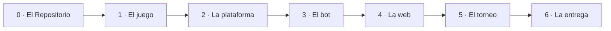

# Guía paso a paso

El proyecto consiste en construir un **juego por turnos de dos jugadores**: las
reglas como librería de Python, una interfaz para que se conecten bots de otras
personas, un bot propio, una página donde cualquiera pueda jugar y un torneo que
clasifique a todos los bots y publique el resultado.
Esta guía sirve como apoyo para marcar las tareas del proyecto en cada una de sus fases.

El trabajo se reparte en siete pasos, numerados del 0 al 6, y cada paso en varias
tareas. Cada tarea se apoya en la anterior, de modo que saltarse una obliga a
volver a ella más tarde con más código encima.

## Cómo se usa

Cada tarea describe qué debe quedar hecho en cada momento.
Decidir cómo hacerlo forma parte del ejercicio, y la técnica que
hace falta está explicada en la sección de la [Guía](index.md) que cada tarea
enlaza.

Toda tarea termina en un resultado observable —una URL que se abre, un comando
que responde, una prueba que pasa— señalado en un recuadro verde. Mientras ese
resultado no se pueda demostrar, la tarea sigue abierta.

---

## El recorrido completo

| Paso | Qué construyes | Cuando acaba, tienes |
|---|---|---|
| **0** | el repositorio | un proyecto vacío público, instalable, protegido y documentado |
| **1** | las reglas | un juego correcto, jugable desde un prompt de Python |
| **2** | la interfaz `Player` | una plataforma a la que alguien de fuera le puede conectar un bot |
| **3** | tu IA | un bot que merece la pena jugar, con resultados medidos |
| **4** | la página web | una URL pública donde cualquiera juega contra él |
| **5** | el torneo | una clasificación que se publica sola |
| **6** | la entrega | un proyecto que otra persona puede usar y que el equipo sabe explicar |

---

## Índice

[TOC]

---

## Tres reglas, antes de empezar

Estas tres reglas se aplican desde el Paso 1 hasta el final del proyecto. Son la
forma en la que trabaja cualquier equipo que comparte un repositorio.

**1. Todo entra por pull request. Nadie escribe directamente en `main`.**
Cada cambio vive primero en una rama y llega a `main` a través de un pull request
que otra persona aprueba. `main` es la versión que funciona, la que se despliega y
la que ve quien llega de fuera, así que nunca debería contener trabajo a medias.
La única excepción es el Paso 0, donde todavía no hay nada que proteger.

**2. Nada se fusiona sin revisión, sin tests y sin documentación.**
Un pull request está listo cuando otra persona lo ha leído y aprobado, cuando las
comprobaciones automáticas están en verde y cuando la documentación refleja lo que
el cambio hace. Revisar no es desconfiar del compañero: es la forma más barata de
encontrar errores y la única manera de que todo el equipo conozca todo el código.

**3. Cada paso termina en un estado estable.**
Al cerrar un paso, el proyecto tiene que estar entero: los tests pasan, la
documentación está publicada y lo que funcionaba antes sigue funcionando. Un paso
que deja el repositorio a medias convierte el siguiente en una reparación, y el
problema se arrastra hasta el final.

---

## Paso 0 — El repositorio

El repositorio es el lugar donde vive el proyecto, y queda configurado antes de
que exista una sola línea de juego: público, instalable, protegido, con pruebas
automáticas y con un sitio de documentación publicado.

Es el único paso que se trabaja directamente sobre `main`. A partir del Paso 1,
todo cambio llega por pull request.

---

### 📌 **0.1 — El repositorio**

El repositorio se crea **público** en GitHub, con un nombre corto y descriptivo,
y con los tres archivos que GitHub ofrece al crearlo: un `README`, un
`.gitignore` para Python y una licencia. Los compañeros de equipo se invitan como
colaboradores desde el primer momento.

La licencia es la parte que más gente se salta y la que más consecuencias tiene.
Un repositorio público sin licencia no es software libre, porque por defecto se
aplica el copyright y nadie puede reutilizar el código legalmente. La licencia
recomendada es **MIT**, salvo que el equipo tenga un motivo concreto para elegir
otra.

**Referencias.** [Primeros pasos](github/first-steps.md) ·
[Elegir una licencia](github/first-steps.md#elegir-una-licencia)

!!! check "Resultado"
    Existe una URL pública del repositorio, y los compañeros de equipo pueden
    clonarlo y subir una rama.

---

### 📌 **0.2 — El paquete instalable**

El proyecto deja de ser una carpeta de scripts y pasa a ser un paquete de Python
instalable. Eso significa un archivo `pyproject.toml` que lo describe y el código
colocado bajo `src/tujuego/`, instalado después en modo editable dentro de un
entorno virtual.

La estructura `src/` no es una decoración. Impide que Python importe la carpeta de
código por accidente, de forma que las pruebas se ejecutan contra el paquete tal y
como lo recibe quien lo instala, y no contra los archivos sueltos del directorio
de trabajo. A partir de aquí, todo lo que venga después —las pruebas, la
aplicación web, el torneo y el bot de otra persona— puede importar el juego con
una sola línea.

**Referencias.** [Qué es una librería](python-library/library.md) ·
[Organización](python-library/organization.md#the-src-layout) ·
[Instalación y uso](python-library/installation-and-usage.md)

!!! check "Resultado"
    La instrucción `import tujuego` funciona desde cualquier directorio del
    sistema, no solo desde la carpeta del proyecto.

---

### 📌 **0.3 — El flujo de trabajo**

La rama `main` se protege en la configuración del repositorio: pasa a exigir un
pull request, al menos una revisión aprobatoria, y deja de admitir escrituras
directas. El repositorio recibe además una plantilla de pull request, para que
todos los cambios respondan a las mismas preguntas: qué hace el cambio, y si se
han actualizado las pruebas y la documentación.

Conviene hacerlo mientras el repositorio está vacío y la regla no molesta a nadie.
Aplicarla a mitad del proyecto obliga a deshacer semanas de costumbres ya
adquiridas, y para entonces la protección se percibe como un estorbo en lugar de
como la forma normal de trabajar.

**Referencias.**
[Configuración del repositorio](github/repository-configuration.md) ·
[Pull requests](github/pull-requests.md#plantillas-de-pull-request)

!!! check "Resultado"
    Un intento de `git push origin main` se rechaza, y un pull request indica
    claramente que necesita una revisión aprobatoria antes de poder fusionarse.

---

### 📌 **0.4 — Las comprobaciones automáticas**

El repositorio incorpora un flujo de trabajo de GitHub Actions, definido en
`.github/workflows/tests.yml`, que en cada cambio instala el paquete y ejecuta las
pruebas con `pytest` junto a un analizador de estilo. Ese flujo se declara después
como **comprobación de estado obligatoria** en las reglas de la rama `main`.

Todavía no hay nada que merezca la pena probar, así que basta con una prueba que
compruebe que el paquete se importa correctamente. Lo que se construye en esta
tarea es el mecanismo, no la cobertura. Una vez declarado obligatorio, un conjunto
de pruebas en rojo deja de ser un aviso que alguien tiene que recordar mirar y
pasa a ser un botón de fusión bloqueado.

**Referencias.** [GitHub Actions](github/actions.md#ejecutar-las-pruebas) ·
[Comprobaciones obligatorias](github/repository-configuration.md#comprobaciones-de-estado-obligatorias)

!!! check "Resultado"
    Un pull request muestra una comprobación en verde, y una prueba rota a
    propósito la pone en rojo e impide fusionar el cambio.

---

### 📌 **0.5 — El sitio de documentación**

El proyecto publica un sitio de documentación desde el principio. Hacen falta un
archivo `mkdocs.yml`, un `docs/index.md` con al menos un párrafo dentro, el
repositorio importado en Read the Docs y la insignia de construcción añadida al
`README`.

La documentación se escribe mejor mientras el proyecto avanza, porque cada paso
siguiente tiene ya un sitio donde escribir lo que acaba de decidir. La alternativa
es dejarla para el final, y la documentación escrita de golpe la última semana
describe el proyecto que alguien recuerda, no el que existe.

**Referencias.** [Documentar un proyecto](documentation/documentation.md) ·
[MkDocs](documentation/mkdocs.md) ·
[Read the Docs](documentation/readthedocs.md)

!!! check "Resultado"
    Existe una URL de documentación en vivo, con una página dentro, que se
    reconstruye automáticamente con cada cambio.

!!! success "Fin del Paso 0"
    Un proyecto vacío que ya es profesional: público, instalable, protegido,
    probado en cada cambio y documentado en una URL real. Todavía no funciona
    nada. Todo está listo para que algo funcione.

---

## Paso 1 — El juego

El juego empieza por sus reglas, sin interfaz, sin bots y sin adornos. Al
terminar existe un juego correcto y completo, jugable desde un intérprete de
Python.

---

### 📌 **1.1 — Las reglas, antes que el código**

El juego se describe primero en prosa, en un archivo `docs/rules.md`, para alguien
que no ha oído hablar de él nunca. La descripción cubre la posición inicial, en
qué consiste un turno, qué hace que un movimiento sea legal, cuándo termina la
partida y quién gana.

Escribir esta página saca a la luz las ambigüedades del juego —*¿se puede pasar?,
¿qué ocurre en caso de tablas?, ¿quién empieza?*— en el momento en el que todavía
no cuestan nada. Si no aparecen aquí, aparecen a mitad de la aplicación web, con
tres archivos ya construidos sobre la respuesta equivocada.

Si el juego tiene **información oculta** o **azar**, la página lo dice de forma
explícita. Esas dos propiedades condicionan el diseño de todo lo que viene
después, y son decisiones que hay que tomar ahora en lugar de descubrirlas más
tarde.

**Referencias.** [Documentar un proyecto](documentation/documentation.md) ·
[Reglas del juego](../game/rules.md)

!!! check "Resultado"
    Existe una página de reglas con la que una persona ajena al equipo podría
    jugar una partida completa sobre papel.

---

### 📌 **1.2 — El estado y el movimiento**

El equipo decide cuál es el dato más pequeño que describe por completo una
posición del juego, y cuál es el más pequeño que describe un movimiento. Conviene
elegir tipos básicos —una lista de enteros, una tupla, una cadena— antes que
clases que todavía no hacen falta, porque un estado simple se puede imprimir,
comparar, copiar y enviar como JSON a un navegador sin ningún trabajo adicional.

Hay dos decisiones que merecen una discusión explícita. La primera es **dónde vive
la información de a quién le toca jugar**: puede formar parte del estado, o puede
llevarla quien ejecuta la partida. La segunda es **si el estado es inmutable**, y
esta tiene una respuesta recomendada: aplicar un movimiento devuelve un estado
nuevo en lugar de modificar el que ha recibido. Un bot que modifica sin querer el
tablero que le han pasado produce un error difícil de localizar.

Las formas elegidas reciben un nombre mediante alias de tipo, como
`State = list[int]` o `Move = tuple[int, int]`, de modo que todas las firmas de
funciones del proyecto se lean de la misma manera.

**Referencias.** [Organización](python-library/organization.md)

!!! check "Resultado"
    Una posición inicial se puede escribir como literal en un intérprete de Python
    e imprimirse por pantalla.

---

### 📌 **1.3 — Las reglas como funciones puras**

Las reglas se implementan como un conjunto reducido de funciones. Cuatro sostienen
cualquier juego por turnos: `legal_moves(state)`, `apply_move(state, move)`,
`is_terminal(state)` y `winner(state)`. Una quinta, `is_legal(state, move)`,
resulta útil cuando generar todos los movimientos legales es demasiado costoso.

Estas funciones deben ser **puras**: no imprimen, no leen de la entrada estándar,
no tocan archivos y no dependen de ningún estado global. Reciben una posición y
devuelven una respuesta. Todo lo demás del proyecto —el bucle de terminal, los
bots, la aplicación web y el torneo— llama a estas funciones, y solo pueden estar
de acuerdo entre sí si existe un único lugar donde viven las reglas.

La frontera debe ser estricta: `apply_move` lanza una excepción cuando recibe un
movimiento ilegal, en lugar de hacer en silencio algo razonable. Así, el error de
un bot falla de inmediato y en el sitio donde se ha producido, en vez de corromper
la partida y manifestarse tres movimientos después.

**Referencias.** [API](python-library/api.md) ·
[Estructura del código](../game/advanced/code-structure.md)

!!! check "Resultado"
    En un intérprete de Python, aplicar un movimiento a una posición devuelve la
    posición siguiente, y la posición original permanece intacta.

---

### 📌 **1.4 — Las pruebas de las reglas**

Las reglas se prueban en un archivo `tests/test_game.py` que refleja el nombre de
`src/tujuego/game.py`. Un módulo de código corresponde a un módulo de pruebas, y
esa correspondencia hace evidente de un vistazo cuándo falta una prueba.

Lo primero que se comprueba son las propiedades que son ciertas en cualquier
juego: los movimientos legales de una posición calculada a mano, que `apply_move`
no modifica su entrada, que un movimiento ilegal lanza una excepción, que una
posición terminal se detecta como tal, y que una secuencia de movimientos
predefinida termina con el ganador esperado.

Después se cubren los casos incómodos, que es donde se concentran los errores: el
tablero vacío, la posición con un único movimiento legal, el movimiento en el
borde del tablero y, si el juego los contempla, las tablas y la posición en la que
un jugador no puede mover.

**Referencias.** [Pruebas](python-library/testing.md)

!!! check "Resultado"
    La orden `pytest` termina en verde en local, y la comprobación automática
    aparece en verde en el pull request.

---

### 📌 **1.5 — Una partida completa desde Python**

Un bucle breve permite jugar una partida entera desde el terminal: imprime el
estado, lee un movimiento por teclado, lo aplica y repite hasta llegar a una
posición terminal, momento en el que anuncia el ganador. Dos personas, un teclado
y ninguna interfaz gráfica.

El bucle pone a prueba todo lo anterior. Si resulta incómodo de
escribir —porque obliga a acceder a las interioridades de las estructuras, o a
mantener por fuera una variable que debería formar parte del estado, o a tratar el
primer turno como un caso especial— entonces la API está mal diseñada, y
corregirla ahora es mucho más sencillo que hacerlo con una aplicación web
construida encima.

El bucle vive fuera de la librería, como un script o como un pequeño punto de
entrada de consola. El paquete debe seguir siendo importable y silencioso.

**Referencias.**
[Instalación y uso](python-library/installation-and-usage.md)

!!! check "Resultado"
    Dos personas del equipo juegan una partida completa en un terminal, de
    principio a fin.

!!! success "Fin del Paso 1"
    Tu juego existe y es correcto, sin ninguna interfaz. Quien instale tu
    paquete puede jugar desde un prompt de Python.

---

## Paso 2 — La plataforma

La plataforma es el punto donde se conecta un bot, incluido uno escrito por
alguien que no ha visto nunca el código del proyecto.

---

### 📌 **2.1 — La interfaz `Player`**

La plataforma define una clase base abstracta con un único método obligatorio,
`choose_move(self, state) -> Move`. La clase añade además una identidad a nivel de
clase —un nombre, los autores y una descripción de una línea— y una fábrica
`create(cls, seed)`, de modo que un bot que utilice azar se pueda construir de
forma reproducible.

El contrato debe ser tan pequeño como el trabajo permita. Cada método que la
interfaz exige es un método que alguien de fuera tiene que implementar
correctamente, y por tanto una forma más de que su bot llegue roto. Un único
método suele ser suficiente, y un segundo método para avisar del fin de la partida
es una ampliación razonable.

Aquí se decide también **qué le está permitido ver a un jugador**. En un juego de
información perfecta, el estado completo. En un juego con información oculta, una
*vista* del estado construida para ese jugador concreto, nunca la posición
completa. Es la única decisión del proyecto que no se puede añadir más tarde sin
rehacer lo que haya encima.

**Referencias.**
[Diseñar una API que otros implementan](python-library/api.md#disenar-una-api-que-otros-implementan) ·
[API de jugador](../game/upload-a-bot/player-api.md)

!!! check "Resultado"
    Existe una clase abstracta que se niega a instanciarse cuando una subclase no
    implementa `choose_move`.

---

### 📌 **2.2 — El jugador de referencia**

La primera implementación de la interfaz es un `RandomPlayer`: consulta los
movimientos legales, elige uno al azar con su propio generador con semilla y lo
devuelve.

Este jugador cumple dos funciones. Demuestra que la interfaz es implementable, y
si escribir el bot más simple posible resulta incómodo, la interfaz se corrige
ahora, cuando todavía existe una sola implementación. Y sirve de vara de medir:
todos los bots del resto del proyecto se comparan contra el aleatorio, y ganarle
es el primer logro significativo de cualquier IA.

Conviene escribirlo como lo escribiría alguien de fuera del equipo, importando
únicamente la API pública. Si el jugador necesita una función auxiliar privada,
esa función forma parte de la API y debería ser pública.

!!! check "Resultado"
    Dos jugadores aleatorios juegan una partida entre ellos y la terminan sin
    cometer ningún movimiento ilegal.

---

### 📌 **2.3 — El ejecutor de partidas**

Una función, `play_game(player_a, player_b, state)`, se encarga de dirigir una
partida completa: alterna los turnos, pide su movimiento al jugador al que le
toca, comprueba ese movimiento, lo aplica y repite el ciclo hasta llegar a una
posición terminal. Al terminar devuelve el ganador y el historial de movimientos.

El ejecutor valida **todos** los movimientos antes de aplicarlos, porque es la
frontera entre el código del equipo y el de un desconocido. Y entrega a cada
jugador una copia del estado, de manera que un bot que modifique lo que recibe
solo se perjudique a sí mismo.

El ejecutor no sabe *quién* está jugando. Conoce dos objetos que tienen un método
`choose_move`, y no sabe nada sobre personas, bots, niveles de dificultad ni
torneos. Esa ignorancia es lo que permite reutilizarlo sin modificarlo en el Paso
4 y en el Paso 5.

**Referencias.** [El torneo](../game/advanced/tournament.md)

!!! check "Resultado"
    Dos bots juegan una partida hasta el final, y la función devuelve el ganador
    junto a la lista de movimientos que ha llevado hasta él.

---

### 📌 **2.4 — La prueba de contrato**

Una prueba recorre **todos** los jugadores registrados y comprueba, en cada turno
de varias partidas distintas, que el movimiento devuelto era legal y que el estado
que se le pasó al jugador no ha sido modificado. La prueba se parametriza sobre el
registro de jugadores, de forma que admitir un bot nuevo no exija escribir ninguna
prueba nueva.

Que la prueba funciona se demuestra escribiendo bots rotos a propósito: uno que
lanza una excepción, uno que devuelve un movimiento ilegal, uno que no devuelve
nada y uno que modifica el tablero que ha recibido. Cada uno de ellos debería
fallar de forma limpia y sin arrastrar a los demás.

Esta prueba es lo que hace seguro aceptar contribuciones de fuera. Sin ella, cada
bot recibido es una revisión de código que hay que hacer perfecta a ojo; con ella,
un pull request defectuoso se pone en rojo por sí solo.

**Referencias.**
[Probar un contrato que implementan otros](python-library/testing.md#probar-un-contrato-que-implementan-otros)

!!! check "Resultado"
    Un bot roto a propósito falla en la integración continua, y un bot correcto
    pasa las comprobaciones sin que nadie tenga que escribirle una prueba propia.

---

### 📌 **2.5 — La API documentada y el camino de envío**

La plataforma necesita dos documentos, y son documentos de naturaleza distinta. La
**referencia** se genera automáticamente a partir de los docstrings con
`mkdocstrings`, de modo que un parámetro renombrado no pueda dejar atrás una
página obsoleta.

El **tutorial** se escribe a mano y acompaña a una persona desde cero hasta un bot
fusionado: qué archivo copiar, qué método implementar, dónde registrarlo, qué
comando ejecutar para comprobarlo y cómo abrir el pull request. Los pasos van
numerados y el archivo de ejemplo se muestra entero, no como un fragmento suelto.

**Referencias.**
[Documentar un proyecto](documentation/documentation.md) ·
[Páginas de API desde los docstrings](documentation/mkdocs.md#paginas-de-api-desde-los-docstrings) ·
[Enviar un jugador](../game/upload-a-bot/submit-a-player.md)

!!! check "Resultado"
    Una persona ajena al equipo sigue el tutorial y abre un pull request que
    funciona, sin necesidad de hacer ninguna pregunta.

!!! success "Fin del Paso 2"
    Tu juego es una plataforma. Alguien de fuera puede añadirle un bot sin
    abrir tu código, y tus tests le dirán si está roto.

---

## Paso 3 — El bot

El jugador aleatorio existe desde el paso anterior. Ahora hace falta un rival que
merezca la pena ganar, y resultados medidos que lo demuestren.

---

### 📌 **3.1 — Ganar al jugador aleatorio**

El primer bot aplica una regla práctica sobre el juego —capturar lo máximo
posible, controlar el centro, no dejar nunca dos en raya— de forma avariciosa:
puntúa cada movimiento legal según esa regla, juega el que más puntúa y deshace
los empates al azar.

Este jugador no mira hacia delante ni tiene ninguna inteligencia real, y aun así
supera con claridad al aleatorio en la mayoría de juegos. Conviene construirlo
antes que cualquier cosa sofisticada, porque proporciona una segunda vara de medir
y porque la función de puntuación que se escribe aquí suele convertirse en la
función de evaluación de la tarea siguiente.

!!! check "Resultado"
    En una tanda de 100 partidas contra el jugador aleatorio, el bot avaricioso
    gana más del 80%.

---

### 📌 **3.2 — Mirar hacia delante**

El segundo bot busca entre las jugadas futuras. El algoritmo depende del juego:
**minimax con poda alfa-beta** para un juego de información perfecta,
**expectimax** cuando interviene el azar, y **búsqueda en árbol de Monte Carlo**
cuando el factor de ramificación es demasiado grande para los dos anteriores.
Cualquiera de ellos necesita tres piezas: un valor para las posiciones terminales,
una evaluación para las no terminales —probablemente la puntuación avariciosa de
la tarea anterior— y un límite de profundidad.

El límite de profundidad no es opcional. Una búsqueda sin límite tarda decenas de
segundos en una posición cargada, y un movimiento que tarda tanto convierte la
interfaz en algo inservible por muy bien que juegue. El bot fija una profundidad
máxima, o bien fija un límite de tiempo y profundiza de forma iterativa hasta
agotarlo.

Conviene medir dónde se va realmente el tiempo. Si la búsqueda a profundidad
completa es rápida, se puede profundizar más; si es lenta, lo que hay que abaratar
es la evaluación, antes de intentar hacer la búsqueda más lista.

!!! check "Resultado"
    El bot de búsqueda gana al bot avaricioso, y responde en menos de un segundo
    en la posición más cargada que el equipo consiga encontrar.

---

### 📌 **3.3 — Medir los bots**

Un script enfrenta a dos jugadores con nombre durante N partidas e imprime una
tabla de tasas de victoria. Cada emparejamiento se juega **en los dos sentidos**,
porque en muchos juegos mover primero vale más que cualquier cantidad de
inteligencia, y un bot que solo se ha probado como jugador uno es un bot del que
no se sabe nada.

El script fija la semilla, de forma que una ejecución se pueda repetir, e indica
siempre el número de partidas jugadas. «Parece mejor» no es un resultado; «gana el
71% de 200 partidas, y el 68% cuando juega en segundo lugar» sí lo es, y es la
frase que permite saber si el último cambio ha servido de algo.

!!! check "Resultado"
    Existe una tabla de tasas de victoria entre el jugador aleatorio, el avaricioso
    y el de búsqueda, generada por un comando que se puede volver a ejecutar.

---

### 📌 **3.4 — Explicar cómo decide**

El bot recibe su propia página de documentación: qué evalúa, cuánto mira hacia
delante y en qué situaciones juega mal. Ser honesto sobre las debilidades resulta
más útil que el elogio, porque una frase como «no ve una derrota forzada a más de
cuatro movimientos» le da a quien lee algo concreto que aprovechar.

De forma opcional, el bot puede publicar el razonamiento de su último movimiento:
la profundidad alcanzada, la puntuación obtenida y el número de posiciones
examinadas. Esa información convierte la página web en algo que explica *por qué*
se ha hecho un movimiento, que es una demostración mucho más interesante que un
tablero que simplemente se mueve.

**Referencias.** [Documentar un proyecto](documentation/documentation.md)

!!! check "Resultado"
    Existe una página desde la que una persona ajena al equipo podría reimplementar
    el bot.

!!! success "Fin del Paso 3"
    Tu bot le gana al aleatorio siempre, al avaricioso casi siempre, y a ti a
    veces.

---

## Paso 4 — Construir y desplegar

El juego llega a un sitio donde cualquier persona pueda jugarlo. La forma elegida
es una **página estática**, servida por [GitHub Pages](github/pages.md) desde el
propio repositorio, igual que
[la página de este proyecto](https://jparisu.github.io/nim-arena). No hace falta
servidor ni hay coste de alojamiento, y el Python que ya está escrito se ejecuta
directamente en el navegador gracias a
[Pyodide](web-app/static-web/pyodide.md).

!!! note "Streamlit también es una respuesta válida"
    Si el equipo prefiere no escribir nada de JavaScript,
    [Streamlit](web-app/streamlit/index.md) es una ruta igual de legítima. El
    resto del paso sigue aplicándose y solo cambia la mecánica de las tareas 4.1 a
    4.3. Hay que tener en cuenta dos diferencias: el despliegue ocurre en
    [Streamlit Community Cloud](web-app/streamlit/cloud.md) y no en Pages, así que
    **la URL es distinta y vive en otro servicio**, y una aplicación gratuita
    [se duerme cuando nadie la usa](web-app/streamlit/cloud.md#los-limites-que-te-van-a-morder).

    En cualquiera de los dos casos, **la URL publicada va en el `README.md`**,
    arriba del todo y como enlace. Quien visite el repositorio tiene que poder
    encontrar la página jugable sin preguntar dónde está.

---

### 📌 **4.1 — Una página servida desde el repositorio**

El repositorio incorpora una carpeta `web/` con tres archivos —`index.html`,
`style.css` y `app.js`— que de momento no muestran más que el nombre del juego. La
opción **Settings → Pages → Source** se configura como **GitHub Actions**, y el
proyecto recibe un flujo de trabajo de despliegue que construye `web/` y lo
publica.

Esto se hace **antes** de que exista nada que enseñar. Poner en marcha el
despliegue mientras la página solo dice «hola» permite equivocarse con calma y
resolver los problemas de permisos sin presión; hacerlo la noche antes de una
demostración, con el juego a medio terminar, sale mucho más caro.

La página se prueba en local sirviendo la carpeta con un servidor, nunca abriendo
el archivo con doble clic. Bajo el protocolo `file://` el navegador bloquea
`fetch()`, y una página que funciona en local pero falla una vez publicada casi
siempre se explica por esto.

**Referencias.**
[Publicar un sitio propio](github/pages.md#publicar-un-sitio-propio) ·
[HTML, CSS y JavaScript](web-app/static-web/html-js.md)

!!! check "Resultado"
    Existe una URL pública en `github.io` que muestra la página provisional y se
    vuelve a desplegar con cada cambio en `main`. El enlace está en el `README`.

---

### 📌 **4.2 — El juego dentro del navegador**

Un script de construcción comprime `src/tujuego/` en un archivo `web/py.zip`, y la
página carga Pyodide, descarga ese archivo, lo descomprime e importa el paquete.
Entre el Python y la página se sitúa **un módulo puente** que expone exactamente
las funciones que la página necesita, y que intercambia cadenas JSON a través de
la frontera entre Python y JavaScript.

La alternativa, reimplementar las reglas en JavaScript, produce dos versiones de
aquello que costó todo el Paso 1 dejar bien, y esas dos versiones acaban no
coincidiendo. Debe haber un único motor, utilizado por igual desde las pruebas, el
torneo y la página.

El archivo `py.zip` es una salida generada: lo produce el flujo de despliegue y se
queda fuera del control de versiones, porque incluirlo en Git convierte cada
reconstrucción en un cambio que revisar.

**Referencias.** [Python en el navegador](web-app/static-web/pyodide.md) ·
[La página web](../game/advanced/web.md)

!!! check "Resultado"
    Desde la consola del navegador se le pueden pedir al puente los movimientos
    legales de una posición, y la respuesta procede del Python del proyecto.

---

### 📌 **4.3 — El tablero y el clic**

La página dibuja el tablero a partir del estado, con un elemento por casilla,
montón o celda. Al pulsar uno de esos elementos se produce un movimiento, que se
aplica a través del puente y provoca que la página se vuelva a dibujar a partir
del estado nuevo. El redibujado parte siempre del estado: modificar directamente
lo que se ve y confiar en que siga coincidiendo con la partida no funciona.

Todo el dibujado vive en una única función, `paintBoard(container, state, onPick)`,
que se invoca desde todos los lugares donde aparezca el tablero. Dos copias de un
renderizador de tablero empiezan a divergir en cuestión de días.

**Referencias.** [HTML, CSS y JavaScript](web-app/static-web/html-js.md)

!!! check "Resultado"
    Una persona puede jugar los dos bandos de una partida completa desde el
    navegador.

---

### 📌 **4.4 — Un bot en el otro asiento**

La página incorpora un selector con los jugadores registrados. Después de cada
movimiento humano, la página le pide su respuesta al bot elegido y la aplica al
tablero. La interfaz indica quién juega con cada bando y anuncia el ganador cuando
la partida termina.

Todo lo que esta tarea necesita ya existe: el registro de jugadores del Paso 2, el
bot del Paso 3 y un puente capaz de llamar a ambos. Si la tarea exige escribir
lógica de juego nueva, es señal de que algo se ha filtrado a la capa equivocada; la
página hace preguntas sobre el juego, pero no las responde.

Un pequeño retardo antes del movimiento del bot hace que la partida se perciba como
meditada en lugar de instantánea. Mostrar qué estaba pensando el bot produce el
mismo efecto, si el equipo ha hecho la parte opcional de la tarea 3.4.

!!! check "Resultado"
    Una persona abre la URL y juega una partida completa contra el bot, incluido
    el final con el ganador anunciado.

---

### 📌 **4.5 — Sobrevivir a quien la usa**

La página se somete a prueba intentando romperla: pulsar un elemento que ya no
está, hacer doble clic, pulsar durante el turno del bot, pulsar con la partida ya
terminada, recargar a mitad de partida y abrirla en un móvil. Cada una de esas
acciones debería producir un mensaje claro o no producir nada, pero nunca una
página en blanco ni un botón que deja de responder.

Una página estática no tiene registro de servidor, así que una excepción que se
escapa resulta invisible para el equipo: quien la usa ve un botón que no hace nada
y no tiene forma de contar lo que ha pasado. Por eso la página captura los errores
de forma global, los muestra en algún sitio visible, y conecta cada una de sus
partes de manera independiente, para que un fallo en una no desarme el resto en
silencio.

**Referencias.**
[Fallar en voz alta](web-app/static-web/html-js.md#fallar-en-voz-alta)

!!! check "Resultado"
    La página no se rompe por mucho que se pulse, y una persona con un móvil y el
    enlace juega una partida completa sin que nadie la ayude.

!!! success "Fin del Paso 4"
    Un enlace que puedes mandarle a cualquiera. No instalan nada, y juegan a tu
    juego contra tu bot.

---

## Paso 5 — El torneo

El torneo decide qué bot es mejor. Se ejecuta de forma automática cada cierto
tiempo y publica su resultado donde cualquiera puede consultarlo.

---

### 📌 **5.1 — Todos los emparejamientos**

El torneo es una liguilla: cada jugador registrado se enfrenta a todos los demás,
en los dos órdenes de salida y durante varias partidas en cada emparejamiento. Las
partidas se juegan reutilizando `play_game` de la tarea 2.3 sin modificarlo; si
aparece la necesidad de escribir un segundo ejecutor, es que el primero sabía
demasiado sobre quién jugaba.

El torneo cuenta victorias, derrotas y empates, y guarda el detalle de cada partida
además de los totales. Toda la ejecución se siembra a partir de un único número,
para que el mismo torneo produzca el mismo resultado dos veces seguidas. Una
clasificación que cambia cuando no ha cambiado nada es una clasificación en la que
nadie confía.

**Referencias.** [El torneo](../game/advanced/tournament.md)

!!! check "Resultado"
    El torneo imprime una tabla de clasificación completa en el terminal.

---

### 📌 **5.2 — Sobrevivir a un jugador malo**

Un torneo se ejecuta sin supervisión y con código escrito por desconocidos dentro.
El fallo que importa no es que un bot pierda, sino que un bot se lleve por delante
toda la ejecución. Lanzar una excepción, devolver un movimiento ilegal, no devolver
nada, no devolver nunca, modificar el tablero recibido o mentir sobre su propio
nombre: cada una de esas conductas debe costarle al infractor la partida en la que
ocurre, y nada más.

Para conseguirlo, cada petición de movimiento va envuelta en una capa de
protección que captura cualquier excepción, impone un tiempo límite, valida el
movimiento devuelto y entrega una copia del estado. Ante cualquier infracción, el
infractor pierde esa partida, el motivo queda registrado y el torneo continúa con
el siguiente emparejamiento.

Este comportamiento se demuestra con pruebas y con bots rotos a propósito: uno que
falla, uno que hace trampas y otro que se queda bloqueado. Cada uno debe perder
únicamente sus propias partidas mientras la ejecución llega hasta el final.

**Referencias.** [Pruebas](python-library/testing.md)

!!! check "Resultado"
    Un bot que lanza una excepción en cada movimiento queda último con un motivo
    registrado, y el torneo sigue produciendo la tabla completa.

---

### 📌 **5.3 — La clasificación en un archivo**

La clasificación se emite como JSON en `results/leaderboard.json`, y no por la
salida estándar. El archivo incluye una versión del esquema, la hora en la que
terminó la ejecución, la clasificación ordenada y los metadatos de cada jugador
que una página necesita para dibujar la tabla sin saber nada más.

El archivo es lo que hace posibles las dos tareas siguientes: lo lee la aplicación
web, la integración continua le hace commit, aparece en el diff de un pull request
y queda registrado en el historial. Nada de eso es posible si el resultado solo
existió en un terminal que ya se ha cerrado.

**Referencias.** [El marcador](../game/advanced/scoreboard.md)

!!! check "Resultado"
    Existe un archivo `leaderboard.json` que se puede abrir y leer, y un comando
    que lo regenera desde cero.

---

### 📌 **5.4 — Ejecución automática**

Un flujo de trabajo ejecuta el torneo de forma programada, con una frecuencia
diaria, y admite también el lanzamiento manual mediante `workflow_dispatch`. Al
terminar, hace commit del `leaderboard.json` actualizado en el repositorio.

Hay una trampa que conviene conocer de antemano: **GitHub no emite ningún evento
`push` para un commit creado por un flujo de trabajo**. El despliegue de Pages, que
se dispara con los push, no se entera de que existe una clasificación nueva. La
solución consiste en que el despliegue escuche además a la finalización del flujo
del torneo, mediante `workflow_run`.

**Referencias.** [GitHub Actions](github/actions.md) ·
[Cuando el sitio no se vuelve a desplegar](github/pages.md#cuando-el-sitio-no-se-vuelve-a-desplegar)

!!! check "Resultado"
    El archivo de clasificación cambia durante la noche, sin que nadie tenga que
    lanzar nada a mano.

---

### 📌 **5.5 — El marcador a la vista**

La página incorpora una pantalla de marcador que descarga `leaderboard.json` y
dibuja la tabla. Esa pantalla no juega ninguna partida: se limita a representar los
datos de un archivo que la construcción ha dejado junto a la página. La descarga se
hace con `{ cache: "no-cache" }`, porque de lo contrario el navegador mostrará sin
avisar la copia del día anterior de un archivo que se actualizó hace una hora.

La pantalla contempla también el caso vacío. Antes del primer torneo el archivo
puede no existir todavía, y la página debe decirlo con un mensaje en lugar de
fallar.

**Referencias.**
[Cargar datos sin backend](web-app/static-web/html-js.md#cargar-datos-sin-backend)

!!! check "Resultado"
    Existe un marcador público, y un bot fusionado hoy aparece clasificado al día
    siguiente sin que nadie haya intervenido.

!!! success "Fin del Paso 5"
    El proyecto ya se ejecuta solo. Un pull request añade un bot, las
    comprobaciones dicen si es válido, el torneo lo clasifica y la página
    enseña el resultado.

---

## Paso 6 — Entregarlo

El proyecto funciona, pero todavía no está entregado. Queda cómo lo recibe
alguien que llega de fuera: qué ve primero, si puede ponerlo en marcha por su
cuenta y si el equipo sabe defender las decisiones que ha tomado.

---

### 📌 **6.1 — El README como portada**

El `README` cabe en una pantalla y contiene lo esencial: qué es el juego, una
imagen o una animación corta de alguien jugando, un enlace a la página jugable, un
enlace a la documentación, cómo instalarlo, cómo añadir un bot y la licencia.
Arriba del todo van las insignias de las pruebas y de la construcción de la
documentación.

El `README` es el tráiler del proyecto, no su documentación. Todo lo que ocupe más
de un párrafo vive en el [sitio de documentación](documentation/index.md) y se
enlaza desde aquí. Un `README` que crece más allá de dos pantallas es un sitio de
documentación intentando escaparse.

**Referencias.** [Documentar un proyecto](documentation/documentation.md)

!!! check "Resultado"
    Una persona ajena al proyecto entiende de qué se trata en treinta segundos y
    sabe exactamente dónde tiene que pulsar a continuación.

---

### 📌 **6.2 — Un clon limpio siguiendo las propias instrucciones**

Alguien del equipo clona el repositorio desde cero en otra máquina, o al menos en
un directorio nuevo con un entorno virtual nuevo, y hace exactamente lo que dicen
el `README` y el tutorial de bots. Escribe los comandos tal y como están
publicados, no arregla nada de memoria por el camino y anota todo lo que falla.

El clon limpio saca a la luz el paso que nadie llegó a escribir, porque todo el
equipo lo tiene instalado desde la segunda semana. Es la única forma de comprobar
si las instrucciones publicadas le sirven a quien no conoce el proyecto.

**Referencias.**
[Instalación y uso](python-library/installation-and-usage.md)

!!! check "Resultado"
    Un clon limpio llega hasta una partida terminada y hasta un bot que funciona,
    usando únicamente lo que está escrito en la documentación.

---

### 📌 **6.3 — Saber explicarlo**

El equipo repasa el proyecto y localiza cada decisión que podría haberse tomado en
otra dirección: la representación del estado, el tamaño de la interfaz de jugador,
qué le está permitido ver a un bot, el algoritmo de búsqueda elegido o el uso de
Pages en lugar de Streamlit. Para cada una, alguien del equipo debe ser capaz de
explicar por qué se decidió así.

Cuando el motivo no resulta evidente leyendo el código, se escribe junto al código
o en la página de documentación donde alguien iría a buscarlo. Un comentario que
explica *por qué* algo es como es sobrevive a todos los comentarios que explican
*qué* hace.

!!! check "Resultado"
    Para cualquier parte del proyecto, alguien del equipo responde a la pregunta
    «¿por qué está construido así?» con un motivo concreto.

---

**Siguiente:** [Git](git/index.md) · [GitHub](github/index.md) · [Librería Python](python-library/index.md) · [Aplicación web](web-app/index.md) · [Documentación](documentation/index.md) — las cinco secciones, a fondo.

**También:** [El juego](../game/index.md)
