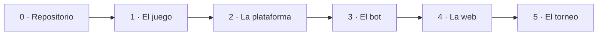

# Guía paso a paso

Esto es el proyecto entero, en orden, en una sola página.

Vas a construir un **juego por turnos de dos jugadores**: las reglas como
librería de Python, una interfaz en la que los bots de otras personas puedan
enchufarse, un bot propio, una página en la que cualquiera pueda jugar, y un
torneo que clasifique a todos los bots y publique el resultado.

---

## El recorrido completo



| Paso | Qué construyes | Cuando acaba, tienes |
|---|---|---|
| **0** | el repositorio | un proyecto vacío público, instalable, protegido y documentado |
| **1** | las reglas | un juego correcto, jugable desde un prompt de Python |
| **2** | la interfaz `Player` | una plataforma a la que alguien de fuera le puede enchufar un bot |
| **3** | tu IA | un bot que merece la pena jugar, con resultados medidos |
| **4** | la página web | una URL pública donde cualquiera juega contra él |
| **5** | el torneo | una clasificación que se publica sola |

Cada tarea de abajo dice qué hacer, enlaza con la sección de esta
[Guía](index.md) que lo explica, y termina con un **Resultado**: la cosa
concreta que deberías poder ver. Marca una tarea cuando puedas ver su
resultado, no cuando te sientas satisfecho.

---

## Tres reglas, antes de empezar

Importan más que cualquier tarea concreta de las de abajo.

!!! tip "1 · Un paso grande, un pull request"
    Sal de `main` en una rama, construye el paso, abre un pull request, que lo
    revise alguien del equipo, fusiona. Nadie hace commit en `main` — ni para
    una errata, ni el último día.

    Esto es lo que hace que el historial sea legible y que el proyecto se pueda
    recuperar cuando algo se rompa. Mira [Flujo de trabajo](github/workflow.md)
    y [Pull requests](github/pull-requests.md).

!!! tip "2 · Un paso no está hecho cuando el código funciona"
    Está hecho cuando los tests pasan, la documentación dice que eso existe, las
    comprobaciones están en verde y la rama está fusionada.

    El código que se escribe ahora y se prueba "luego" es código que no se
    prueba nunca. Mira [Pruebas](python-library/testing.md) y
    [Documentar un proyecto](documentation/documentation.md).

!!! tip "3 · Algo jugable en cada etapa"
    Cada paso grande termina con algo que puedes poner delante de una persona.

    Es deliberado: un proyecto que solo funciona al final es un proyecto del que
    no puedes saber en qué estado está.

!!! note "El orden es de dependencias, no un calendario"
    Cada paso necesita al anterior — el bot necesita la interfaz, la interfaz
    necesita las reglas. Dentro de un paso, las tareas se pueden repartir entre
    el equipo y hacerse en paralelo.

---

## Paso 0 — El repositorio

Un sitio donde ponerlo. **Este es el único paso que haces directamente sobre
`main`;** a partir del Paso 1, todo llega por pull request.

- [ ] **0.1 — Crear el repositorio**

    Créalo **público**, en GitHub, con un nombre corto y descriptivo. Deja que
    GitHub añada los tres archivos que ofrece: un `README`, un `.gitignore`
    para Python y una licencia. Invita a tus compañeros como colaboradores
    desde el principio.

    La licencia es la que la gente se salta de las tres y no debería. Un
    repositorio público sin licencia no es open source: el copyright es lo que
    se aplica por defecto, así que nadie puede reutilizarlo legalmente. Elige
    **MIT** salvo que tengas un motivo para elegir otra cosa. Mira
    [Primeros pasos](github/first-steps.md) y
    [Elegir una licencia](github/first-steps.md#elegir-una-licencia).

    **Resultado.** Una URL pública. Tus compañeros pueden clonarlo y subir una
    rama.

- [ ] **0.2 — Convertirlo en un paquete instalable**

    Añade un `pyproject.toml` y pon tu código bajo `src/tujuego/`, con un
    `__init__.py`. La estructura `src/` no es decoración: impide que Python
    importe tu carpeta de código por accidente, de modo que los tests se
    ejecutan contra el paquete **tal y como lo recibe quien lo usa**. Mira
    [Organización](python-library/organization.md#the-src-layout).

    Después instálalo en modo editable dentro de un entorno virtual e impórtalo
    desde otro sitio cualquiera. Si eso funciona, todo lo que venga después
    —los tests, la aplicación web, el torneo, el bot de otra persona— puede
    importar tu juego con una línea. Mira
    [Qué es una librería](python-library/library.md) e
    [Instalación y uso](python-library/installation-and-usage.md).

    ```console
    $ python -m venv .venv && source .venv/bin/activate
    $ pip install -e .
    $ cd /tmp && python -c "import tujuego; print(tujuego.__version__)"
    ```

    **Resultado.** `import tujuego` funciona desde cualquier directorio.

- [ ] **0.3 — Adoptar el flujo de trabajo**

    Protege `main`: **Settings → Rules**, exige un pull request, exige al menos
    una revisión aprobatoria y prohíbe los push directos. Hazlo *ahora*,
    mientras el repositorio está vacío y la regla no cuesta nada cumplir.
    Hacerlo en la semana seis significa deshacer seis semanas de costumbres.
    Mira [Configuración del repositorio](github/repository-configuration.md).

    Añade una plantilla de pull request para que todos los PR respondan a las
    mismas preguntas: qué hace, y si se actualizaron los tests y la
    documentación. Es una lista que escribes una vez y de la que una persona
    revisora se beneficia treinta. Mira
    [Pull requests](github/pull-requests.md#plantillas-de-pull-request).

    **Resultado.** `git push origin main` se rechaza. Un PR muestra que
    necesita revisión antes de poder fusionarse.

- [ ] **0.4 — Ejecutar las comprobaciones en cada push**

    Escribe `.github/workflows/tests.yml`: descarga el repositorio, instala
    Python, instala el paquete, ejecuta `pytest` y un linter. Todavía no tienes
    nada que merezca la pena probar, así que empieza con un test que compruebe
    que el paquete se importa — lo que importa de esta tarea es la *tubería*,
    no la cobertura. Mira
    [GitHub Actions](github/actions.md#ejecutar-las-pruebas).

    Después hazla obligatoria. En las reglas de rama, añade el workflow como
    **comprobación de estado obligatoria**. A partir de ese momento, una suite
    en rojo no es un aviso, es un botón de merge bloqueado, y nadie tiene que
    acordarse de mirar. Mira
    [Comprobaciones de estado obligatorias](github/repository-configuration.md#comprobaciones-de-estado-obligatorias).

    **Resultado.** Un tick verde en un pull request. Un test roto a propósito
    lo pone en rojo y bloquea el merge.

- [ ] **0.5 — Publicar el sitio de documentación**

    Añade un `mkdocs.yml` y un `docs/index.md` con un párrafo dentro. Ejecuta
    `mkdocs serve` para verlo en local, luego importa el repositorio en
    [Read the Docs](documentation/readthedocs.md) y añade la insignia de
    construcción a tu README. Mira [MkDocs](documentation/mkdocs.md).

    Quince minutos ahora te compran un sitio publicado en el que escriben todos
    los pasos siguientes. La alternativa —dejar la documentación para el
    final— produce un esprint de documentación la última semana, y la
    documentación escrita la última semana es documentación que nadie se cree.
    Mira [Documentar un proyecto](documentation/documentation.md).

    **Resultado.** Una URL de documentación en vivo con una página dentro, que
    se reconstruye en cada push.

!!! success "Fin del Paso 0"
    Un proyecto vacío que ya es profesional: público, instalable, protegido,
    probado en cada cambio y documentado en una URL real. Todavía no funciona
    nada. Todo está listo para que algo funcione.

---

## Paso 1 — El juego

Las reglas, y nada más que las reglas. Sin interfaz, sin bots, sin adornos.

- [ ] **1.1 — Escribir las reglas antes que el código**

    Abre `docs/rules.md` y describe el juego en prosa: la posición inicial, en
    qué consiste un turno, qué hace legal un movimiento, cuándo termina la
    partida y quién gana. Escríbelo para alguien que no ha oído hablar de tu
    juego.

    Es la hora más barata del proyecto. Cada ambigüedad que encuentres al
    escribir esta página —*¿se puede pasar? ¿qué pasa en tablas? ¿quién empieza?*—
    es una ambigüedad que si no habrías encontrado a mitad de la aplicación
    web, con tres archivos ya construidos sobre la respuesta equivocada.

    Si tu juego tiene **información oculta** o **azar**, dilo aquí, de forma
    explícita. Esas dos propiedades cambian el diseño de todo lo que viene
    después, y hay que decidirlas ahora y no descubrirlas luego. Mira
    [Documentar un proyecto](documentation/documentation.md) y las
    [Reglas del juego](../game/rules.md) de este repositorio como ejemplo de la
    forma que tiene.

    **Resultado.** Una página de reglas con la que alguien de fuera podría
    jugar al juego sobre papel.

- [ ] **1.2 — Modelar el estado y el movimiento**

    Decide cuál es el dato más pequeño que captura una posición por completo, y
    cuál es el más pequeño que captura un movimiento. Prefiere tipos básicos
    —una lista de enteros, una tupla, una cadena— a clases que todavía no
    necesitas. Un estado que es una estructura simple se puede imprimir,
    comparar, copiar y enviar como JSON a un navegador sin ningún trabajo.

    Dos decisiones que hay que tomar a conciencia. **Dónde vive "a quién le
    toca"** — ¿dentro del estado, o lo lleva quien ejecuta la partida? Y **¿es
    inmutable un estado?**: ¿aplicar un movimiento devuelve un estado nuevo, o
    modifica el que te han dado? Devuelve uno nuevo. Un bot que muta sin querer
    el tablero que le pasaron es un error al que si no le dedicarás una tarde.

    Ponles nombre a las formas con alias de tipo (`State = list[int]`,
    `Move = tuple[int, int]`) para que todas las firmas del proyecto se lean
    igual. Mira [Organización](python-library/organization.md).

    **Resultado.** Puedes escribir una posición inicial como literal en el REPL
    e imprimirla.

- [ ] **1.3 — Implementar las reglas como funciones puras**

    Cuatro funciones sostienen un juego por turnos: `legal_moves(state)`,
    `apply_move(state, move)`, `is_terminal(state)` y `winner(state)`. Añade
    `is_legal(state, move)` si el conjunto de movimientos legales es lo bastante
    grande como para que generarlo sea un derroche.

    Mantenlas **puras**: sin imprimir, sin `input()`, sin archivos, sin estado
    global. Reciben una posición y devuelven una respuesta. Todo lo demás del
    proyecto —el bucle de terminal, los bots, la página web, el torneo— llama a
    estas cuatro funciones, y solo pueden estar todos de acuerdo si las
    funciones son el único sitio donde existen las reglas.

    Sé estricto en la frontera. `apply_move` con un movimiento ilegal debería
    lanzar una excepción, no hacer en silencio algo razonable. Un motor
    estricto convierte el error de un bot en un fallo inmediato y localizado en
    lugar de en una partida corrupta tres movimientos después. Mira
    [API](python-library/api.md) y, como ejemplo trabajado,
    [Estructura del código](../game/advanced/code-structure.md).

    **Resultado.** En un REPL: aplicas un movimiento a una posición y recibes la
    siguiente, con la original intacta.

- [ ] **1.4 — Probar las reglas**

    Crea `tests/test_game.py`, reflejando `src/tujuego/game.py`. Un módulo de
    código, un módulo de test — esa correspondencia es toda la convención, y
    hace evidente cuándo falta un test. Mira
    [Pruebas](python-library/testing.md).

    Prueba las cosas que son ciertas independientemente del juego: los
    movimientos legales en una posición que has calculado a mano; que
    `apply_move` no muta su entrada; que un movimiento ilegal lanza una
    excepción; que una posición terminal se detecta; que una secuencia de
    movimientos guionizada termina con el ganador que esperas.

    Después prueba los casos incómodos, porque es donde viven tanto los puntos
    como los errores: el tablero vacío, la posición con exactamente un
    movimiento legal, el movimiento en el borde del tablero y —si tu juego los
    tiene— unas tablas y una posición en la que alguien no puede mover.

    **Resultado.** `pytest` en verde en local, y la comprobación en verde en el
    pull request.

- [ ] **1.5 — Jugar una partida entera desde Python**

    Escribe un bucle de veinte líneas: imprime el estado, lee un movimiento con
    `input()`, aplícalo, repite hasta la posición terminal, anuncia el ganador.
    Dos personas, un teclado, sin interfaz.

    Esta es la prueba honesta de todo lo anterior. Si el bucle es incómodo de
    escribir —si tienes que meter mano en las tripas, o llevar una variable que
    debería haber guardado el estado, o tratar el primer turno como caso
    especial— tu API está mal, y es mucho más barato arreglarlo ahora que
    cuando haya una página web construida encima.

    Deja el bucle fuera de la librería. Es un script, o un pequeño
    `__main__`/punto de entrada de consola; el paquete sigue siendo importable
    y silencioso. Mira
    [Instalación y uso](python-library/installation-and-usage.md).

    **Resultado.** Tú y alguien del equipo jugáis una partida completa en un
    terminal.

!!! success "Fin del Paso 1"
    Tu juego existe y es correcto, sin ninguna interfaz. Quien instale tu
    paquete puede jugar desde un prompt de Python.

---

## Paso 2 — La plataforma

Un sitio donde un bot pueda enchufarse — incluido un bot escrito por alguien
que no ha visto tu código nunca.

- [ ] **2.1 — Diseñar la interfaz `Player`**

    Escribe una clase base abstracta con **un** método obligatorio:
    `choose_move(self, state) -> Move`. Añade identidad a nivel de clase —un
    nombre, los autores, una descripción de una línea— y una fábrica
    `create(cls, seed)`, para que un bot que use azar se pueda construir de
    forma reproducible.

    Mantén el contrato tan pequeño como permita el trabajo. Cada método que
    exiges es un método que alguien de fuera tiene que implementar
    correctamente, y cada uno de ellos es una forma de que su bot esté roto.
    Con uno suele bastar; un gancho para "fin de partida" es un segundo
    razonable. Mira
    [Diseñar una API que otros implementan](python-library/api.md#disenar-una-api-que-otros-implementan).

    Decide aquí **qué le está permitido ver a un jugador**. Para un juego de
    información perfecta, el estado. Para un juego con información oculta, una
    *vista* del estado construida para ese jugador — nunca la posición
    completa, o tus bots podrán hacer trampas y tu juego no será el juego que
    documentaste. Es la única decisión del proyecto que no se puede añadir
    después. Mira [API de jugador](../game/upload-a-bot/player-api.md).

    **Resultado.** Una clase abstracta que se niega a instanciarse si falta
    `choose_move`.

- [ ] **2.2 — Escribir el jugador de referencia**

    Implementa `RandomPlayer`: pide los movimientos legales, elige uno al azar
    con su propio generador con semilla, devuélvelo. Treinta segundos de
    reflexión, y hace dos trabajos importantes.

    Primero, demuestra que la interfaz es implementable: si escribir el bot más
    simple posible resulta incómodo, arregla la interfaz ahora, cuando hay
    exactamente una implementación. Segundo, es la vara de medir: todos los
    bots del resto del proyecto se miden contra el aleatorio, y "le gana al
    aleatorio" es lo primero significativo que consigue cualquier IA.

    Escríbelo como lo escribiría alguien de fuera, importando solo tu API
    pública. Si necesita un ayudante privado, ese ayudante es parte de la API y
    debería ser público.

    **Resultado.** Dos jugadores aleatorios terminan una partida legal entre
    ellos.

- [ ] **2.3 — Escribir el ejecutor de partidas**

    Una función: `play_game(player_a, player_b, state)`. Alterna turnos, pide
    un movimiento a quien le toque, comprueba el movimiento, aplícalo, repite
    hasta la posición terminal. Devuelve el ganador y el historial de
    movimientos.

    Valida **todos** los movimientos que te dé un jugador, antes de aplicarlos.
    Esta función es la frontera entre tu código y el de un desconocido, y el
    motor del otro lado es estricto. Dale a cada jugador una copia del estado,
    para que un bot que mute lo que le han dado se perjudique solo a sí mismo.

    Mantén al ejecutor ignorante de *quién* juega. Conoce dos objetos con un
    método `choose_move`, y nada sobre humanos, bots, dificultad o el torneo.
    Eso es lo que te permitirá reutilizarlo sin tocarlo en el Paso 4 y en el
    Paso 5. Mira [El torneo](../game/advanced/tournament.md).

    **Resultado.** Dos bots juegan hasta el final; obtienes un ganador y la
    lista de movimientos que lo produjo.

- [ ] **2.4 — Escribir el test de contrato**

    Escribe un test que recorra **todos** los jugadores registrados y compruebe,
    en cada turno de varias partidas distintas: que el movimiento devuelto era
    legal, y que el estado que se le pasó no se modificó. Parametrízalo sobre
    el registro, para que admitir un bot nuevo no necesite ningún test nuevo.

    Después demuestra que el test funciona escribiendo bots que lo rompan. Un
    bot que lanza una excepción, uno que devuelve un movimiento ilegal, uno que
    no devuelve nunca, uno que edita el tablero que le dieron. Cada uno debería
    fallar limpiamente y por sí solo. Mira
    [Probar un contrato que implementan otros](python-library/testing.md#probar-un-contrato-que-implementan-otros).

    Esta es la tarea que hace que aceptar contribuciones de fuera sea seguro.
    Sin ella, cada bot que te manden es una revisión de código que tienes que
    hacer perfecta a ojo; con ella, el pull request se pone en rojo solo.

    **Resultado.** Un bot roto a propósito falla en CI. Uno correcto pasa sin
    que nadie le añada un test.

- [ ] **2.5 — Documentar la API y el camino de envío**

    Dos documentos, y son documentos distintos. La **referencia** se genera de
    tus docstrings con `mkdocstrings`, para que un parámetro renombrado no
    pueda dejar atrás una página obsoleta. Mira
    [Páginas de API desde los docstrings](documentation/mkdocs.md#paginas-de-api-desde-los-docstrings).

    El **tutorial** se escribe a mano y lleva a una persona desde cero hasta un
    bot fusionado: copia este archivo, implementa este método, regístralo aquí,
    ejecuta este comando para comprobarlo, abre un pull request. Numera los
    pasos. Enseña el archivo entero, no un fragmento. Mira
    [Documentar un proyecto](documentation/documentation.md) y
    [Enviar un jugador](../game/upload-a-bot/submit-a-player.md) en este
    repositorio.

    **Resultado.** Alguien de fuera de tu equipo sigue el tutorial y abre un
    pull request que funciona sin hacerte ni una pregunta.

!!! success "Fin del Paso 2"
    Tu juego es una plataforma. Alguien de fuera puede añadirle un bot sin
    abrir tu código, y tus tests le dirán si está roto.

---

## Paso 3 — El bot

Algo que merezca la pena ganar. Ya tienes el aleatorio; ahora construye un
rival.

- [ ] **3.1 — Ganar al aleatorio**

    Busca una regla práctica sobre tu juego —captura lo máximo posible, controla
    el centro, nunca dejes dos en raya— y aplícala con avaricia: puntúa cada
    movimiento legal con esa regla, juega el mejor, deshaz empates al azar.

    El juego avaricioso no mira hacia delante ni tiene inteligencia alguna, y
    aun así aplastará al aleatorio en la mayoría de juegos. Constrúyelo antes
    que nada sofisticado: es una hora de trabajo, te da una segunda vara de
    medir, y la función de puntuación que escribas aquí suele ser la función de
    evaluación que reutilizarás en la tarea siguiente.

    **Resultado.** En 100 partidas contra el aleatorio, gana más del 80%.

- [ ] **3.2 — Mirar hacia delante**

    Ahora busca. **Minimax con poda alfa-beta** para un juego de información
    perfecta, **expectimax** si hay azar, **Monte Carlo tree search** si el
    factor de ramificación es demasiado grande para cualquiera de los dos.
    Necesitas tres cosas: un valor para una posición terminal, una evaluación
    para una no terminal (tu puntuación avariciosa, seguramente) y un límite de
    profundidad.

    El límite de profundidad no es opcional. Una búsqueda sin límite es un bot
    que tarda treinta segundos en una posición cargada, y un movimiento de
    treinta segundos es una interfaz rota por muy bueno que sea. Limita la
    profundidad, o limita el tiempo y profundiza iterativamente hasta agotarlo.

    Vigila lo que cuesta de verdad la búsqueda. Si una búsqueda a profundidad
    completa es rápida, baja más; si es lenta, abarata la evaluación antes de
    hacer la búsqueda más lista.

    **Resultado.** Le gana a tu jugador avaricioso, y responde en menos de un
    segundo en la peor posición que encuentres.

- [ ] **3.3 — Medirlo**

    Escribe un script pequeño que juegue N partidas entre dos jugadores con
    nombre e imprima una tabla de tasas de victoria. Ejecuta cada emparejamiento
    **en los dos sentidos** — en muchísimos juegos, mover primero vale más que
    cualquier cantidad de inteligencia, y un bot probado solo como jugador uno
    es un bot del que no sabes nada.

    Fija la semilla para que una ejecución sea reproducible, e indica el número
    de partidas. "Parece mejor" no es un resultado; "gana el 71% de 200
    partidas, el 68% como segundo jugador" sí lo es, y es la frase que te dice
    si tu último cambio ayudó.

    **Resultado.** Una tabla de tasas de victoria entre el aleatorio, el
    avaricioso y tu bot de búsqueda, producida por un comando que puedes volver
    a ejecutar.

- [ ] **3.4 — Explicar cómo decide**

    Escribe la página de documentación: qué evalúa, cuánto mira hacia delante,
    en qué es malo. Ser honesto sobre la debilidad es más útil que el elogio —
    "no ve una derrota forzada a más de cuatro movimientos" le dice a quien lee
    algo que puede aprovechar.

    Opcionalmente, deja que el bot publique su razonamiento del último
    movimiento: la profundidad alcanzada, la puntuación, el número de
    posiciones examinadas. Cuesta un diccionario y convierte tu página web en
    algo que enseña *por qué* se hizo un movimiento, que es mucho mejor
    demostración que un tablero que simplemente se mueve. Mira
    [Documentar un proyecto](documentation/documentation.md).

    **Resultado.** Una página desde la que alguien podría reimplementar tu bot.

!!! success "Fin del Paso 3"
    Tu bot le gana al aleatorio siempre, al avaricioso casi siempre, y a ti a
    veces.

---

## Paso 4 — Construir y desplegar

Un sitio donde una persona pueda jugar de verdad. Vas a construir una **página
estática**, servida por [GitHub Pages](github/pages.md) desde tu propio
repositorio — el mismo montaje que
[la página de este proyecto](https://jparisu.github.io/nim-arena). Sin
servidor, sin factura, sin arranque en frío, y el Python que ya escribiste se
ejecuta en el navegador mediante
[Pyodide](web-app/static-web/pyodide.md).

!!! note "Streamlit también es una respuesta válida"
    Si tu equipo prefiere no escribir nada de JavaScript,
    [Streamlit](web-app/streamlit/index.md) es una ruta legítima y el resto de
    este paso sigue aplicando — solo cambia la mecánica de las tareas 4.1 a
    4.3. Ten en cuenta dos diferencias: se despliega en
    [Streamlit Community Cloud](web-app/streamlit/cloud.md) y no en Pages, así
    que **la URL es otra y está en otro servicio**, y una aplicación gratuita
    [se duerme cuando nadie la usa](web-app/streamlit/cloud.md#los-limites-que-te-van-a-morder).

    En cualquiera de los dos casos, **la URL publicada va en el `README.md`**,
    arriba, como enlace. Sea cual sea el servicio que elijas, quien visite tu
    repositorio tiene que poder encontrar la página jugable sin preguntar dónde
    está.

- [ ] **4.1 — Servir una página desde tu repositorio**

    Haz una carpeta `web/` con tres archivos —`index.html`, `style.css`,
    `app.js`— que no digan más que el nombre de tu juego. Pon **Settings →
    Pages → Source** en **GitHub Actions**, y escribe el workflow de despliegue
    que construye `web/` y lo publica. Mira
    [Publicar un sitio propio](github/pages.md#publicar-un-sitio-propio) y
    [HTML, CSS y JavaScript](web-app/static-web/html-js.md).

    Haz esto **antes** de que haya nada que enseñar. Conseguir que la tubería
    de despliegue funcione mientras la página dice "hola" lleva una tarde de
    ajustes y permisos; conseguirlo la noche antes de una demostración, con un
    juego terminado en juego, lleva la misma tarde y sale bastante más caro.

    Pruébalo en local sirviendo la carpeta, nunca haciendo doble clic en el
    archivo: en `file://` el navegador bloquea `fetch()`, y una página que
    funciona en local y falla publicada casi siempre es esto.

    ```console
    $ python -m http.server -d web 8000
    ```

    **Resultado.** Una URL pública de `github.io` mostrando tu marcador de
    posición, redesplegada en cada push a `main`. El enlace está en el README.

- [ ] **4.2 — Meter tu juego en el navegador**

    Añade un script de construcción que comprima `src/tujuego/` en
    `web/py.zip`, y que la página cargue Pyodide, descargue el archivo, lo
    descomprima e importe tu paquete. Escribe **un módulo puente** que exponga
    exactamente las funciones que la página necesita, y pasa cadenas JSON a
    través de la frontera Python↔JavaScript. Mira
    [Python en el navegador](web-app/static-web/pyodide.md).

    Esta es la tarea que mantiene honesto al proyecto. La alternativa
    —reimplementar las reglas en JavaScript— significa dos versiones de aquello
    que te costó el Paso 1 hacer bien, y no van a coincidir. Un motor, usado
    igual por los tests, el torneo y la página. Mira
    [La página web](../game/advanced/web.md).

    Haz que el workflow de despliegue ejecute el script de construcción, y deja
    `py.zip` fuera de Git: es salida generada, y commitearla convierte cada
    reconstrucción en un diff.

    **Resultado.** Desde la consola del navegador puedes pedirle al puente los
    movimientos legales de una posición y recibir la respuesta de tu Python.

- [ ] **4.3 — Dibujar el tablero y recoger un clic**

    Dibuja el tablero a partir del estado —un elemento por casilla, montón o
    celda— y haz que pulsar uno produzca un movimiento, lo aplique a través del
    puente y redibuje desde el estado nuevo. Redibuja siempre desde el estado;
    nunca parchees lo que se ve y confíes en que siga coincidiendo.

    Escríbelo como una sola función, `paintBoard(container, state, onPick)`, y
    llámala desde todos los sitios en los que aparezca el tablero. Dos copias
    de un renderizador de tablero divergen en una semana. Mira
    [HTML, CSS y JavaScript](web-app/static-web/html-js.md).

    **Resultado.** Una persona puede jugar los dos lados de una partida
    completa en el navegador.

- [ ] **4.4 — Poner un bot en el otro asiento**

    Añade un selector con tus jugadores registrados y, después de cada
    movimiento humano, pídele su respuesta al bot elegido y aplícala. Indica
    quién es quién, y di quién ha ganado cuando termine la partida.

    Ya tienes todo lo que esto necesita: el registro del Paso 2, el bot del
    Paso 3 y un puente que puede llamar a los dos. Si esta tarea requiere
    lógica de juego nueva, algo se ha filtrado a la capa equivocada — la página
    debería hacer preguntas, no responderlas.

    Un pequeño retardo antes del movimiento del bot hace que la partida se
    sienta meditada en lugar de instantánea. También enseñar qué estaba
    pensando el bot, si hiciste la mitad opcional de la tarea 3.4.

    **Resultado.** Una persona abre la URL y juega una partida completa contra
    tu bot, con final.

- [ ] **4.5 — Sobrevivir a quien la usa**

    Ahora intenta romperla. Pulsa un palillo que ya no está. Haz doble clic.
    Pulsa durante el turno del bot. Pulsa después de que acabe la partida.
    Recarga a mitad. Ábrela en un móvil. Cada una de estas cosas debería
    producir un mensaje o nada en absoluto — nunca una página en blanco y nunca
    un botón muerto.

    Una página estática no tiene log de servidor, así que una excepción que se
    escapa es invisible: quien la usa ve un botón que no hace nada y no tiene
    forma de contarte por qué. Captura los errores globalmente, enséñalos en
    algún sitio visible, y conecta cada parte de la página de forma
    independiente para que un fallo no pueda desarmar el resto en silencio.
    Mira [Fallar en voz alta](web-app/static-web/html-js.md#fallar-en-voz-alta).

    **Resultado.** No puedes romper la página a base de clics. Alguien con un
    móvil y el enlace juega una partida completa sin que estés a su lado.

!!! success "Fin del Paso 4"
    Un enlace que puedes mandarle a cualquiera. No instalan nada, y juegan a tu
    juego contra tu bot.

---

## Paso 5 — El torneo

Quién es mejor de verdad — decidido automáticamente, y publicado.

- [ ] **5.1 — Jugar todos los emparejamientos**

    Liguilla: cada jugador registrado contra todos los demás, en los dos
    órdenes, varias partidas cada uno. Reutiliza `play_game` de la tarea 2.3
    sin tocarlo — si te descubres necesitando un segundo ejecutor, el primero
    sabía demasiado.

    Cuenta victorias, derrotas y empates, y guarda el detalle por partida
    además de los totales. Siembra toda la ejecución desde un único número para
    que el mismo torneo dé el mismo resultado dos veces; una clasificación que
    cambia cuando no ha cambiado nada es una clasificación en la que nadie
    confía. Mira [El torneo](../game/advanced/tournament.md).

    **Resultado.** Una tabla de clasificación impresa en tu terminal.

- [ ] **5.2 — Sobrevivir a un jugador malo**

    Un torneo se ejecuta sin supervisión, con código de desconocidos dentro, y
    el fallo que importa no es que un bot pierda: es que un bot se lleve por
    delante toda la ejecución. Cada una de estas cosas tiene que costarle al
    infractor su partida y nada más: lanzar una excepción, devolver un
    movimiento ilegal, no devolver nada, no devolver nunca, mutar el tablero
    que le dieron, o mentir sobre su propio nombre.

    Envuelve cada petición de movimiento: captura todo, impón un timeout, valida
    el movimiento, pasa una copia del estado. Ante cualquier infracción, el
    infractor pierde esa partida, se registra el motivo, y el torneo continúa
    con el siguiente par.

    Demuéstralo con tests. Escribe los bots rotos a propósito —uno que se
    cuelgue, uno que haga trampas, uno que se quede colgado— y comprueba que
    cada uno pierde sus propias partidas mientras la ejecución termina. Mira
    [Pruebas](python-library/testing.md).

    **Resultado.** Un bot que lanza una excepción en cada movimiento queda
    último con un motivo registrado, y el torneo sigue produciendo la tabla
    completa.

- [ ] **5.3 — Escribir la clasificación en un archivo**

    Emite la clasificación como JSON — no a stdout, a
    `results/leaderboard.json`. Incluye una versión de esquema, la hora en que
    terminó la ejecución, la clasificación ordenada y los metadatos por jugador
    suficientes para que una página dibuje la tabla sin saber nada más.

    Un archivo es lo que hace posibles las dos tareas siguientes. Lo lee la
    página web, le hace commit CI, se ve en el diff de un pull request y queda
    en el historial, y nada de eso funciona si el resultado solo existió en un
    terminal que ya se ha cerrado. Mira
    [El marcador](../game/advanced/scoreboard.md).

    **Resultado.** Un `leaderboard.json` que puedes abrir, y un comando que lo
    regenera.

- [ ] **5.4 — Ejecutarlo automáticamente**

    Escribe un workflow que ejecute el torneo de forma programada —cada noche
    sobra— y con `workflow_dispatch`, para poder lanzarlo también a mano. Haz
    que le haga commit del nuevo `leaderboard.json` al repositorio. Mira
    [GitHub Actions](github/actions.md).

    Una trampa, y te costará una tarde si te la encuentras sin aviso: **GitHub
    no emite ningún evento `push` para un commit hecho por un workflow**. Tu
    despliegue de Pages, que se dispara con push, no se enterará de la nueva
    clasificación. El arreglo es que el despliegue escuche también a que
    termine el workflow del torneo, con `workflow_run`. Mira
    [Cuando el sitio no se vuelve a desplegar](github/pages.md#cuando-el-sitio-no-se-vuelve-a-desplegar).

    **Resultado.** El archivo de clasificación cambia durante la noche sin que
    nadie lo mire.

- [ ] **5.5 — Enseñarlo**

    Añade una pantalla de marcador que descargue `leaderboard.json` y dibuje la
    tabla. No se juega ninguna partida para dibujarla — es puro renderizado de
    datos sobre un archivo que la construcción dejó junto a la página. Pasa
    `{ cache: "no-cache" }`, o un navegador te enseñará tan feliz la copia de
    ayer de un archivo que se actualizó hace una hora. Mira
    [Cargar datos sin backend](web-app/static-web/html-js.md#cargar-datos-sin-backend).

    Contempla el caso vacío: antes del primer torneo, puede que el archivo no
    exista. Dilo en la página en lugar de fallar.

    **Resultado.** Un marcador público. Fusiona un bot hoy y mañana está
    clasificado sin que nadie haga nada.

!!! success "Fin del Paso 5"
    El proyecto ya se ejecuta solo. Un pull request añade un bot, las
    comprobaciones dicen si es válido, el torneo lo clasifica y la página
    enseña el resultado.

---

## Entregarlo

- [ ] **6.1 — Convertir el README en una portada de verdad**

    Una pantalla: qué es el juego, una imagen o una animación corta de alguien
    jugando, un enlace a la página jugable, un enlace a la documentación, cómo
    instalarlo, cómo añadir un bot y la licencia. Pon arriba las insignias de
    los tests y de la construcción de la documentación.

    El README es el tráiler, no la documentación. Todo lo que pase de un
    párrafo va en el [sitio de documentación](documentation/index.md) con un
    enlace desde aquí. Un README que crece más allá de dos pantallas es un
    sitio de documentación intentando escaparse. Mira
    [Documentar un proyecto](documentation/documentation.md).

    **Resultado.** Alguien de fuera entiende qué es esto en treinta segundos y
    sabe exactamente dónde pulsar después.

- [ ] **6.2 — Clonarlo limpio y seguir tus propias instrucciones**

    En otra máquina, o al menos en un directorio nuevo con un entorno virtual
    nuevo, clona el repositorio desde cero y haz exactamente lo que dicen tu
    README y tu tutorial de bots. Escribe los comandos tal y como están. No
    arregles nada de memoria por el camino: apunta lo que falló.

    Esto encuentra el paso que nadie escribió, porque todo el equipo lo tiene
    instalado desde la semana dos. Es la hora de mayor valor al final de un
    proyecto, y la única forma de saber si las instrucciones que llevas
    publicando funcionan de verdad. Mira
    [Instalación y uso](python-library/installation-and-usage.md).

    **Resultado.** Un clon limpio llega a una partida terminada, y a un bot que
    funciona, usando solo lo que está escrito.

- [ ] **6.3 — Saber explicarlo**

    Recorre el proyecto y encuentra cada decisión que podría haber ido en otra
    dirección —la representación del estado, el tamaño de la interfaz de
    jugador, qué le está permitido ver a un bot, la búsqueda que elegiste, Pages
    en vez de Streamlit— y asegúrate de que alguien del equipo sabe decir por
    qué.

    Donde el motivo no sea evidente a partir del código, escríbelo junto al
    código o en la página donde alguien iría a buscarlo. Un comentario que
    explica *por qué* algo es como es sobrevive a todos los comentarios que
    explican *qué* hace.

    **Resultado.** Para cualquier parte del proyecto, alguien puede responder a
    "¿por qué está construido así?" con un motivo y no con un encogimiento de
    hombros.

---

**Siguiente:** [Git](git/index.md) · [GitHub](github/index.md) · [Librería Python](python-library/index.md) · [Aplicación web](web-app/index.md) · [Documentación](documentation/index.md) — las cinco secciones, a fondo.

**También:** [El juego](../game/index.md)
