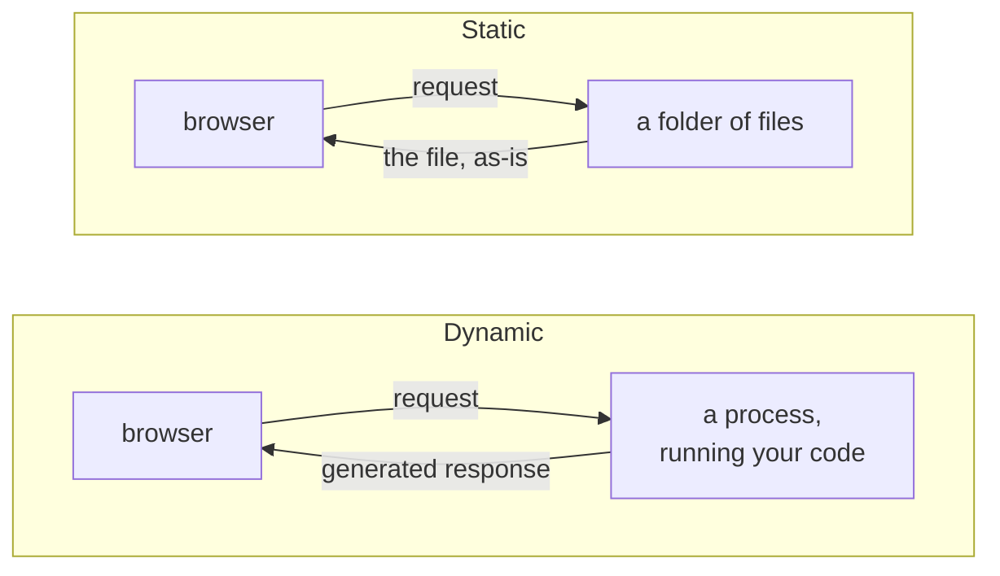

# Hosting

A **web app** is three things: a browser, a URL, and something at the other end
of that URL. This page is about the "something at the other end" — what it can
be, what it costs, and the one distinction that decides everything else.

Get this choice right first. It determines which of the two routes in this
section you take, how you deploy, and what your app is allowed to do.

## Static or dynamic

A host is **static** if it only hands out files it already has, unchanged. A
host is **dynamic** if it runs your code on every request.

Everything follows from that line:

| | Static | Dynamic |
| --- | --- | --- |
| The host does | serve files | run a process |
| Your code runs | in the visitor's browser | on the server |
| Costs | effectively nothing | a machine, always on |
| Goes to sleep | never | on a free tier, yes |
| Can keep a secret | **no** | yes |
| Can write to a database | no | yes |
| Fails when | never, really | the process dies |

!!! warning "Anything you ship to a static site is public"
    Not "hard to find" — public. Every file the browser loads can be read by
    anyone who opens the developer tools, including your JavaScript, your JSON
    and anything you embedded in them. There is no such thing as a hidden API
    key in a static page. If your design needs a secret, you need a dynamic
    host, and then you need to keep the secret out of the repository too.

## Interactive does not mean dynamic

The usual mistake is assuming that a page which *does things* needs a server.
It does not. The browser is a capable computer, and a static host is perfectly
happy to hand it a program to run.

This repository's own game page is static. It plays a full game of NIM against
an AI, computes legal moves, runs a tournament bracket and renders a scoreboard
— with no server anywhere. It does it by shipping the **real Python engine** to
the browser through [Pyodide](static-web/pyodide.md), and the scoreboard by
`fetch()`ing a JSON file that a
[scheduled workflow](../github/actions.md) committed to the repository.

The rule of thumb:

> If everything your app does can happen on the visitor's own machine, and
> everything it needs to read can be a file, it can be static.

A two-player turn-based game against a bot fits inside that sentence with room
to spare. The rules are a pure function, the bot is a pure function, and the
board is a few numbers.

## What a free tier gives you, and what it takes back

Both routes in this section are free. They are free in different ways, and the
differences are the ones that will surprise you during a demo.

**A static host** (GitHub Pages) has essentially no moving parts. It does not
sleep, it does not cold-start, and there is nothing to crash. The costs are
paid once, at load time: everything the page needs must be downloaded before it
works. For a Pyodide page that is a real wait — several seconds on a first
visit — and you should show a loading state rather than a blank screen.

**A dynamic host** (Streamlit Community Cloud) gives you a process, and a free
process is a rationed one:

- it **sleeps** after a period with no visitors, and the next visitor waits for
  it to wake up;
- CPU and memory are **capped**, and an expensive bot can hit the cap;
- there is **no persistent disk** — anything the app writes is gone on the next
  restart;
- the URL is on somebody else's domain, and is not yours.

!!! tip "Sleep is a demo problem, not a technical one"
    Open your app a minute before you present it. A woken app is as fast as any
    other; a cold one spends thirty seconds on a splash screen while somebody
    is watching you.

## Where data lives when there is no database

You will want to store *something* — a scoreboard, a set of results, a saved
game. Without a database, the options in ascending order of effort:

| Where | Survives | Use it for |
| --- | --- | --- |
| **A JSON file in the repository** | forever, and it is versioned | results, leaderboards, anything a job produces |
| **The URL** | as long as the link does | a shareable game state |
| **`localStorage`** | on that one browser, until cleared | a theme, a preference, a draft |
| **In memory** | until reload | the current game |

The first row is the one people underuse. A file committed by a
[scheduled workflow](../github/actions.md) is a perfectly good read-only
database: it has history, it has review, it is free, and reading it from a
static page is one `fetch()`. This repository's leaderboard is exactly that —
see [The scoreboard](../../game/advanced/scoreboard.md).

Sharing state *between different visitors* is the thing none of these do. If
two people must see each other's moves in real time, you need a server, and
that is a much larger project than this one.

## The two routes

- [**Streamlit**](streamlit/index.md) — write the whole app in Python. No HTML,
  no JavaScript. Dynamic: it needs a process, and on the free tier that process
  sleeps.
- [**Static web**](static-web/index.md) — HTML, CSS and JavaScript in a folder,
  optionally running your Python through Pyodide. Static: nothing to sleep,
  nothing to pay, but the browser does all the work.

Pick **Streamlit** if your team writes Python and nothing else, and you want
something on screen today. Pick **static** if you want a URL that is always
instant, or you are willing to write some JavaScript to get one.

Both are real answers. Neither is more correct than the other, and the
[Web app](index.md) page has the comparison table side by side.

!!! note "Whatever you pick, the logic stays in the library"
    The app is a **shell**. It draws the board, reads the clicks and calls your
    package; it never contains a copy of the rules. If the web app knows how to
    detect a win, you have two implementations to keep in sync, and one of them
    will be wrong. See [API](../python-library/api.md).

## Where to go next

- [Streamlit](streamlit/index.md) — the Python-only route.
- [Static web](static-web/index.md) — the no-server route.
- [GitHub Pages](../github/pages.md) — the free static host attached to your
  repository.
