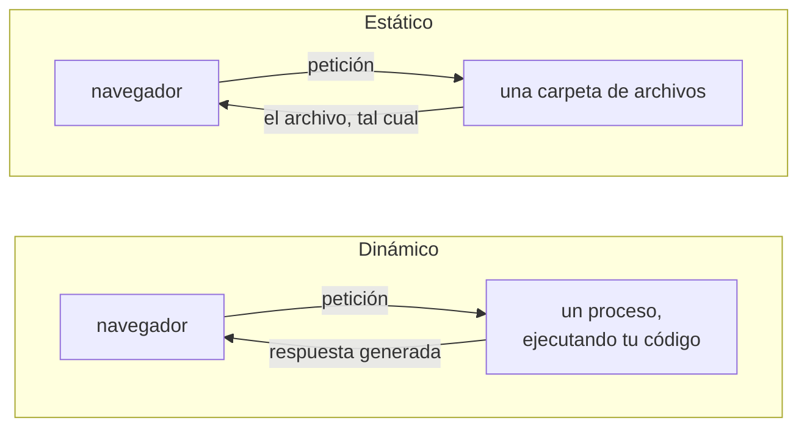

# Alojamiento

Una **aplicación web** son tres cosas: un navegador, una URL y algo al otro
lado de esa URL. Esta página trata de ese "algo al otro lado" — qué puede ser,
qué cuesta y cuál es la distinción que decide todo lo demás.

Acierta con esta elección primero. Determina cuál de las dos rutas de esta
sección tomas, cómo despliegas y qué le está permitido hacer a tu aplicación.

---

## Estático o dinámico

Un servicio es **estático** si solo entrega archivos que ya tiene, sin
modificarlos. Es **dinámico** si ejecuta tu código en cada petición.

Todo se deduce de esa línea:

| | Estático | Dinámico |
| --- | --- | --- |
| El servicio | sirve archivos | ejecuta un proceso |
| Tu código se ejecuta | en el navegador de quien visita | en el servidor |
| Cuesta | prácticamente nada | una máquina, siempre encendida |
| Se duerme | nunca | en un plan gratuito, sí |
| Puede guardar un secreto | **no** | sí |
| Puede escribir en una base de datos | no | sí |
| Falla cuando | casi nunca | el proceso se muere |

!!! warning "Todo lo que envías a un sitio estático es público"
    No "difícil de encontrar" — público. Cualquiera que abra las herramientas
    de desarrollo puede leer todos los archivos que carga el navegador:
    tu JavaScript, tu JSON y cualquier cosa que hayas incrustado en ellos. No
    existe tal cosa como una clave de API escondida en una página estática. Si
    tu diseño necesita un secreto, necesitas un servicio dinámico — y entonces
    también necesitas mantener ese secreto fuera del repositorio.

---

## Interactivo no significa dinámico

El error habitual es suponer que una página que *hace cosas* necesita un
servidor. No lo necesita. El navegador es un ordenador capaz, y a un servicio
estático le parece perfectamente bien entregarle un programa para que lo
ejecute.

La página de este repositorio es estática. Juega una partida completa de NIM
contra una IA, calcula los movimientos legales, resuelve un cuadro de torneo y
dibuja un marcador — sin servidor por ningún lado. Lo consigue enviando el
**motor Python real** al navegador mediante
[Pyodide](static-web/pyodide.md), y el marcador con un `fetch()` de un archivo
JSON del que un [workflow programado](../github/actions.md) ha hecho commit en
el repositorio.

La regla práctica:

> Si todo lo que hace tu aplicación puede ocurrir en la máquina de quien la
> visita, y todo lo que necesita leer puede ser un archivo, puede ser estática.

Un juego por turnos de dos jugadores contra un bot cabe en esa frase con
espacio de sobra. Las reglas son una función pura, el bot es una función pura y
el tablero son unos cuantos números.

---

## Qué te da un plan gratuito, y qué te quita

Las dos rutas de esta sección son gratuitas. Lo son de maneras distintas, y las
diferencias son justo las que te van a sorprender durante una demostración.

**Un servicio estático** (GitHub Pages) no tiene apenas piezas móviles. No se
duerme, no arranca en frío y no hay nada que se pueda caer. El coste se paga
una vez, al cargar: todo lo que la página necesita tiene que descargarse antes
de que funcione. Para una página con Pyodide eso es una espera real —varios
segundos en la primera visita— y conviene enseñar un indicador de carga en
lugar de una pantalla en blanco.

**Un servicio dinámico** (Streamlit Community Cloud) te da un proceso, y un
proceso gratuito es un proceso racionado:

- se **duerme** tras un rato sin visitas, y la siguiente persona espera a que
  despierte;
- la CPU y la memoria están **limitadas**, y un bot caro puede llegar al tope;
- **no hay disco persistente** — lo que la aplicación escriba desaparece en el
  siguiente reinicio;
- la URL está en el dominio de otro, y no es tuya.

!!! tip "Dormirse es un problema de demostración, no técnico"
    Abre tu aplicación un minuto antes de presentarla. Una aplicación despierta
    va tan rápido como cualquier otra; una fría se pasa treinta segundos en una
    pantalla de carga mientras alguien te mira.

---

## Dónde viven los datos cuando no hay base de datos

Vas a querer guardar *algo* — un marcador, unos resultados, una partida. Sin
base de datos, las opciones, de menos a más esfuerzo:

| Dónde | Sobrevive | Úsalo para |
| --- | --- | --- |
| **Un archivo JSON en el repositorio** | para siempre, y con historial | resultados, clasificaciones, lo que produzca un job |
| **La URL** | mientras el enlace exista | una partida que se pueda compartir |
| **`localStorage`** | en ese navegador, hasta que se borre | un tema, una preferencia, un borrador |
| **En memoria** | hasta recargar | la partida en curso |

La primera fila es la que menos se usa y más rinde. Un archivo del que hace
commit un [workflow programado](../github/actions.md) es una base de datos de
solo lectura perfectamente válida: tiene historial, pasa por revisión, es
gratis, y leerlo desde una página estática es un `fetch()`. La clasificación de
este repositorio es exactamente eso — mira
[El marcador](../../game/advanced/scoreboard.md).

Compartir estado *entre visitantes distintos* es lo único que ninguna de estas
opciones hace. Si dos personas tienen que ver los movimientos de la otra en
tiempo real, necesitas un servidor, y eso es un proyecto mucho mayor que este.

---

## Las dos rutas

- [**Streamlit**](streamlit/index.md) — escribe toda la aplicación en Python.
  Sin HTML, sin JavaScript. Dinámica: necesita un proceso, y en el plan
  gratuito ese proceso se duerme.
- [**Web estática**](static-web/index.md) — HTML, CSS y JavaScript en una
  carpeta, y opcionalmente tu Python mediante Pyodide. Estática: nada que se
  duerma, nada que pagar, pero el navegador hace todo el trabajo.

Elige **Streamlit** si tu equipo escribe Python y nada más, y quieres algo en
pantalla hoy mismo. Elige **estática** si quieres una URL siempre instantánea,
o estás dispuesto a escribir algo de JavaScript para conseguirla.

Las dos son respuestas reales. Ninguna es más correcta que la otra, y la página
[Aplicación web](index.md) tiene la comparación lado a lado.

!!! note "Elijas lo que elijas, la lógica se queda en la librería"
    La aplicación es una **cáscara**. Dibuja el tablero, lee los clics y llama
    a tu paquete; nunca contiene una copia de las reglas. Si la aplicación web
    sabe detectar una victoria, tienes dos implementaciones que mantener
    sincronizadas, y una de las dos va a estar mal. Mira
    [API](../python-library/api.md).

---

**Siguiente:** [Streamlit](streamlit/index.md) — la ruta de solo Python.

**También:** [Web estática](static-web/index.md) · [GitHub Pages](../github/pages.md)
