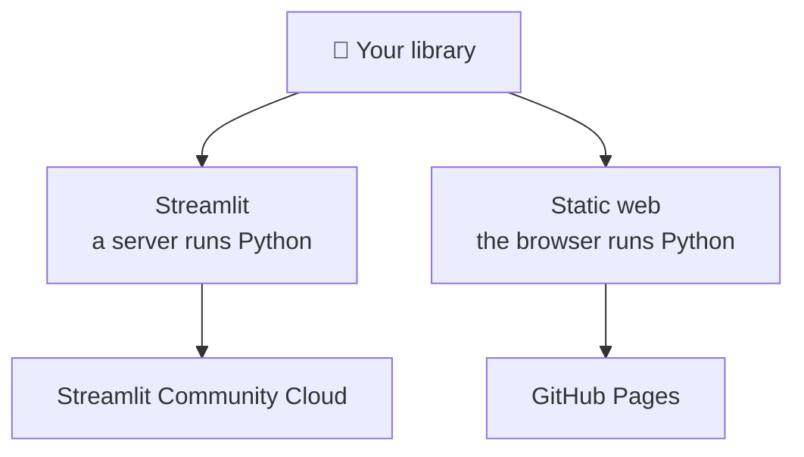

# Web app

A library nobody can try is a library nobody uses. This section is about putting
a **face** on the project: a page someone opens in a browser and uses, with
nothing to install.

---

## There are two paths, and they do not cost the same

| | [Streamlit](streamlit/index.md) | [Static web](static-web/index.md) |
| --- | --- | --- |
| Language | Python only | HTML, CSS, JavaScript (+ Python via Pyodide) |
| Needs a server | Yes | No |
| Where it runs | Streamlit Community Cloud | GitHub Pages, any static host |
| Sleeps when unused | Yes | No |
| Up-front effort | Low | Medium |

Read [Hosting](hosting.md) first — it explains what the choice really means —
then pick one.

---

## The pages

- :material-server-network:{ .lg .middle } **[1 · Hosting](hosting.md)**

    ---

    Where a web app runs, who pays for it, and why “static” is the word that
    decides everything else.

- :material-language-python:{ .lg .middle } **[2 · Streamlit](streamlit/index.md)**

    ---

    Write the whole app in Python and deploy it to Streamlit Community Cloud.

- :material-language-html5:{ .lg .middle } **[3 · Static web](static-web/index.md)**

    ---

    HTML, CSS and JavaScript in a folder, published for free from your
    repository.

