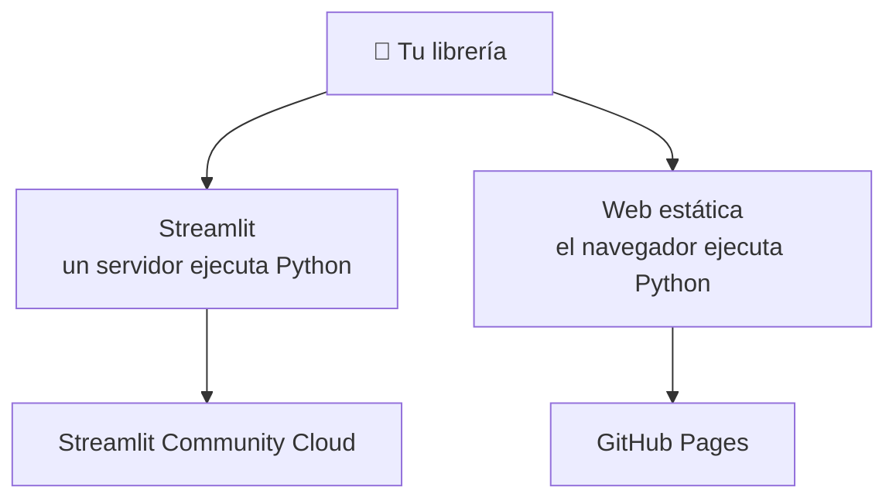

# Aplicación web

Una librería que nadie puede probar es una librería que nadie usa. Esta sección
trata de ponerle **cara** al proyecto: una página que alguien abre en el
navegador y usa, sin instalar nada.

---

## Hay dos caminos, y no cuestan lo mismo

| | [Streamlit](streamlit/index.md) | [Web estática](static-web/index.md) |
| --- | --- | --- |
| Lenguaje | Solo Python | HTML, CSS, JavaScript (+ Python vía Pyodide) |
| Necesita servidor | Sí | No |
| Dónde se ejecuta | Streamlit Community Cloud | GitHub Pages, cualquier host estático |
| Se duerme si nadie la usa | Sí | No |
| Esfuerzo inicial | Bajo | Medio |

Lee primero [Alojamiento](hosting.md) — explica qué implica de verdad la
elección — y luego escoge uno.

---

## Las páginas

- :material-server-network:{ .lg .middle } **[1 · Alojamiento](hosting.md)**

    ---

    Dónde se ejecuta una aplicación web, quién la paga y por qué «estática» es
    la palabra que decide todo lo demás.

- :material-language-python:{ .lg .middle } **[2 · Streamlit](streamlit/index.md)**

    ---

    Escribe toda la aplicación en Python y despliégala en Streamlit Community
    Cloud.

- :material-language-html5:{ .lg .middle } **[3 · Web estática](static-web/index.md)**

    ---

    HTML, CSS y JavaScript en una carpeta, publicados gratis desde tu
    repositorio.

